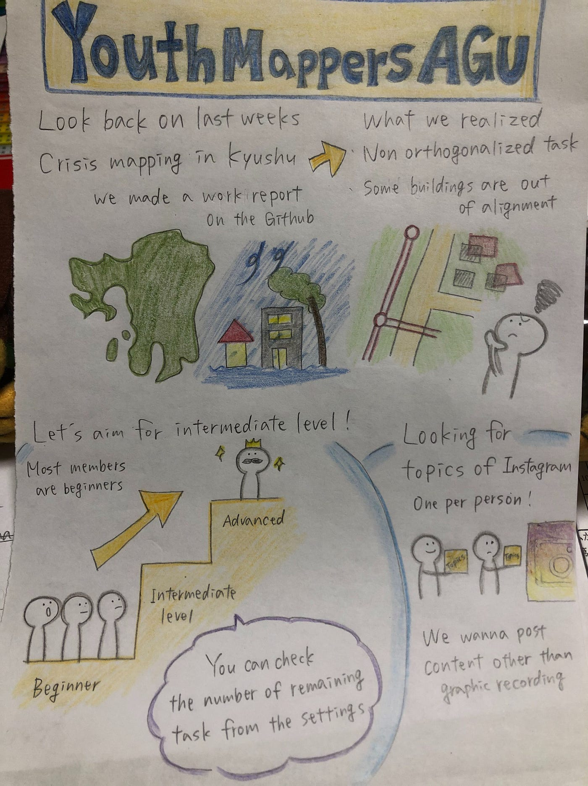
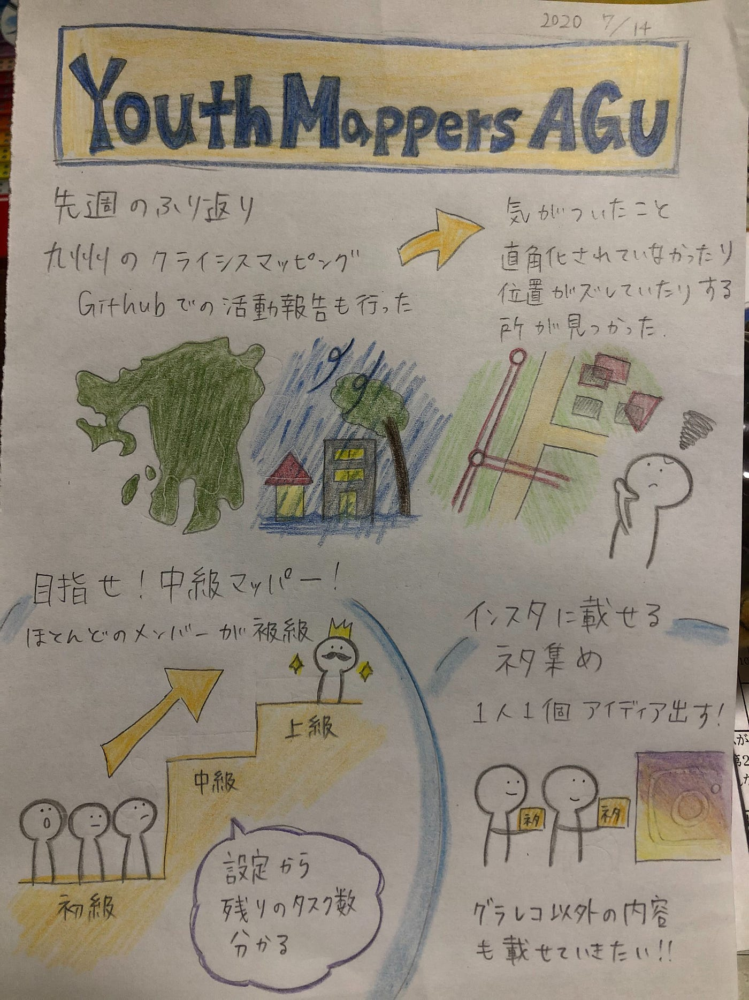

### マッピング上級者に私はなる！

こんにちは！昨日から激暑です。そろそろ梅雨明けますかね…

熊本の被害の全貌は見えてくるのでしょうか。

それでは内容に移ります。

・YouthMappersAGUのメンバーほとんどがまだ初級マッパー→7月中までに全員が中級者を目指す！！！そのまま上級者へ…！

・[熊本の豪雨のクライシスマッピング](https://tasks.hotosm.org/projects/9023)：Githubでの活動報告も行ったが、、、実際には直角化されていない、ずれているなどの問題も！！

・インスタ：ネタが尽きてきた、、、。グラレコだけじゃつまらない！ということでSNS係、ネタを収集します。

SIVAでのマッパソン開催について

以前からSIVAと共同でマッパソンを開催しようと話していましたが、開催時期につていSIVA側から夏休み期間中にしてほしいという申し入れがありました。1年生が多いSIVAでの混乱を避けるためにも夏休み期間中に開催したいと思います。

今回のグラレコです。

