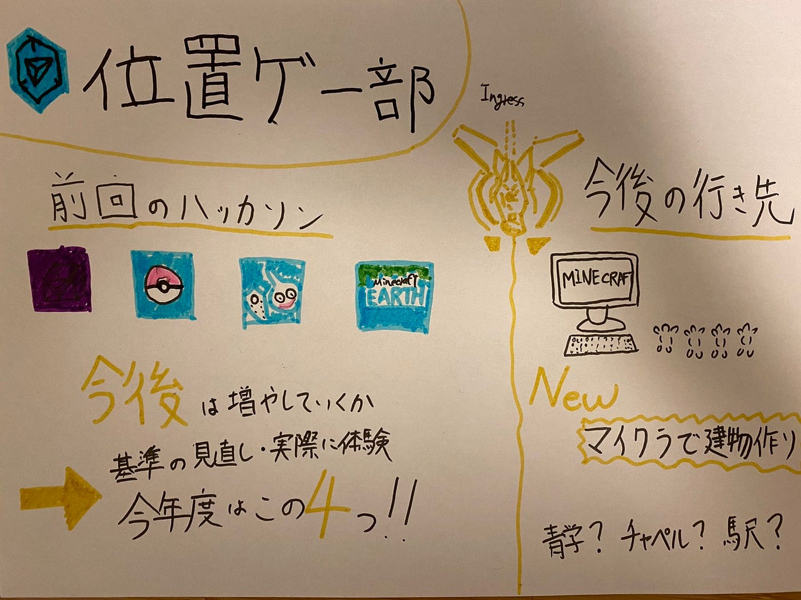

### 位置ゲー部週報：今後の予定

今週のミーティングでは主に2つのことについて話し合いました。

1つ目は前回のハッカソンの際に新しい位置情報ゲームのほかに追加で基準を増やすかについてです。

結果として、今年度新しい位置情報ゲームの追加はしないことに決定しました。理由としてはまず、今回新たに基準作成したものはまだ完璧なものではないため、実際に他の人に体験してもらい感想を得ないと正確かどうか判断することが難しいためです。

そのためにも新しい位置情報ゲームに挑戦してみてください。マイクラアースに関しては近々基準を上げる予定です。

新しい位置情報ゲームのコツの記事はこちらからです

[ドラゴンクエストウォーク](https://medium.com/furuhashilab/%E4%BD%8D%E7%BD%AE%E3%82%B2%E3%83%BC%E9%83%A8%E3%83%8F%E3%83%83%E3%82%AB%E3%82%BD%E3%83%B3-%E3%83%89%E3%83%A9%E3%82%AF%E3%82%A8%E3%82%A6%E3%82%A9%E3%83%BC%E3%82%AF%E3%81%AE%E5%9F%BA%E6%BA%96%E6%B1%BA%E5%AE%9A-5570e94d4aa7)

[マイクラアース](https://medium.com/furuhashilab/%E3%83%9E%E3%82%A4%E3%82%AF%E3%83%A9%E3%82%A2%E3%83%BC%E3%82%B9-%E3%83%AC%E3%83%99%E3%83%AB%E8%A8%AD%E5%AE%9A-fca83893a622)

2つ目に話した議題は今後の活動について話していきました。

まずやることの1つとして新たにマインクラフトを用いて建物作りをすることを視野に入れることにしました。

以前に古橋先生が投稿してくださったこちらのサイトを参考にしました。1ブロックを1メートルとし、縮図のように建物作りをしています。このようにして我々位置ゲー部もマインクラフトを用いて建物作りをしてくことを視野に入れました。

[『マインクラフト』9年かけて作られた「特大現代都市」のマップデータが配布中。総勢400人が参加するマイクラ最大規模の街 | AUTOMATON
『マインクラフト』で、400人規模で制作中の超巨大なマップデータが配布中だ。海外掲示板redditを中心に注目を集めている。「Greenfield」というプロジェクトとして制作されているこの都市は、2011年から約9年の歳月をかけて成長して…automaton-media.com](https://automaton-media.com/articles/newsjp/20200517-124460/)

しかし想定できる問題点がいくつかあります。

・位置ゲー部に建物作りをした人がいないためにマニュアル作成をしなければいけない（マイクラ経験者は1人） →豆腐（四角形の建物）になってしまう可能性

・どのようにして実際に距離を測るか→特に高さ

今度実際にマインクラフトのクリエイティブでどのくらい難しいか挑戦していきます。

グラレコはこちらです。

