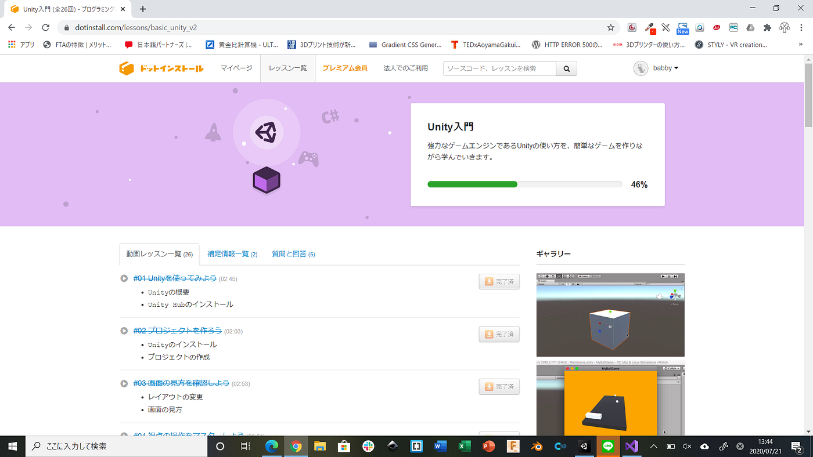
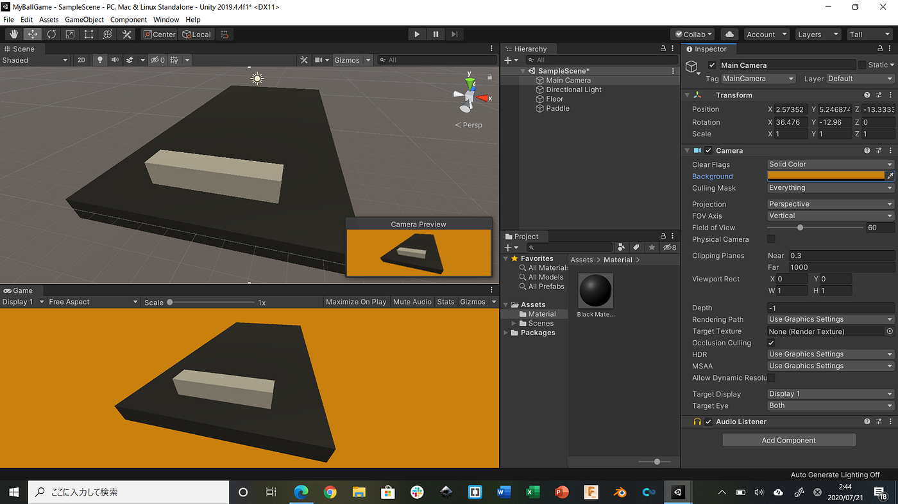
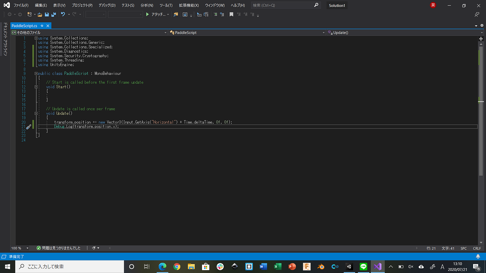
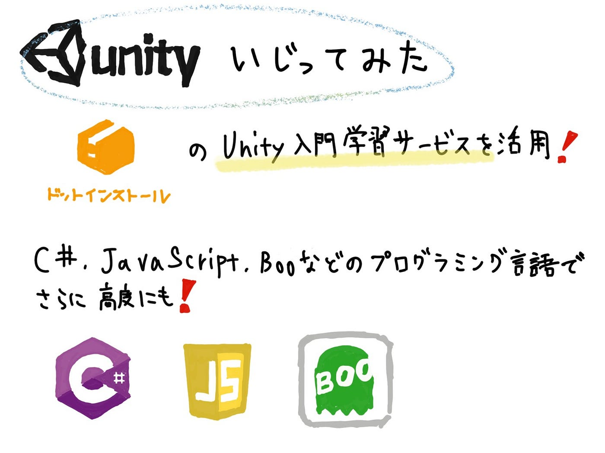

### Unity触ってみた！

[ドットインストール
HTML, CSS, JavaScript, PHP…dotinstall.com](https://dotinstall.com/)

今回のものづくり部は、ゲームエンジンのUnityを実際に触ってみました。_**[ドットインストール_**](https://dotinstall.com/)というレッスン動画が挙がっているサイトを使用し、そこにある「Unity入門」を実際に見ながら出来るとこまで実践してみました。

今回私たちが受講したレッスンは全26回のレッスンでしたが、その半分を行いました。

単純なゲームを作っていくという事を目標としたレッスンで、このように順を追って作業していました。Blenderなどの３DCADを使用した経験があったので、「マテリアル」「カメラ」「ライト」などの概念はなんとなく理解はしていたものの、

**Visual Studio**を使用し、動きを付けようとした段階でなぜかうまい具合にUnityで反応せず、作業が止まってしまいました。

**C#言語**というプログラミング言語を使用しないといけなく、レッスン動画の通りに打ち込んでも反映されませんでした。

しかし、Unity を用いる上でこのC#言語の基礎くらいは習得していかなければいけないという事が分かったので、そちらの方も学んでいけたらいいなと思いました。

#### **＜グラレコ＞**

#### **（追記）**

#### **＜ものづくり部ロゴ完成＞**

ものづくり部のロゴが完成しました。今後、SNSなどで情報を公開するうえで必要かなと思い、このロゴを使っていけたらいいなと思います。

