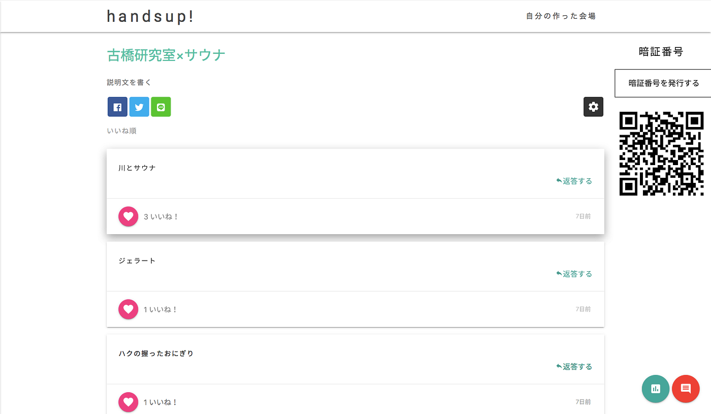
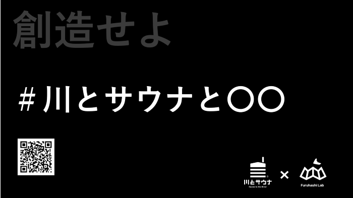
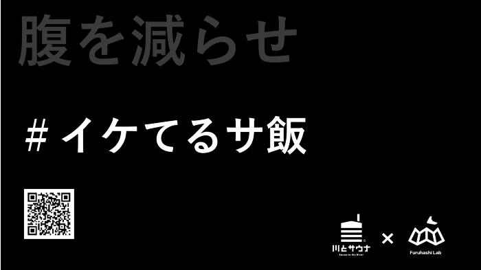
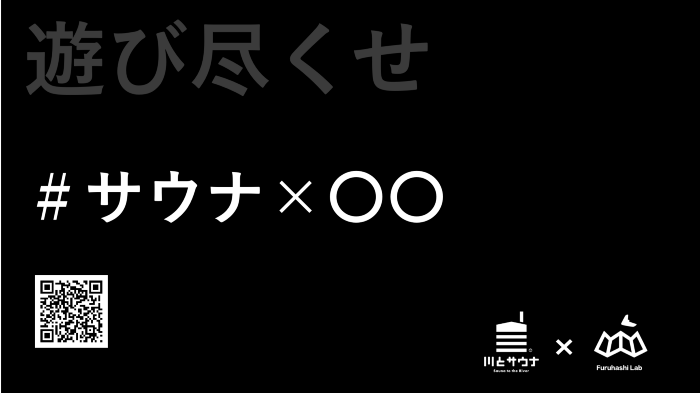

### アンケート結果報告

こんにちは！古橋研究室の安保です。

これまで横瀬部は、夏合宿でのサウナイベントを「川とサウナ」さんの協力のもと計画を進めてきました。二週間前の「川とサウナ」さんとのミーティングでコラボが決定し、古橋研究室が「川とサウナと◯◯」のアイディアを提示することになるました。

そして先週のゼミでゼミ生にアンケートを実施し、色々な観点からのアイディアを募りました。

今週は[アンケートの結果](https://handsup.cloud/r/bEJOp1o)報告と今後について報告したいと思います。

前回までの流れ↓

[横瀬xサウナ週報
こんにちは！古橋研究室横瀬部4年のイジユルです。先週は横瀬xサウナのイベントでサ飯を企画であるホルモンカレーを紹介致しました。medium.com](https://medium.com/furuhashilab/%E6%A8%AA%E7%80%ACx%E3%82%B5%E3%82%A6%E3%83%8A%E9%80%B1%E5%A0%B1-3aec5af491b3)

[今、横瀬部は「アイディア」を求めている。
古橋研究室の大庭です。medium.com](https://medium.com/furuhashilab/%E4%BB%8A-%E6%A8%AA%E7%80%AC%E9%83%A8%E3%81%AF-%E3%82%A2%E3%82%A4%E3%83%87%E3%82%A3%E3%82%A2-%E3%82%92%E6%B1%82%E3%82%81%E3%81%A6%E3%81%84%E3%82%8B-5300e8860883)

先週のゼミ内でリアルタイム型アンケートという形でゼミ生から愛gヒアを吸い上げました。用意した質問は３つ。

> ＃川とサウナと◯◯

> ＃いけてるサ飯

> ＃サウナ×〇〇

#### アンケート結果

> ドローン（２）

> ジェラート、ハクの握ったおにぎり、みかん、肉、サカナクション、ビール、ガチャムク、ポケモン、マッピンゴ、VR、筋トレ

> 肉（３）

> フルーツ、そば、ラーメン、味噌ポテト、センレックナムサイ、ソーセージ、スイカ、きゅうり、チーズ、ポテサラ、冷たいもの

> 将棋、ハンモック、怖い話、キャンプファイヤー、写真大会、川遊び、人狼、バンド、一発芸、カラオケ、ビンゴ、釣り、フルーツバスケット

ご協力ありがとうございました。

ざっとアンケートを見てみて、「川とサウナ」さんに新たなアイディアを提示するには弱いものが多かった印象でした。より古橋研究室らしさを〇〇に当てはめたいと思います。

＃川とサウナと◯◯

ここがコラボにおいて一番重要なものになります。古橋ゼミの特徴を考えると横瀬部のミーティングでも話したドローンとの組み合わせがいいのではないかと考えます。

＃いけてるサ飯

一番回答が多かったのは肉でした。サ飯は元々、サウナで汗を流したあとのミネラル摂取等が目的で比較的味の濃いものが食べられています。実際に「川とサウナ」さんではホルモンと食べています。横瀬では鹿や、イノシシなどの鳥獣被害があるので鹿肉や猪肉などは次回のミーティングで提示してみようと思います。

＃川と〇〇

ここは我々学生ならではの視点で斬新な遊びなどを期待してみました。我々の古橋ゼミには依田くんがいるのでバンドとの新たなコラボもいいかもしれません（笑）

これらを踏まえて次回は「川とサウナ」さんにアイディアを提示します。お楽しみに！！！
