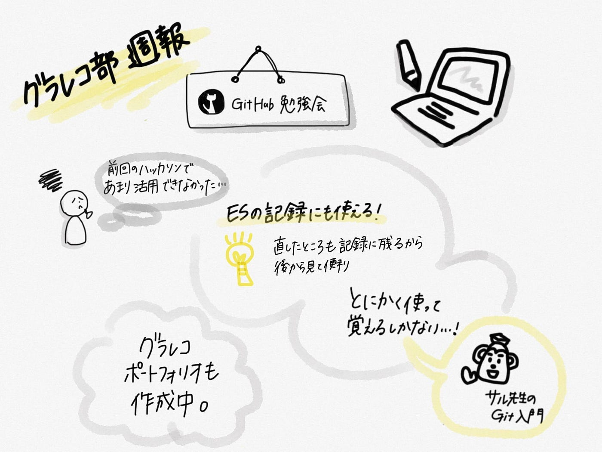
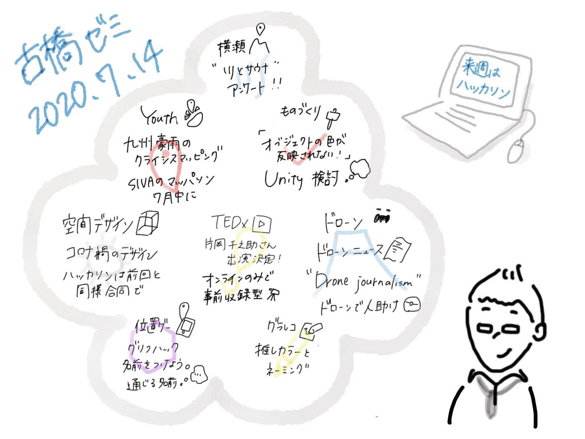

### 勉強中。

こんにちは！グラレコ部です。
今週はGitHub講習会を開きました！

#### ##GitHub講習会

前回のハッカソン、グラレコ部はGitHubを使いこなせていませんでした…。
来週に迫った7月ハッカソン。
もっと使いこなせるようにならなくては…！

ということで、平澤さん主導のもと、グラレコ部GitHub講習会が開催されました。

GitHubのいいところは修正したところを残せるところ。
これを利用して、平澤さんは就活のエントリーシートの保管に使っていたそうです。
なるほど、Wordで管理していると、いちいち修正したものを別ファイルに置き換えなければいけなくなるので面倒ですよね。
GitHubだとどこを変えたかが記録に残るので後から見返せるのがポイントです！

ちなみにGitの基本について「サル先生のGit入門」がわかりやすいのでぜひ参考に！

[Gitを使ったバージョン管理｜サル先生のGit入門【プロジェクト管理ツールBacklog】
はじめまして。博多生まれGit育ちの「 ダイミョー」ばい。今日は一緒にバージョン管理システム「Git（ギット）」ば勉強するばい。 みなさんはファイルを編集前の状態に戻したい時、どのようにしていますか。…backlog.com](https://backlog.com/ja/git-tutorial/intro/01/)

#### ##今週の週報グラレコ

最近100均のタッチペンを購入し、デジタルグラレコにも挑戦中です。
今回はTayasui Sketchesというアプリを使用しました。
アプリについての関連記事はこちら。

[オンラインでのグラレコ実践記 vol.1（iPad編）
新型コロナウイルスの影響により、青山学院大学でも前期の開始時期が遅れ、講義もすべてオンラインで行われることに。しかし！ 「#学びを止めない」我らが古橋研究室。予定通りの日程のまま、オンラインでゼミが開かれています。medium.com](https://medium.com/furuhashilab/%E3%82%B0%E3%83%A9%E3%83%AC%E3%82%B3%E9%83%A8%E9%80%B1%E5%A0%B1-%E3%82%BF%E3%83%96%E3%83%AC%E3%83%83%E3%83%88%E7%AB%AF%E6%9C%AB%E3%81%A7%E3%81%AE%E3%82%B0%E3%83%A9%E3%83%AC%E3%82%B3%E5%AE%9F%E8%B7%B5%E8%A8%98-vol-1-e75834c0e96a)

私は研究室のiPad mini第4世代をお借りしているのですが、Apple PencilやCrayonに対応していない…。
細かいイラストや文字は、手で書くにはちょっと厳しい…。
ということでタッチペンを使ってみたところ、意外と書けるかも…？

ちなみに今週のゼミ議事録もデジタル式で書いてみました。

字の大きさやペンの太さがバラバラなのは何とかしたいところです…。
アナログと違って紙の大きさを把握しづらいのが難しいです。
とはいえ、豊富なペンの種類とカラーバリエーション、一度書いたものを切り取って移動させたりできるのは、さすがデジタル！
もっと使いこなせるように頑張ります！！

青山学院大学 古橋研究室3年

大岸 裕紀
