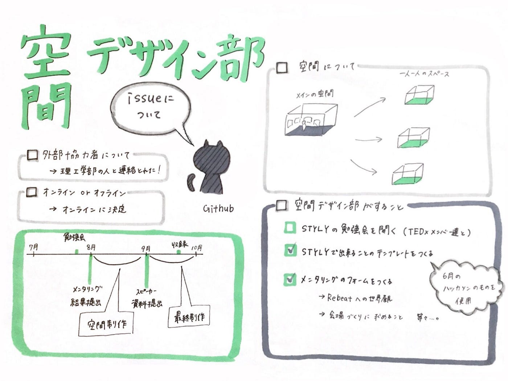

### 空間デザイン部は頑張り時

#### <10月に開催が迫っているTEDx AoyamaGakuinUの会場制作について>

今週もTEDxの空間制作についての話し合いをしました。

#### **空間について**

TEDxの空間は、10人のスピーカーそれぞれの内容にあった空間をデザインすることになりました。

そのため、スピーカーの方々とのメンタリング（内容のヒヤリング）をします。

テーマであるrebeatの世界観や本番のプレゼンのイメージについて、お伺いしてstylyで制作します。

#### **決定事項**

・理工学部の方が会場制作に参加してくれました！VRに詳しい方なので心強い

・**開催は完全オンラインで決定！**オンライン組とオフライン組で分かれて進めていたので、これでみんなで作業ができます。

#### **空間デザイン部のタスク**

＜Stylyの勉強会＞
メンタリングでスピーカーの方々にしっかりと説明ができるように、今一度stylyの知識をつけなければならないので勉強会を開催しました。

<Stylyテンプレート>
stylyでできることのテンプレートを作ります。できることとできないことを認識しておくことでスムーズに作業が進むからです。

<メンタリングのフォーム>
スピーカーの方々が会場作りに求めていることをしっかりとヒアリングをするために、質問をあらかじめ用意しておくためです。

<グラレコ>

