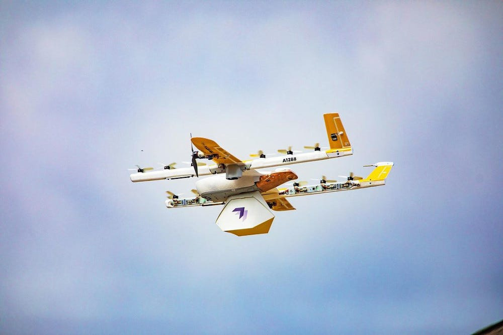
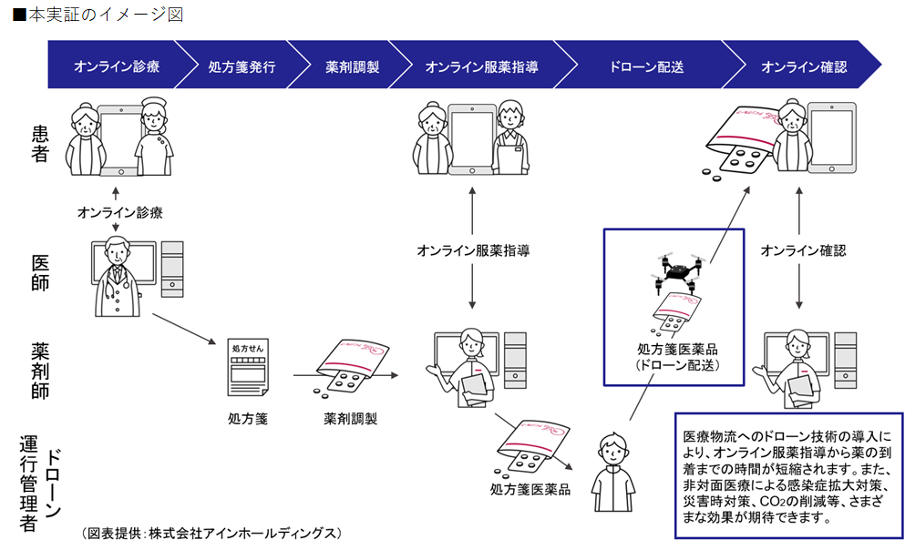
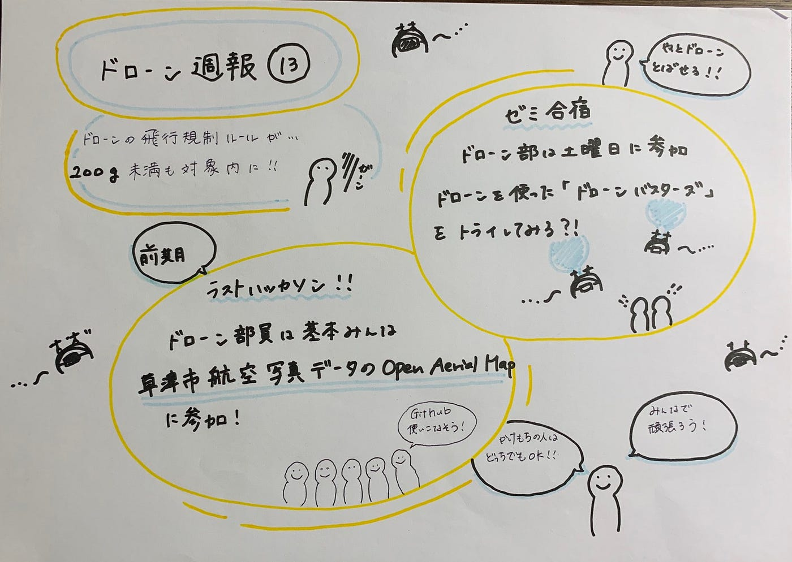

### ドローン週報⑬

こんにちは、松山蘭です。

今回のドローン部ミーティングでは

・ハッカソンについて

・ゼミ合宿について

話し合いました。

・ハッカソンについて

掛け持ちをしていない人以外は草津市航空写真データのOpenAerialMap投入に参加することに決定しました

・ゼミ合宿について

ドローン部は土曜日に参加予定で、バルーンバスターズをやってみても面白いかも？と言うことになりました。

今回の週報では、「ドローンでの処方箋医薬品配送」

についてお話したいと思います。

７月18日、19日に旭川医科大学、ANAホールディングスらと、オンライン診療・オンライン服薬指導と連動した

ドローンによる処方箋医療品の配送実験を行ったそうです。

これは、まず医師がオンラインで診察後、処方した医薬品をドローンで届ける実験です。

ちなみに、オンライン診療、オンライン服薬指導、ドローンによる処方箋医薬品配送の一連実証実験は国内で初だそうです。

日本で初ということは世界ではもう行われているのでしょうか？

実はもうアメリカでは、医薬品のドローン配達がおこなわれていました。

Wing 会社では、アメリカロックダウン中2週間で日用品も含め１０００件を超える配達をしたそうです。

オンライン診察からの処方箋医薬品かは分かりませんが、さすがアメリカ実践力があります

日本もドローンを活用した医薬品配達が実現してほしいです。

ちなみに、オンラインサービスの流れがこちらになります

オンラインでの一連のサービスが可能になると多くのメリットがあります。

例えば

病院に行かなくてよくなるため、新型コロナウイルスでの院内感染のリスクが減ったり、

地方での医者不足の解消にもつながります

これから無人で効率よく配送できるドローンに期待が高まりそうです！

今回の週報のグラレコです

