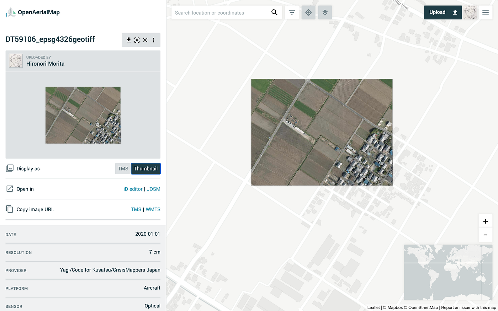
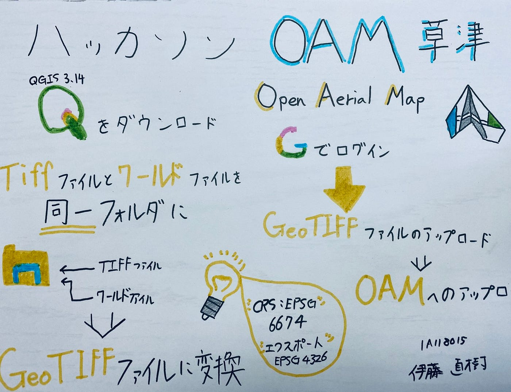

### OpenAerialMapの活用（草津市編）

ハッカソン7月編

未だにAerialのスペルミスが治らない**22歳**になった森田です。
どうしてもAirialって入力してしまうんですよね。この機会にAerialのスペルを完璧に覚えればと思います。

エアリアルと言えば、ヤマザキビスケットから販売されているスナック菓子を思い出しますよね。あの、ふわサク感がたまらないんです。個人的にはチェダーチーズ味が一番おすすめなので、興味ありましたらぜひお買い求めください。

[ヤマザキビスケット エアリアル濃厚チェダーチーズ 70g×10個
ヤマザキビスケット エアリアル濃厚チェダーチーズ 70g×10個amzn.to](https://amzn.to/3fZB4o9)

今回のハッカソンでは、[OpenAerialMap](https://openaerialmap.org/)を用いて草津市航空写真データの投入を行いました。

#### ## OAMとは

OpenAerialMapは、誰もが航空写真を投稿し活用することができる、オープンデータの共有サービスを提供しています。地上でいう[Mapillary](https://www.mapillary.com/)、地上でいうOAMと言ったところでしょうか。

#### **## なぜOAMなのか**

現在までに、[Bing](https://www.bing.com/maps/aerial)や[ESRI](https://www.arcgis.com/home/item.html?id=10df2279f9684e4a9f6a7f08febac2a9)が衛星写真の公開がされてきます。私たち古橋研究室では、OSMでのマッピングを行っているため、少なからずお世話になったことがあると思います。しかし衛星画像には、ある大きな欠点があります。そう、それは、、

**解像度**と**GPSの精度**

特にOSMでマッピングを行っていると、建物なのか岩なのかよくわからないことが多々ありますよね。他にも撮影の角度によって、マッピングの位置のズレが生じたり。

そんな衛星画像による課題を、ドローンで撮影しOAMにアップしていくことで解決できるのです！

また、今回は草津市から航空画像を提供していただいたのですが、総計500枚にも及ぶデータ量でありました。試しに1枚ダウンロードしてみたのですが、1枚あたり100MBの容量を使います。ドローンの種類によって容量は異なると思いますが、iPhoneで撮った写真一枚が約1MBと考えると、**航空画像1枚で普通の写真100枚分もの容量**になります。

提供していただいたデータ全てをダウンロードすると、なんと50GBもの大きさになってしまいます。そんな大きさのデータを保管しとくには、なかなか厳しいものがありますよね。そこでOAMに投稿してあげることによって、フリーストレージで保管をすることができます。

#### ## OAMにアップロードへの作業手順

1. [QGIS](https://qgis.org/ja/site/forusers/download.html)をインストールする

1. ワールドファイルとTIFFファイルをワンセットでダウンロード

1. TIFFファイルをGeoTIFFファイルに変換する

1. できたGeoTIFFファイルをOAMで投稿する

#### ### GeoTIFFファイルの作成

OAMに画像をアップロードするにあたり、画像データとしてのTIFFファイルをGeoTIFFファイルに変換する必要があります。

```
TIFFファイル：画像のファイル形式の一つ。高画質な時に適したファイル形式。
```

```
GeoTIFFファイル：TIFFファイルにジオリファレンス情報を付け加えたファイル形式。
```

```
ワールドファイル：コンピュータで取り扱う事の出来る座標位置情報を追加したテキストデータ
```

つまり、**画像1枚を位置情報などを追加した画像に変換**を行うことになります。

1. QGISを起動

1. ダウンロードしたTIFFファイルをドラッグ＆ドロップ

1. TIFFファイルが読み込まれたことを確認

1. 読み込んだTIFFファイルにCRS（座標参照系）を設定

1. レイヤにOpenStreetMapを導入

1. TIFFファイルをGeoTIFF形式でエクスポート
ファイル名は指定されている場合はその名前で保存
ここでは、”DTxxxxx_epsg4326geotiff.tif”を選択（xxxxxにはファイルの数字を入れる）

1. CRSをプロジェクトCRS: EPSG: 4326- WGS 84に変更

1. GeoTIFFファイルの書き出しが完了

#### ### OAMへのアップロード

先ほど作成したGeoTIFFファイルをOAMにアップロードしていきます。

1. OpenAerialMapを起動

1. ログインする（FacebookまたはGoogleアカウント）

1. 必要事項を記入
- Title
- Platform
- Sensor
- Date Start
- Date End
- Title Service
- Provider
- Tags
- Contact
- License

1. アップロードするGeoTIFFファイルを選択

1. 提出

1. アップロードされたことを確認

しっかりアップロードされると、



マップ上に航空写真が貼り付けられていることが確認できます。

今回はQGISを用いたGeoTIFFファイルの作成とOpenAerialMapへのアップロードを行いました。今後自分たちで空撮だけではなく、データをOAMで公開できるようにしていきたいと思います！

[furuhashilab/oam4kusatsu
草津市航空写真データの OpenAerialMap 投入 OpenAerialMap への航空写真データ投入 QGIS 3.14 をインストール…github.com](https://github.com/furuhashilab/oam4kusatsu)


