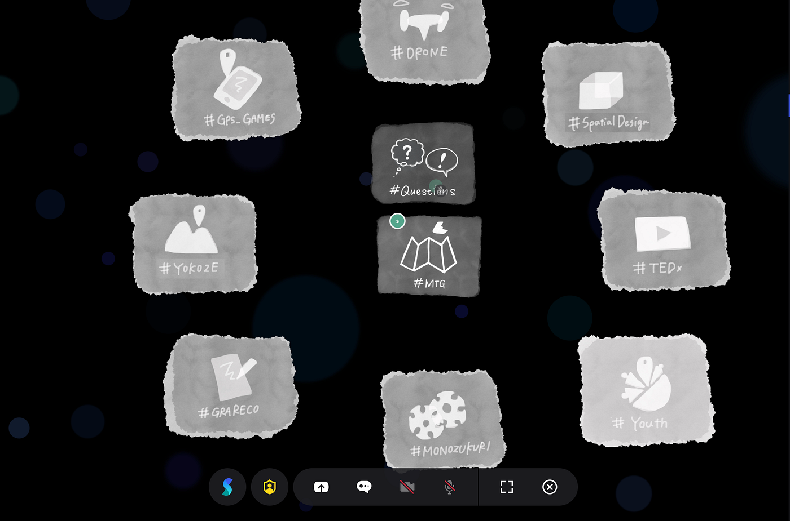

### SpatialChat を作ってみた

こんにちは！
GSC用、古橋ゼミ用SpatialChatを今回のハッカソンで作ってみました！

URLはこちらです！
GSC用[https://spatial.chat/s/aoyamagsc](https://spatial.chat/s/aoyamagsc)
古橋ゼミ用[https://spatial.chat/s/FuruhashiLab](https://spatial.chat/s/FuruhashiLab)

5人いるチームメンバーを、２つに分けて作業を行いました！

自分は古橋研を担当したのでこの記事では、そのことを中心に話していきたいと思います！

まず、古橋研究室ということで部活動ごとにスペースを作りました！

このように、部活ごとにイラストを書いて、そこで話し合ってもらうというスペースづくりを心がけました！

このように、部活動で円を書く形をとり、真ん中には、【全体のMTG】【先生に質問したいときに聞く】場所を作り、主に毎回のゼミで使うことを想定して制作をしました！

発表用スライド：[https://docs.google.com/presentation/d/1v8QRINTT5G5wwpbTjl1gqxQ3UBvB2LSer7Cs9ZJVUCQ/edit#slide=id.p](https://docs.google.com/presentation/d/1v8QRINTT5G5wwpbTjl1gqxQ3UBvB2LSer7Cs9ZJVUCQ/edit#slide=id.p)

Git hub:
[https://github.com/furuhashilab/spatialchat4gsc](https://github.com/furuhashilab/spatialchat4gsc)
