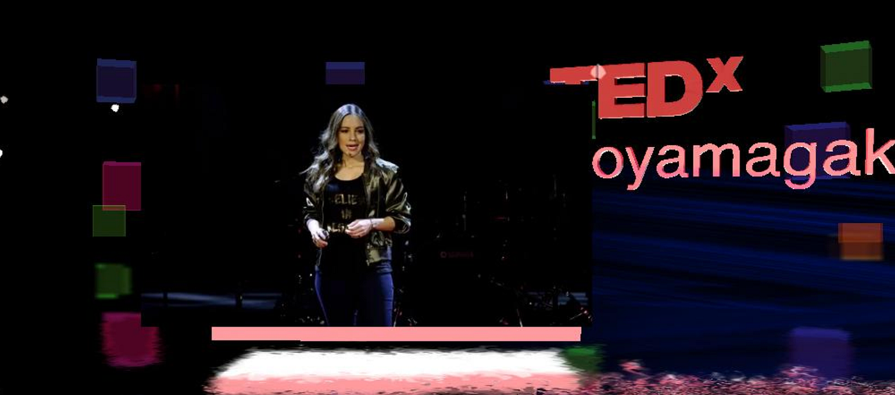
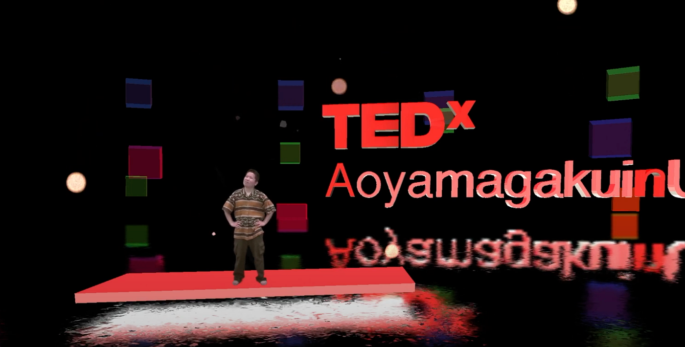
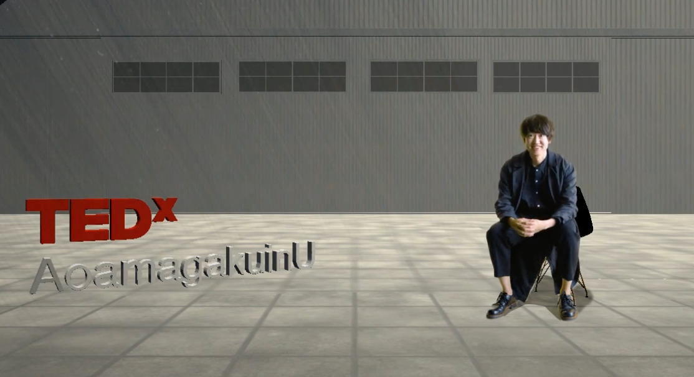
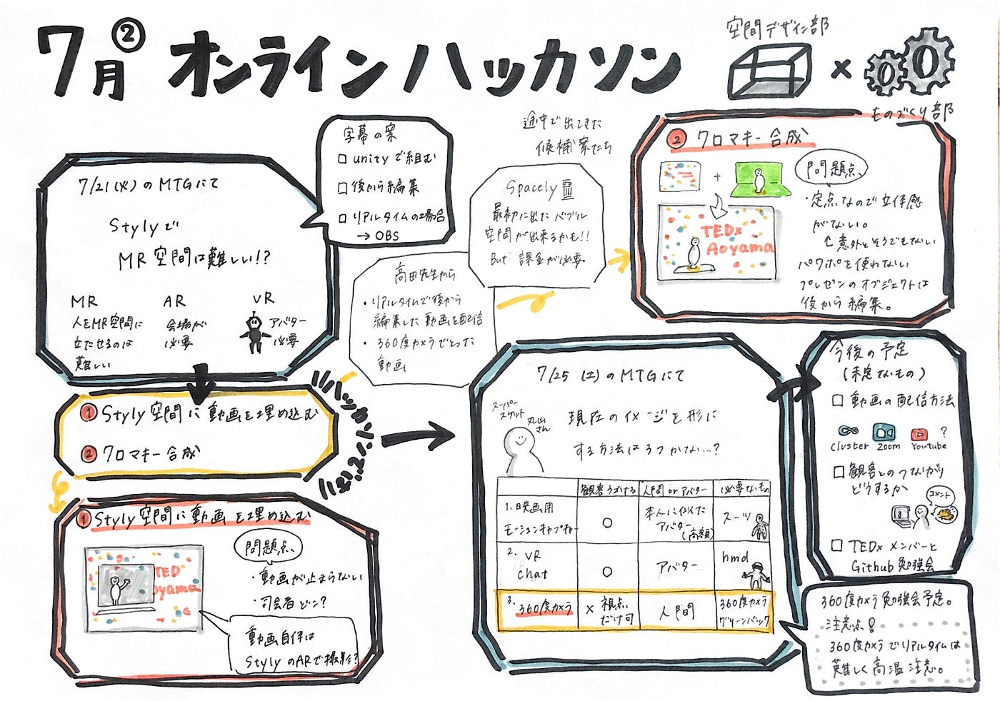

### TEDx会場設計方法決定？！

stylyのエンジニアの方とのMTGでstyly上のMR空間の撮影はできない＋リアルタイムの観客とのインタラクションはできないと言われてしまったところから始まった今回のハッカソン…！VRになるとスピーカーの方がアバターになってしまい、ARだと撮影がiPhone画質クオリティになってしまうことから今まで通りMR空間の会場で作成できないかを検討することにしました！

TEDxdesignチームのレポジトリ→[https://github.com/furuhashilab/2020_TEDxdesign](https://github.com/furuhashilab/2020_TEDxdesign)

＜ハッカソンの目標＞
会場設計の方法を決定する

#### →360度カメラを利用してみる方向で決定

#### →ダメだった場合、styly空間にクロマキー合成

＜ハッカソンの内容＞
・6月のハッカソンで作成したstylyの空間にクロマキー合成
・6月のハッカソンで作成したstylyの空間にTEDxの動画を埋め込む
・VR詳しい丸山さん、古橋先生とMTG

＜検討案＞

１stylyにTEDxの動画を埋め込む

撮影した動画をstylyで作成した空間に貼る。映画館のような感じ。

メリット
・めちゃめちゃ簡単
・空間の背景色と撮影時の背景色同じにしたら違和感なし？
・動画の編集でオブジェクトを出すこと可能
デメリット
・動画が止まらない
・司会者をどこにおく？
・配信用アプリが別で必要

２stylyにクロマキー合成

stylyで作成した空間にグリーンバックで撮影した映像を合成し、録画

メリット
・ただ動画貼るよりも臨場感がある
・想像していたものに近い
・作成した空間の光なども映る
・動画編集でパワポを使わないプレゼン可能

デメリット
・定点カメラの撮影になる
・配信用アプリが必要

３360度カメラを利用する →7/31 試す

360度カメラ、グリーンバックで撮影。それをstylyで作ったMR空間に合成。
編集でオブジェクト加えることも可能
・どうやって映るのか試してみないとわからない
→画質、音質、人が伸びないかなど

・観客との距離が近い（ cluster利用すれば）
・編集、合成が厄介？
・配信用アプリ不要

４VR chatでアバター作成

HMD（ヘッドマウントディスプレイ）をつけて話し、モーションを加える
→スピーカーがアバターはよくない

５映画用モーションキャプチャー
専用スタジオ、専用スーツを着用して撮影
多額な費用

古橋先生、丸山さんとのmtgを通してとにかくいろいろ試してみて出来ること、できないことを明らかにしていきながらやるのがいいのではないかとなりました！またオンラインイベントに参加してやり方を盗んでいくことも重要な鍵になりそうです！

今回のハッカソンではstylyにクロマキー合成をすると綺麗に写り、音も問題なく出ることがわかりました！31日に360度カメラを使用して撮影を行い、どのように映るのかなどを具体的に試す作業を行ったのちに会場作成の方法を完全決定します！

＜今後の予定＞

・動画の配信方法
・観客との繋がりをどうするか。一体感をどうやって出す？
・TEDxメンバーにGitHubで情報共有をしていくことを伝える
・OBS、LIVなどの配信アプリ必要に応じて勉強？

今回のハッカソン内容詳細→[GitHub](https://github.com/furuhashilab/2020_TEDxdesign/issues/17)

＜グラレコ＞

＜発表用資料＞
