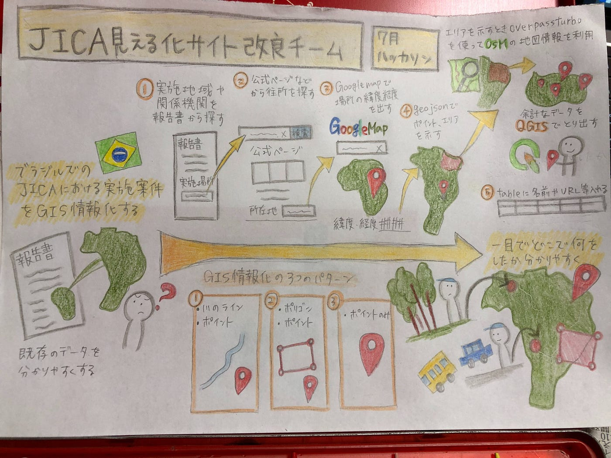

### ついにJICAのお力になれる日が！

今回のハッカソン、死にそうになっていた第一位の吉田です。ですが、国際協力の第一人者と言っても過言ではないJICAのお力になれるプロジェクトとして、気合を入れて頑張ることができたのではないかと思います、、。

それでは内容に入ります！

### 今回のハッカソンについて

ブラジルでのJICAにおける実施案件をGIS情報化する。

→「既存の報告書にある地図をよりわかりやすいものにする」というもの

今回は新たなウェブサイトやソフトがたくさん出てきてとても新鮮でした！

**今回のハッカソン、やり方について**

①実施地域や関係機関を報告書から探す

②公式ホームページから関係機関の住所を探す

③Google Mapで場所の関係機関の緯度経度を出す

④**geojson**で関係機関をポイントし、実施地域のエリアを示す

⑤エリアを示す時、**overpassturbo **を使ってOSMの地図情報を利用する

⑥余計なデータを**QGIS**で取り出す。

⑦**geojson**のtableに名前やURLなどを書き込む

**GIS情報化の３つのパターン**

①川のライン、ポイント

②ポリゴン、ポイント

③ポイントのみ

上記太字の二つを今回のハッカソンとすることで、、、

ひと目でブラジルの**どこ**で**何**を行ったのかをわかりやすくしてみました！

JICA見える化サイト改良チームにYouthMappersAGUのメンバーが関われたこと誇りに思います！

吉田の祖父もブラジルにJICAの技術者として渡ったことがあるので親近感を持ちながら活動することができました！

さらなる国際協力の発展を目指して頑張っていきたいと思います！

[https://docs.google.com/document/d/1Q33FF2VwrqBGGeWchHRX-inJgKDwBhZnRRJ6MaU08is/edit?usp=sharing](https://docs.google.com/document/d/1Q33FF2VwrqBGGeWchHRX-inJgKDwBhZnRRJ6MaU08is/edit?usp=sharing)

**今回のグラレコ**

