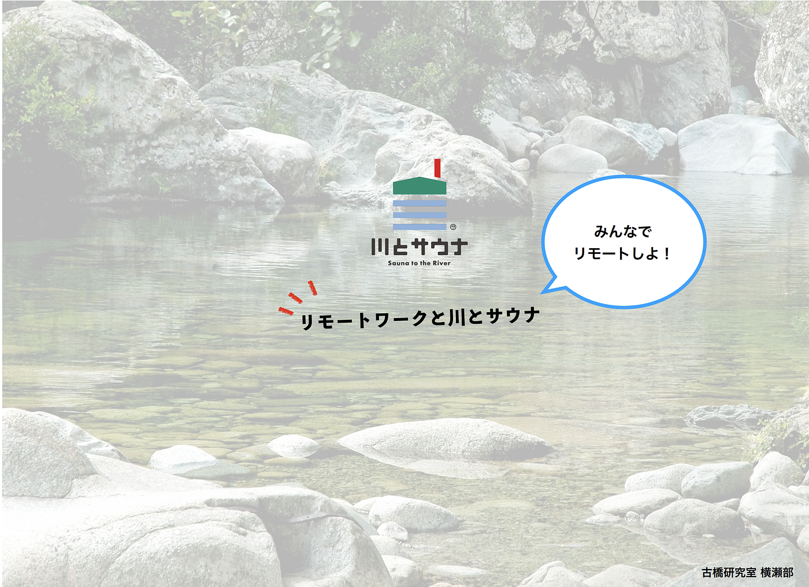
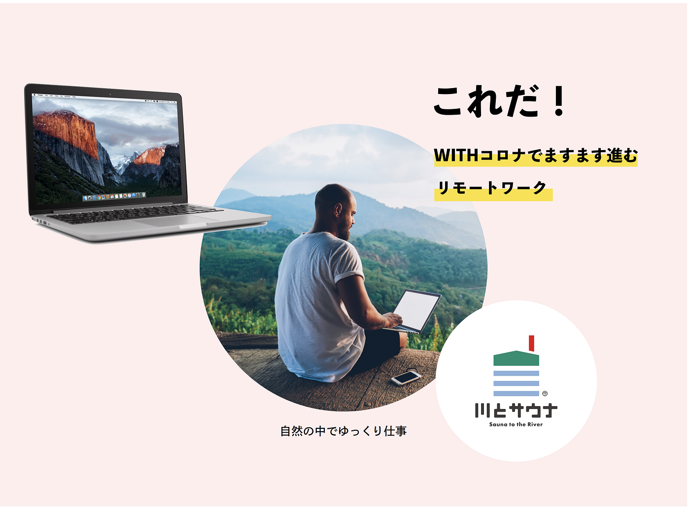
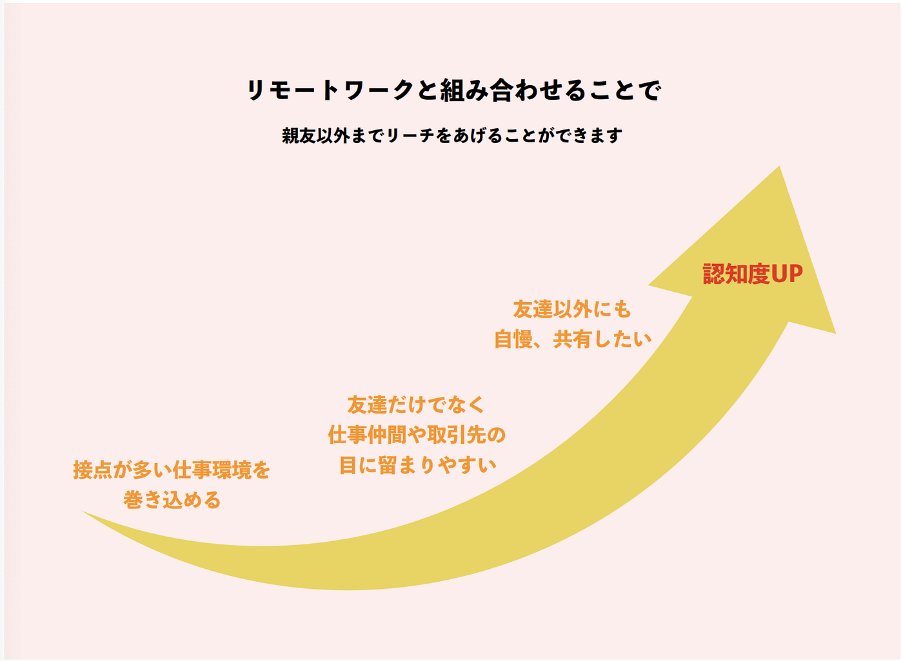

### 横瀬部ハッカソン、イベントコンセプト

こんにちは、古橋研究室横瀬部4年イ・ジユルです。今回7月オンラインハッカソンは**「川とサウナ x OOO」**のコンセプト決める活動を行いました。

前回、「川とサウナ」チームとのミーティングにより、せっかく大学生が沢山集まるイベントなので、大学生っぽいコンセプトを加えて、新しいイベントを企画しようという意見がありましたので、２週間に渡って色んな意見を収斂してコンセプトを決めました。

その結果決まったコンセプトは

> _**「リモートワークと川とサウナ」！！_**

企画書PDFリンク

[https://drive.google.com/file/d/17ct5XyL8Y9dr3Z5B0lfNidMWPkx2WxGd/view](https://drive.google.com/file/d/17ct5XyL8Y9dr3Z5B0lfNidMWPkx2WxGd/view)

最近、コロナの影響でお仕事がリモートワーク（オンライン授業）に変わった人が多いと思います。満員電車など出勤のストレスからは解放され、良いと思っている人もいると思いますが、家で仕事をすると中々集中ができないという新たな問題が発生しています。

家で仕事や勉強をする時、なんかボーとしてしまう経験した事ありませんか？！

その途切れた集中力を上げる一つの方法としてサウナと川、リモートワーク を組み合わせた「リモートワークと川とサウナ」コンセプトを紹介致します。

### 自然の中でゆっくり仕事ができる！

横瀬のリモートワークと川とサウナがなぜ良いのか？

①**サウナで集中力アップ**

②WITHコロナで自分ごとに

③自然を感じてリラックスできる

④ライフスタイルにできる

⑤汗をかいて運動不足解消

⑥朝活でライフワークバランス

だから横瀬の川とサウナで仕事をしたくなる！

この以外にもこのような魅力も！

そして今後は、このようなコンセプトでサウナイベントを行い、都心を離れて自然で新たなワークライフを過ごしている姿を記録して、川とサウナを奨励するPR活動を行いと考えています。

### まとめ

今回は古橋研究室横瀬部の合宿向けサウナイベントのコンセプトについてお知らせしました！コロナの影響で合宿が日帰りになった為、イベント開催が少し難しくなったと思いますが、変わった状況に応じて最大に活かせるイベントを作って行きたいと思いますので、今後もぜひ楽しみにしてください！
