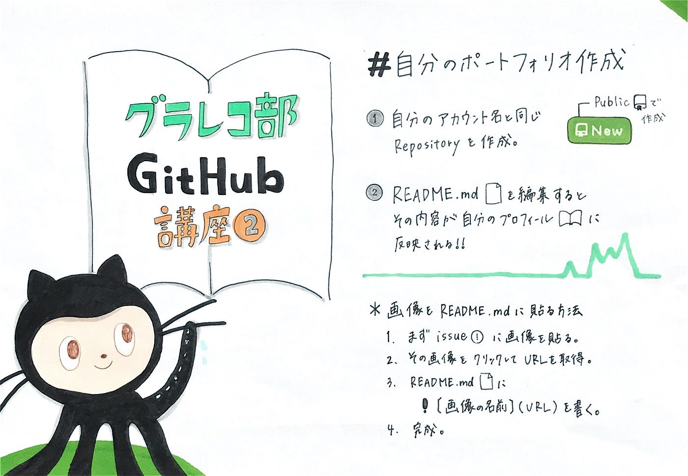
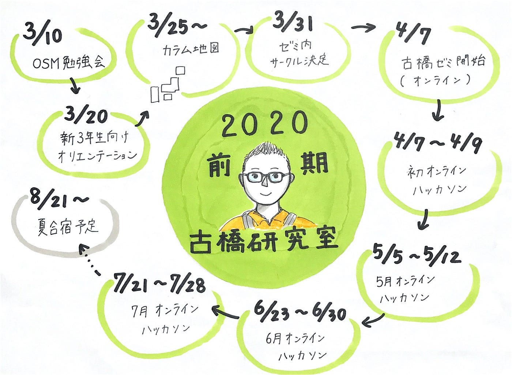

### 後期グラレコ部始動

前回に引き続きグラレコ 部では平澤さん主導の元、Githubについて学びました！

### ＃今回制作したのは…

> _●repository_

> _●個人ポートフォリオ（仮）_

#### ＃個人ポートフォリオとは…

以前**古橋先生に教えていただいた方法**で今回グラレコ部全員GitHubで個人ポートフォリオを作成してみました。

**古橋先生に教えていただいた方法： **Githubのアカウント名と同じrepositoryを作り、README.mdを編集するとその内容が自分のプロフィールページに反映されるのでポートフォリオとして使えるのでは…！

以下グラレコにまとめてみました。

難しいと思っていましたが意外と簡単に作ることができました！

### ＃前期古橋ゼミ終了

前期古橋ゼミは新型コロナウイルスの影響でまさかの全部オンラインで開催となりました。

個人的に2020年前期古橋ゼミの大きな活動をまとめてみました。抜けているところがあるかもしれません…。

グラレコに出会って約半年、最初の頃よりは成長できたと思います！（そう信じたい！！）

引き続き試行錯誤しながらもグラレコを活用していきたいです！

青山学院大学 古橋研究室3年

川嶋彩香
