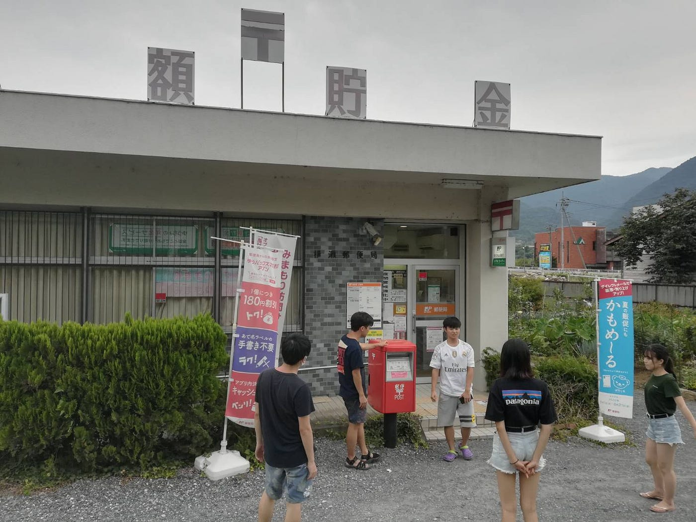
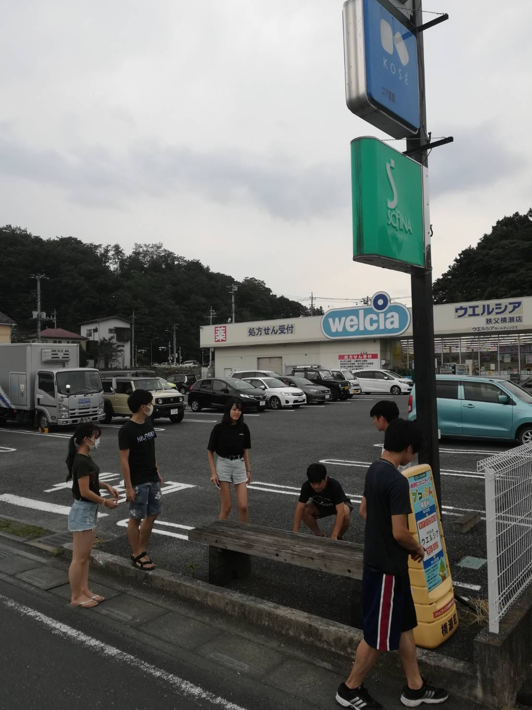
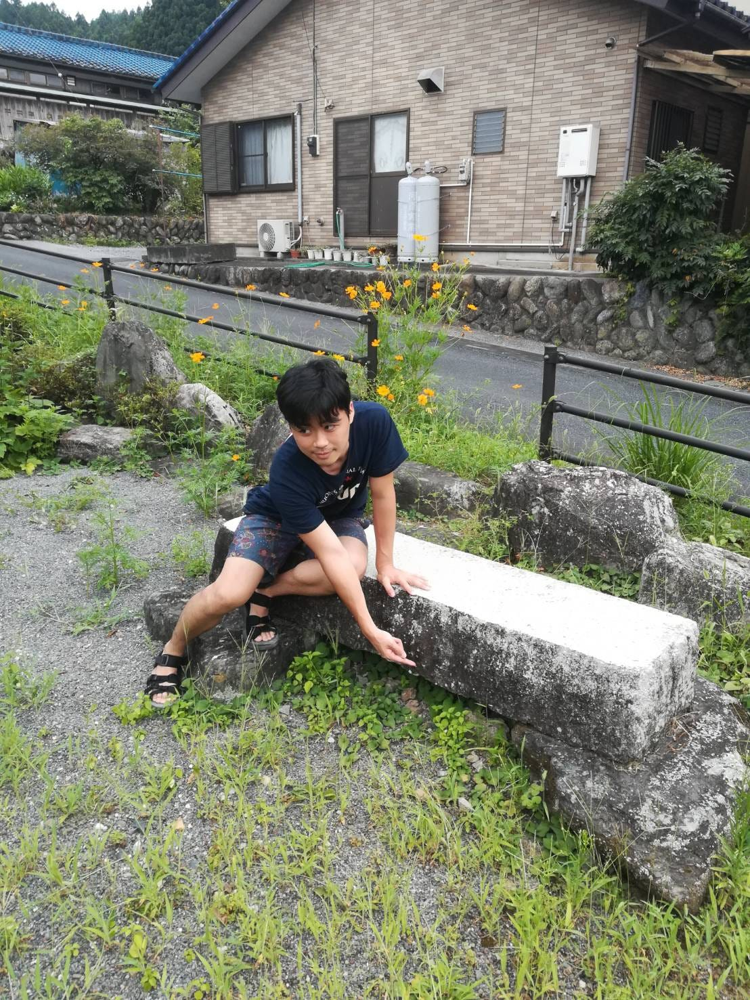
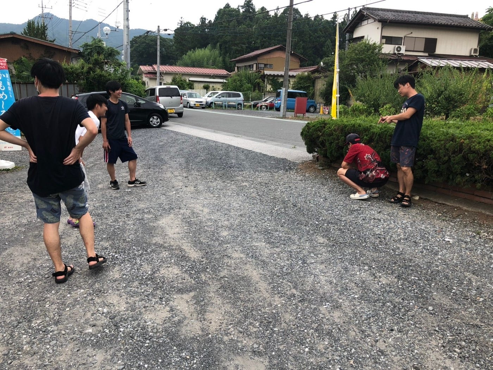

### ドローン部〜夏合宿〜

今回の夏合宿では「ジオキャッシング」というものに初めて取り組みました。この活動では今回役割分担を行うことはなく、どちらかというとメンバー全員で「どうすれば見つけにくいようにできるか」ということを吟味しながら活動しました。

隠し場所として今回我々は以下の三箇所に決めました。

・横瀬郵便局

・ウェルシア（薬局）

・昭和天皇御製碑近辺

また、今回の合宿を通じて副作用要素としてメンバー間との良い関係も構築することができたのではないかと感じています。

やはりこのような活動はオンラインより現地に赴く方がより価値があるものなのではないのかと感じたので、コロナコロナと言われていますが私はこれからも現地での参加をしていこうという気分になりました。
