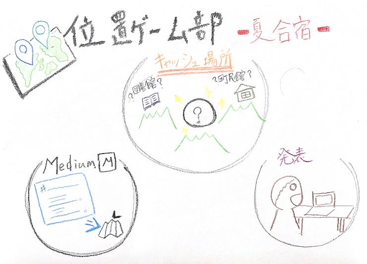
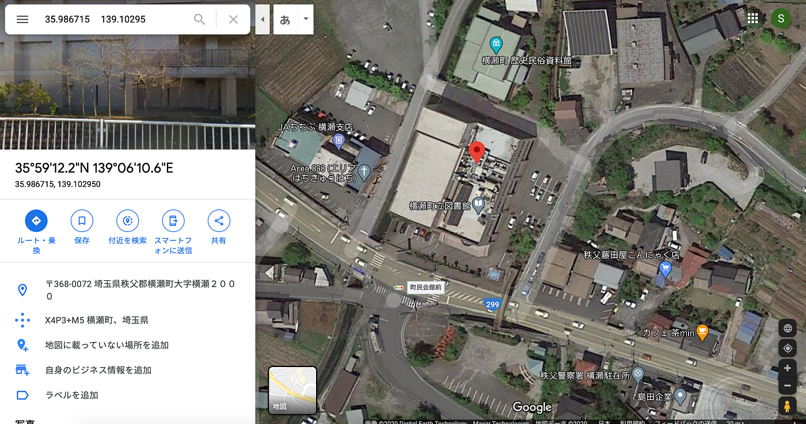

### 位置ゲー部 -夏合宿-

位置ゲー部の夏合宿の成果は以下のスプレッドシートから確認ください↓
[https://docs.google.com/spreadsheets/d/1DSGIskhv6l6W5OnXSPVH3BjUJTRl9tQriXr9eFvD2G4/edit#gid=0](https://docs.google.com/spreadsheets/d/1DSGIskhv6l6W5OnXSPVH3BjUJTRl9tQriXr9eFvD2G4/edit#gid=0)

今回は役割分担
・キャッシュの場所を決める人
・発表資料を作る人
・発表者

という仕事分担を行い、スムーズに仕事を行うことができました

依田が現地に行ったということもあり、横瀬の実際の状況をみながらの、キャッシュ場所選びができました

隠し場所の一つに、図書館の敷地内の草むらに隠す場所を選んだ

草むらに隠した時に、風や雨でキャッシュがなくなってしまうのではないかと思ったが、他の場所ではどのような対策をしているのかが気になった。
