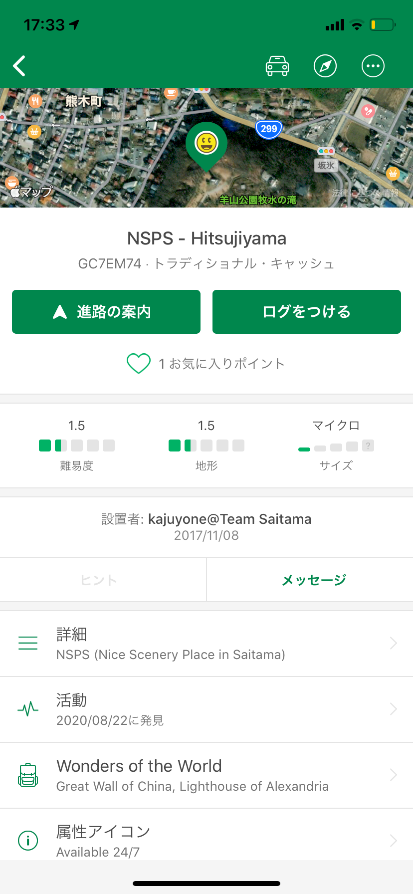
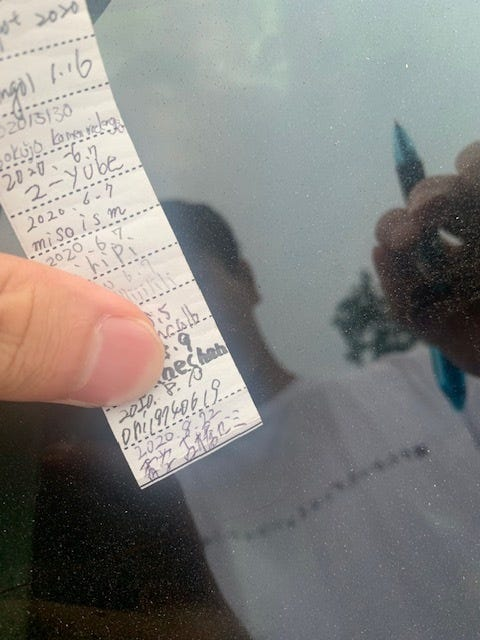
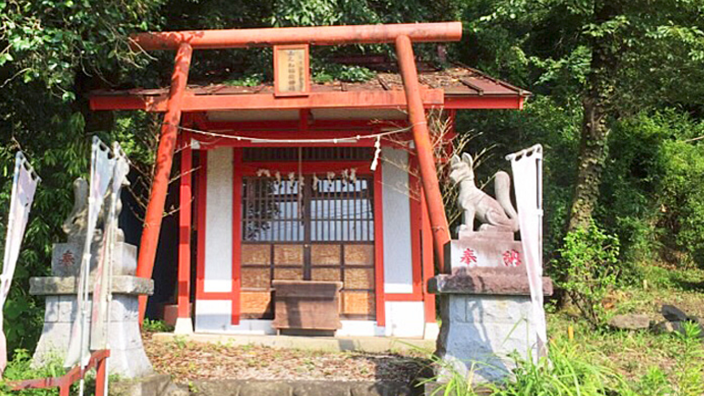
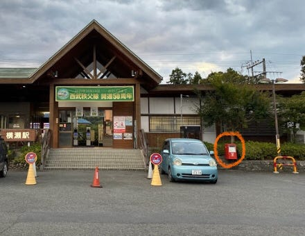
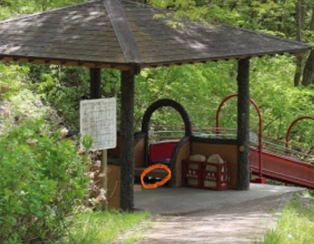
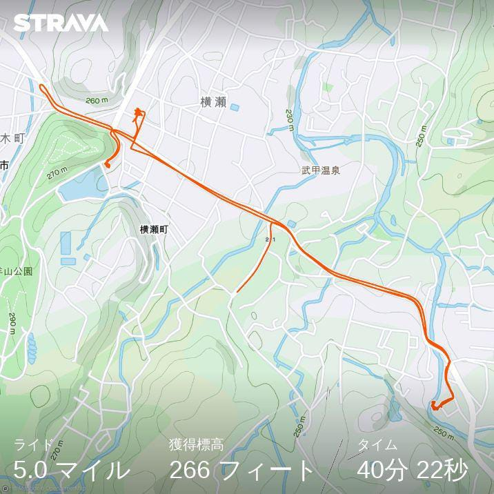
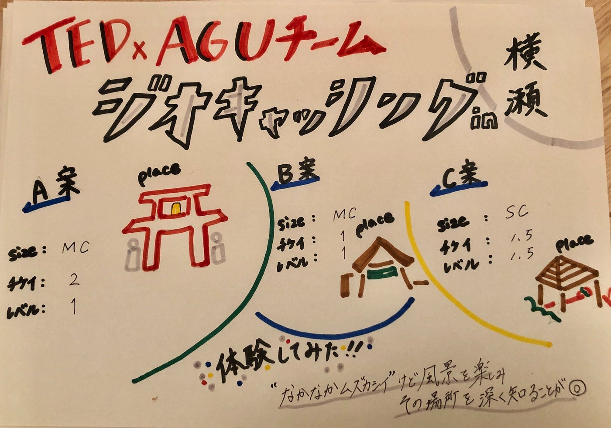

### 横瀬でGEO CASHING！！

２０２０年度の夏合宿は、コロナの影響で日帰り形式になり、限られた人数で行われました。

そして、GEO CASHINGも初めて経験する事が出来ました。GEO CASHINGがどのようなものなのかをまず知るために、我々TEDxAGUメンバーの数名で実際に横瀬に隠されたものを探しに行きました。

一番近い横瀬駅に最初足を運び、探したのですが、なかなか見つからず断念し、別のスポットとして羊山公園にも行ってみたところ、数十分探した上でやっと見つける事が出来ました！

マイクロサイズということもあり、とても小さなカプセルでしたが、その中に紙が入っていて、しっかりサインをすることが出来ました！

この経験を上で、我々は以下の三つの案を出しました。

A案）町長の財産; 稲荷神社

ここでは、マイクロサイズで狛犬の裏に設置することで、神社ならではの場所を探す楽しさを出そうと考えました。

B案）町長の財産; 横瀬駅

横瀬駅のポストは、実際に我々が探した場所でもあったのですが、何も見付からなかったということもあり、このポイントにしました。他の場所よりは比較的見つけやすいのではないかと思い設置案をこの場所に立てました。

C案）町長の財産;横瀬町農村公園

この公園では、長い滑り台があるのが特徴的であり、その出発地点に設置することで、子供でも大人と一緒に楽しく探すことが出来るのではないかと思い、この場所を今回の案に挙げました。

#### ＜Strava＞

([https://www.strava.com/activities/3948540980?share_sig=94B685141598172900&utm_medium=social&utm_source=ios_share](https://www.strava.com/activities/3948540980?share_sig=94B685141598172900&utm_medium=social&utm_source=ios_share))

#### ＜発表用スライド＞

#### **＜グラレコ＞**

