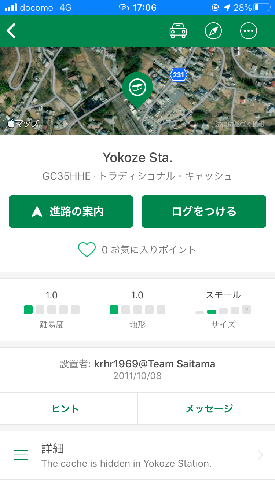
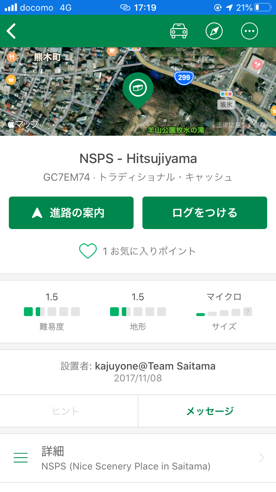
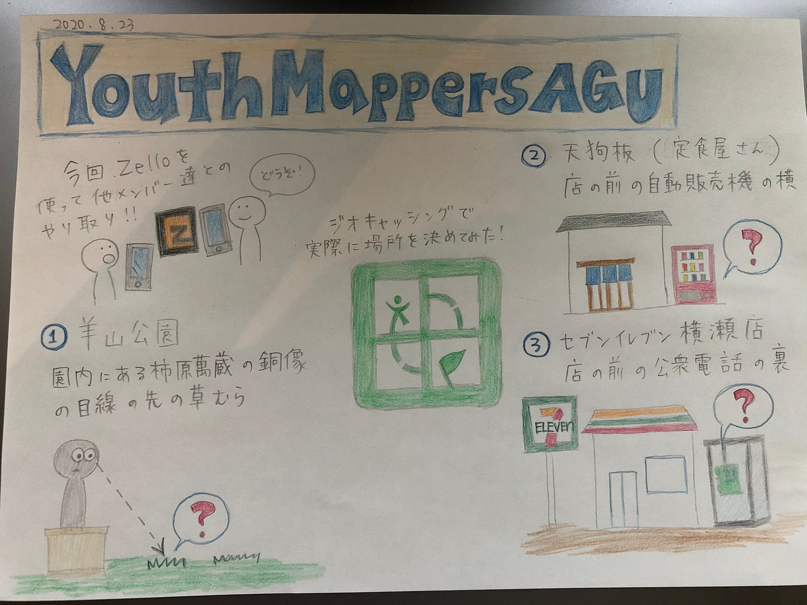

### 灯台下暗しとはこの事

こんにちはYouthMappersAGUの日向野邦春です。

今回は古橋ゼミ合宿でのジオキャッシングについて書きます。

私たちはまずジオキャッシングとはどんなレベルなのかを知るために横瀬市内にある仕掛けを見つけに行きました。

**横瀬駅**

まず向かったのは横瀬駅です。

お宝のサイズはスモールで難易度も１なので比較的に見つけやすいかと思っていましたが結局見つけることは出来ませんでした。駅員さんが片付けてしまったのかもしれません、、、

**羊山公園**

横瀬を見下ろせる丘がある公園ですがとにかく広かったです。

お宝のサイズはマイクロサイズで難易度も横瀬駅よりも少し難しくなっています。30分以上探し続けても見つからずに諦めようとしたその時、、、

転落防止柵の留め具の下に小さなカプセルがくっ付いているのを見つけました。まさかと思って触ってみたら簡単に外すことが出来て中に紙が入っていました。紙に「青山学院大学古橋研究室」と書いておきました。

私たちのジオキャッシング設置場所は羊山公園、うどん屋「天狗坂」とセブンイレブン秩父横瀬店に設置しました。

[Google Sheets - create and edit spreadsheets online, for free.
Create a new spreadsheet and edit with others at the same time -- from your computer, phone or tablet. Get stuff done…docs.google.com](https://docs.google.com/spreadsheets/u/0/d/1DSGIskhv6l6W5OnXSPVH3BjUJTRl9tQriXr9eFvD2G4/htmlview)

