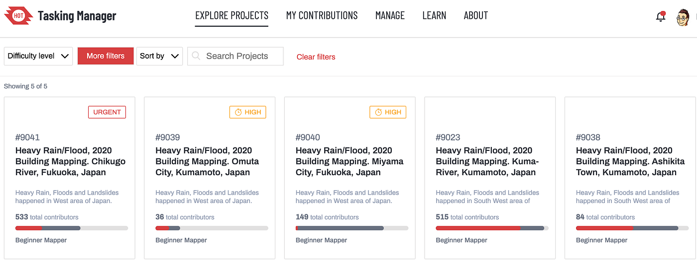
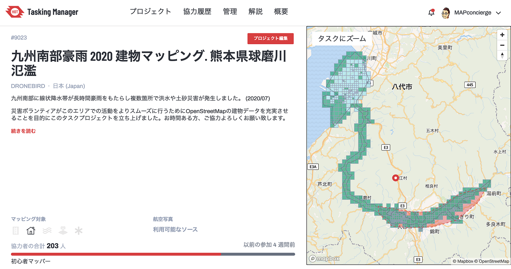
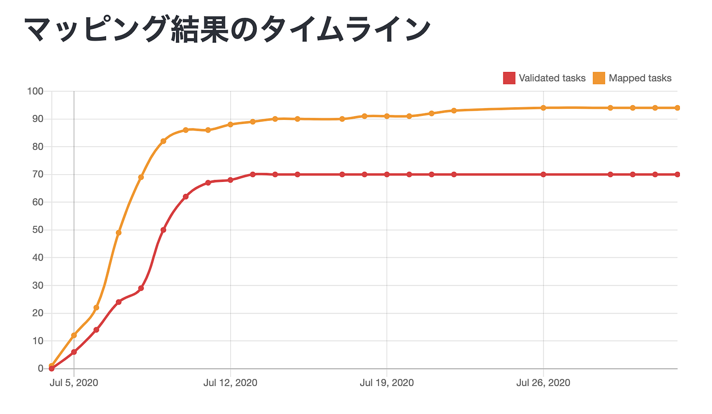
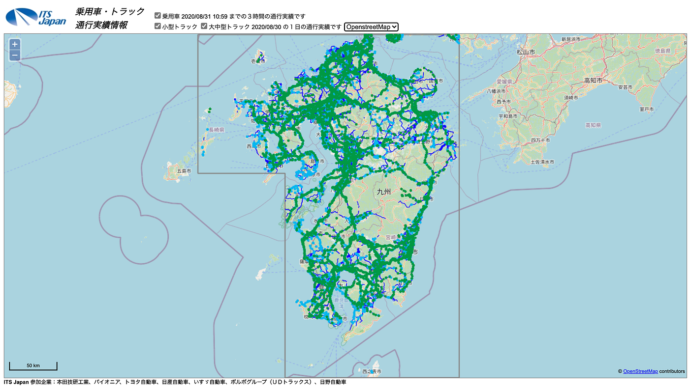
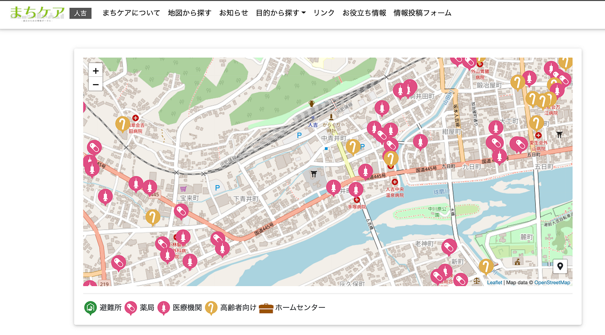
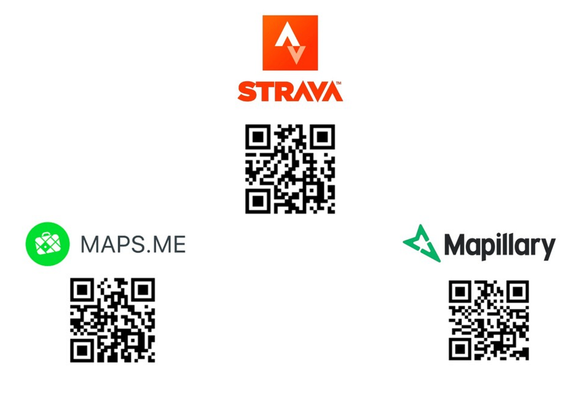
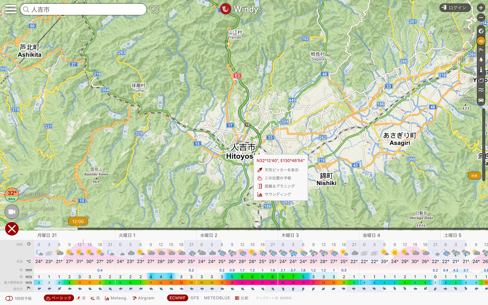

### 令和2年7月豪雨クライシスマッピング参加者数は1,800人超え！しかし課題も多く、改善すべき点をまとめました。

日本各地での水害被害が今年も増えてきました。

7月上旬から降り続いていた線状降水帯による豪雨が、熊本県人吉市を含め複数の県と地域で河川の氾濫、浸水、土砂災害等発生し、甚大な被害が発生しました。

[令和2年7月豪雨
令和2年7月豪雨（れいわ2ねんしちがつごうう）は、 2020年（ 令和2年）7月3日から7月31日にかけて、 熊本県を中心に 九州や 中部地方など日本各地で発生した 集中豪雨である。同年7月9日に、当時継続中だった大雨を 気象庁…ja.wikipedia.org](https://ja.wikipedia.org/wiki/%E4%BB%A4%E5%92%8C2%E5%B9%B47%E6%9C%88%E8%B1%AA%E9%9B%A8)

事態の深刻さに気づき、すぐに災害時の被災地情報支援としてクライシスマッピング活動の準備を行い、2020年7月時点で最新版の [HOT Tasking Manager ver.4](https://tasks.hotosm.org/) のプロジェクト管理者権限を[Humanitarian OpenStreetMap Team](https://www.hotosm.org/)メンバーとして受け取り(TM3以前と管理者権限運用が変更)、球磨川の氾濫による被害が深刻な人吉市やその下流域、そして芦北町の建物マッピングから開始しました。本報告は、この令和2年7月豪雨クライシスマッピングでできたこと、できなかったことを整理し次につなげていくために、まとめてみました。

クライシスマッピングのタスクプロジェクトが立ち上がると、青山学院大学の古橋研究室を中心に多くの学生や[YouthMappers AGU](https://www.instagram.com/youthmappers4agu) メンバー、OpenStreetMap Japan Slackチーム、熊本のテクノロジー集団 [KumaMCN](https://www.facebook.com/groups/KumaMCN/) にHOTを中心とした海外勢、さらに Mapbox の Minsk チームが合流して、全体での参加人数(Total Contributors) が延べ 1,866人 (2020/08/11 現在)が、[計５つのクライシスマッピングプロジェクト](https://tasks.hotosm.org/explore?campaign=DRONEBIRD)に取り組んでくれ、そのエリアのほぼすべての建物入力をコンプリートしました。

[#9023 Kuma River 554 contributors (203 total contributors)](https://tasks.hotosm.org/projects/9023)
[#9038 Ashikita Town 95 contributors (38 total contributors)](https://tasks.hotosm.org/projects/9023)
[#9039 Omuta City122 contributors (66 total contributors)](https://tasks.hotosm.org/projects/9039)
[#9040 Miyama City 188 contributors (66 total contributors)](https://tasks.hotosm.org/projects/9040)
[#9041 Chikugo River 907 contributors (254 total contributors)](https://tasks.hotosm.org/projects/9040)

ただ、今回の建物マッピングで使用した航空写真は国土地理院の[地理院地図](https://maps.gsi.go.jp/)タイル「[全国最新写真（シームレス）](https://maps.gsi.go.jp/development/ichiran.html#seamlessphoto)」を前提にしていたため、発災後の航空写真は2004年〜2009年を中心とした10年以上前に撮影された情報であり、解像度は粗いけれども最新のMAXAR画像を併用しながらのマッピング作業と発災前のデータに依存せざるを得ない状態でした。また、作業途中で国土地理院の発災後撮影画像のオルソモザイクデータが公開されると想定して、段階的に公開された「斜め写真」は参考程度に用いていましたが、今回の令和2年7月豪雨災害としては、8月31日現在国土地理院からはオルソモザイク画像までは公開されず、その想定が外れました。

[令和2年7月豪雨に関する情報
(斜め写真) 久留米地区（福岡県久留米市、筑後市、大川市、小郡市、うきは市、朝倉市、大刀洗町、大木町、広川町、佐賀県鳥栖市、神埼市、上峰町、みやき町）（7/8撮影）…www.gsi.go.jp](https://www.gsi.go.jp/BOUSAI/R2_kyusyu_heavyrain_jul.html)

一方で、今回の被災地は [災害ドローン救援隊DRONEBIRDの災害協定締結エリア](https://github.com/crisismappersjapan/agreement4dronebird_CMJxLGOV)ではないため、災害時とはいえ要請なく被災地各地の上空をドローンで勝手に空撮することは難しかったと言わざるを得ませんでした。発災後の被害状況を迅速にマッピングする目的は航空写真以外の情報を基に行わざるを得ず、十分には達成できていないというのも今回のクライシスマッピングの課題といえます。国土地理院の斜め写真が公開された時点で、地理院側のオルソモザイクデータ公開を待つのではなく、迅速にオルソモザイク処理を独自に実施し、[OpenAerialMap](https://openaerialmap.org/) などに展開すべきでした。

[crisismappersjapan/agreement4dronebird_CMJxLGOV
NPO法人クライシスマッパーズ・ジャパン/ドローンバードと各地自治体等とのドローン防災協定書関連. Contribute to crisismappersjapan/agreement4dronebird_CMJxLGOV…github.com](https://github.com/crisismappersjapan/agreement4dronebird_CMJxLGOV)

課題は多く指摘されましたが、いずれにしても、延べ1,800名を超えるクライシスマッピングが、今まで充実していなかったエリアの [OpenStreetMap](https://www.openstreetmap.org/#map=9/32.5538/130.9433) データ粒度を高め、65,000軒以上の建物外形が入力され、より使いやすいデータセットとして素早く整備されたことは、各地の災害現場で活動する救援隊・災害ボランティアを間接的に支援したことは事実でもあります。

ここでは、クライシスマッピング活動で整備された地図データがどのように現場で使われているか、具体的な利用方法を紹介します。

まず、発災後すぐに必要になるのは、**どの道路が通行可能で、どの道路が車が通行できないのか**を、可能な限り正確に現場に向かう救援隊に伝えることです。

東日本大震災以降、カーナビデータから抽出された通行実績データは、通れた道マップとして[ホンダ](https://map.yahoo.co.jp/maps?layer=in&v=3)や[トヨタ](https://www.toyota.co.jp/jpn/auto/passable_route/map/)、[パイオニア](https://www.geospatial.jp/gp_front/content/75ea6688-3bbd-43d8-8b76-9db4c3b2abf7) 等が迅速に公開するケースが増えてきましたが、各社プラットフォームがバラバラで総合的に把握することが難しい課題がありました。現在は、各社のデータを取りまとめている ITS Japan が通行実績情報として発災時には公開する体制ができ、その背景地図には地理院地図とOpenStreetMapが使われています。またITS Japan の通行実績情報には「**小型トラック**」と「**大中型トラック**」の種別が有り、小型乗用車とは区別したルートの確認が可能になる点で優れています。日頃より連携している団体には、この通行実績情報が公開されると同時に、我々からも通知し、情報を共有しています。

[ITS Japan 通行実績情報
ITS Japan 参加企業：本田技研工業、パイオニア、トヨタ自動車、日産自動車、いすゞ自動車、ボルボグループ（ＵＤトラックス）、日野自動車disaster-system.its-jp.org](http://disaster-system.its-jp.org/map4/map/#map=8/32.567711/131.338119&layer=osm)

被災地の災害ボランティア活動で重要なのは、現在の避難状況と町の復旧・復興状況を地図で一覧できること。災害対策本部でも大判の紙地図が張り出されて、様々な情報が上に書き込まれていきますが、草の根の被災地復興マイマップは行政のような公的機関とは別に、各地で自発的に情報ボランティアが公開をしています。

その中で、我々のクライシスマッピングデータを素早く活用しているのが、2018年の西日本豪雨災害時に真備町で活用された「[まびケア](https://mabi-care.com/)」をベースに改良された「[まちケア](https://machicare.jp/)」です。OpenStreetMapの上に、POIsデータと呼ばれる地点情報を避難所、薬局、医療機関、高齢者向け施設、ホームセンターなどでカテゴライズして情報提供が行われました。

[まちケア
まちケアは災害の被害を受けた町の復旧、復興する間、 色々な人々から必要な情報をできるだけ素早く集めて発信する情報サイトです。machicare.jp](https://machicare.jp/)

2020年は、新型コロナの影響で県外からのボランティア受け入れができないといった厳しい状況ではありますが、2019年の[全国災害ボランティア支援団体ネットワーク(JVOAD) ](http://jvoad.jp/)全国フォーラムで、筆者は災害ボランティアが現場で使うべきスマホアプリを３つ取り上げ、その活用方法を共有しました。

今回の災害でも問題となった、電気・通信インフラの途絶は、せっかく便利なスマートフォンの価値を押し下げます。もちろん Googleマップも見れなくなりますし、スマホナビアプリの殆どはオンラインが前提の仕組みになっています。しかし、OpenStreetMapは誰もが自由にコピーし、配布することが最大の特徴。そこで活躍するのがオフライン地図アプリ [MAPS.ME](https://maps.me/en/download/) です。現場へ向かう前に事前にスマホに地図をダウンロードしておくことで、カーナビ代わりにスマホがGPS利用可能な詳細のナビ地図を提供します。

[Maps.me
MAPS.ME - not just an app but a friend in all your adventuresmaps.me](https://maps.me/en/download/)

自分たちがどこでどんな作業をしたのかを記録し、他人と共有するのは非常に難しいです。しかも、その作業コストも大きいので通常は大まかな住所や字名程度でしか共有されません。しかし、現地を徒歩や自転車で移動して、その移動の軌跡を記録するにはランニングやサイクリングのアクティビティをスマホで保存することができる [Strava](http://strava.com/) は非常に便利です。

[Strava | Run and Cycling Tracking on the Social Network for Athletes
Designed by athletes, for athletes, Strava's mobile app and website connect millions of runners and cyclists through…strava.com](http://strava.com/)

そして、現地の被害状況を正確な位置情報とセットで伝えるには、市民参加型のストリートビュー写真共有プラットフォーム [Mapillary](https://www.mapillary.com/) を用いることで、撮影場所、カメラの向き、そして時系列データなどが整理され、機械学習も含めたオブジェクト認識から、特徴点を用いた点群データ生成までが自動的に行われます。このような写真を基に、クライシスマッピングチームが適切に最新の情報を取得して、地図更新に役立てます。

[The street-level imagery platform that scales and automates mapping
Mapillary is the street-level imagery platform that scales and automates mapping using collaboration, cameras, and…www.mapillary.com](https://www.mapillary.com/)

これら以外にも、例えば気象情報アプリ [Windy](https://www.windy.com/) は OpenStreetMap の上に、様々な気象情報を重ねて表示し、現地活動の安全管理に貢献しています。災害ドローン救援隊DRONEBIRDでも、高度ごとの風速確認など安全なドローン飛行を行う上で欠かすことのできないアプリです。

[Windy as forecasted
Weather radar, wind and waves forecast for kiters, surfers, paragliders, pilots, sailors and anyone else. Worldwide…www.windy.com](https://www.windy.com/)

他にも現地の災害ボランティアや、被災されている方々、復旧復興に関わられている様々な組織で Googleマップだけではなく OpenStreetMap もまた活用されているでしょう。もし他にも活用事例をご存知でしたら是非教えていただければ幸いです。

OpenStreetMapの良いところは、まさに自由に商用利用も複製も可能なため、データ整備しているボランティアマッパーが想像しないような使われ方をされているケースもよくあります。もしかすると、普段遣いのツールが知らない間に OpenStreetMap を使っているかもしれません。日本でOSMコミュニティが立ち上がって12年、ようやくOSMはあって当たり前の地図インフラとして機能してきたと感じています。

今回のクライシスマッピングは、これで終わりというわけではありません。今年水害が発生した場所は、この先の未来もまた洪水や氾濫、土砂災害に見舞われる可能性が非常に高いエリアです。また、今回被害が大きかったエリアでクライシスマッピングプロジェクトを立ち上げられなかったエリアもたくさんあります。

我々の先人の知見でもあるハザードマップと、今回の被災地を見比べながら、近い将来起こるであろう同様の災害を先回りし、より迅速に、効果的な地図づくりを行えるよう、今回乗り越えられなかった多くの課題をひとつひとつクリアしていきながら、草の根のクライシスマッピング活動の拡充に引き続き取り組んでまいります。

最後に、今回の令和2年7月豪雨クライシスマッピングに様々な形で参加いただいたボランティアマッパーのみなさんに感謝申し上げます。
