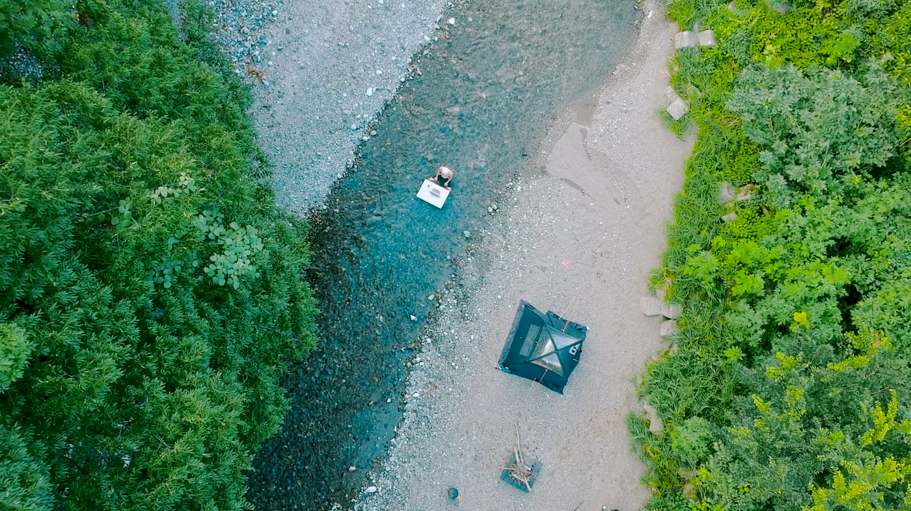
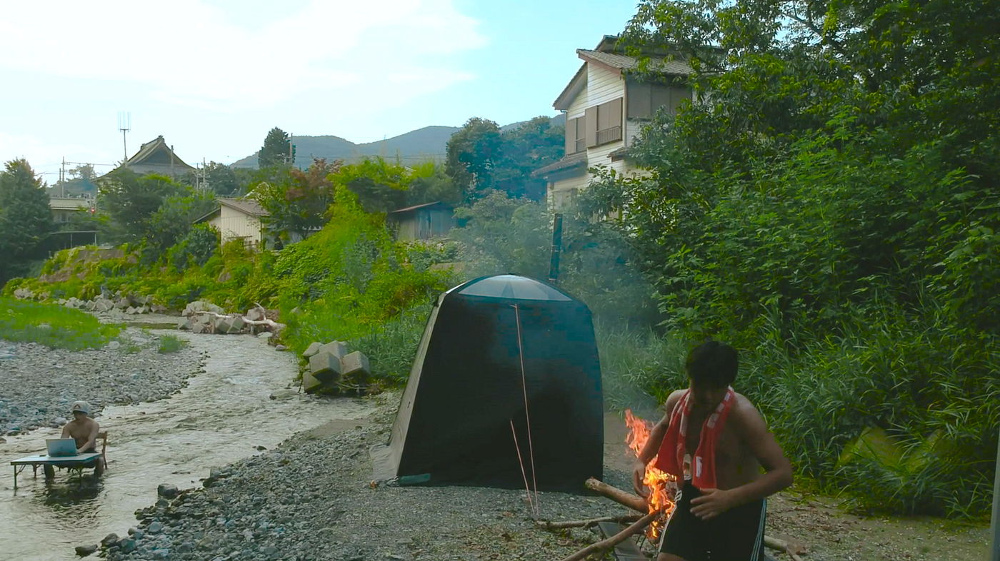
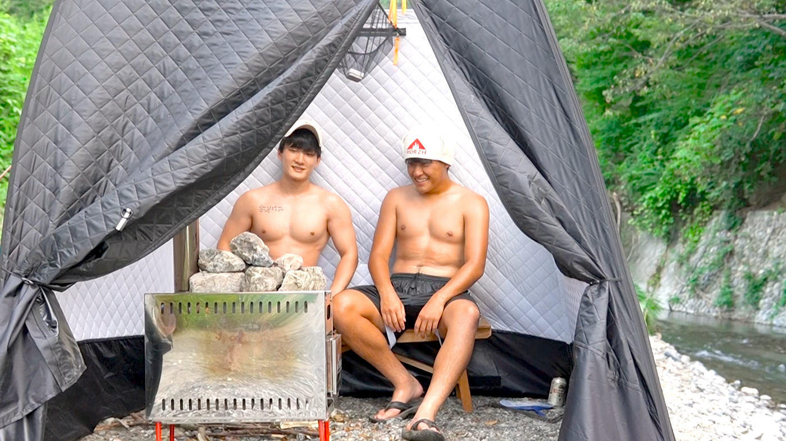
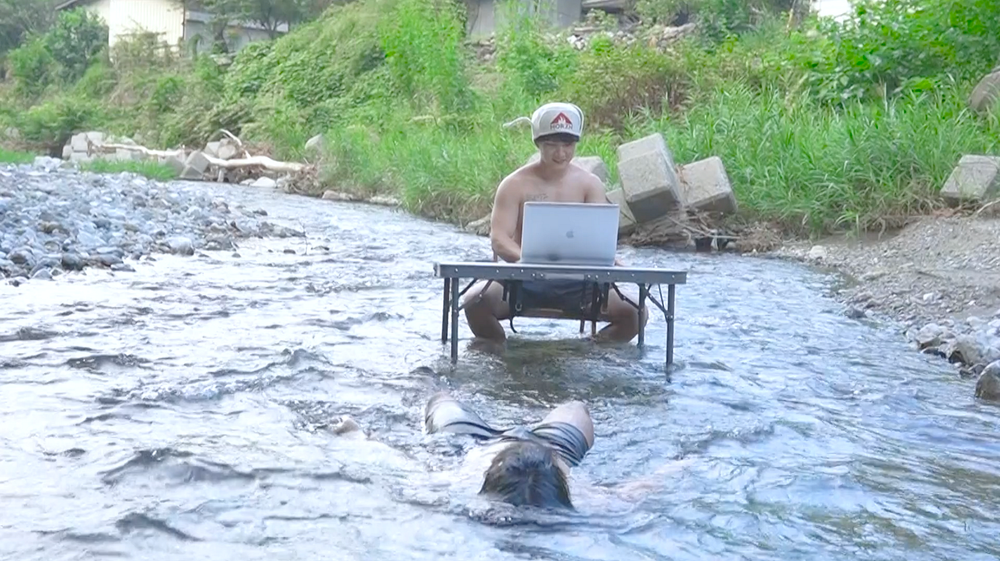

### 横瀬部/夏合宿ー川とサウナとリモートワーク

こんにちは！古橋ゼミ4年のイジユルです。今回のゼミ合宿では夏合宿のメインと言えばメインである**「川とサウナ」**を担当させて頂きました。

**「川とサウナ」って何？**と思うかたがいらっしゃると思うので、先に「川とサウナ」について説明します。

> 「川とサウナ」コンセプト

> 木々の木漏れ日 清流のせせらぎ 小鳥のさえずり

> この、圧倒的大自然が広がるのは埼玉県横瀬町。
僕たちはここにサウナを作りました。

> サウナの中でヒリヒリと上がる肌の温度。
滴り落ちる汗。

> サウナから出ると、目の前には横瀬の山々が恵んでくれた清流があります。

> カラダを…投じる。

> カラダが不思議な衣に包まれ、多幸感に満たされます。
川から上がると、自分の五感が研ぎ澄まされていることに気づくでしょう。

> 全身に自然を注入するディープリラックス体験、
それが「川とサウナ」です。

> 参照ー[川とサウナチーム](http://kawatosauna.love/)

こちらは日本で「川とサウナ」で最も有名な川とサウナチームのホームページから参考して頂きました。今回の合宿でも実際に「川とサウナ」チームとのオンラインミーティングで「川とサウナ」に関する様々な情報収集した上で準備を行っていきました。

#### 川とサウナとリモートワーク

今回の合宿では「川とサウナ」というコンセプトに「リモートワーク」というキーワードを追加し、新たなコンセントを作り出しました。

> WITHコロナの影響でリモートワークが増えてきた現在、ネット環境がある建物でしかできなくなり、自然と触れ合う機会が沢山減ってきたと思います。毎日同じような空間での仕事に疲れた人々に一日だけでも自然と触れ合いながら、自由に仕事できる環境を与えたいと思い、今回の「川とサウナとリモートワーク」を作り出しました。

今回は本番のイベントを主催する前のプレイベントとしてイベント全体の構想と広報材料を集める事をメインに行いました。

まず早速今回合宿で作った動画をご覧になってください

[https://youtu.be/up45pogjeOY](https://youtu.be/up45pogjeOY)

[YOKOZE x SAUNA x RemoteWork](https://youtu.be/up45pogjeOY)

ご覧のように大自然の中でリモートワークとサウナ、バーベキューをするというバランス良い組み合わせで日常の疲れを一気に打破！！できるような物を作り出す事が横瀬部の夏合宿のメイン課題でした。

サウナテント構築、野外ワイファイ環境構築など準備する上で沢山の障害物がありましたが、部員同士で数回のブレーンストーミングを行い、沢山のアイデアを出し、今回のゼミ合宿で無事にプレイベントを行う事ができました！

次は本番のイベントを向けて続々準備していきたいと思います。

最後に今回の企画を行う上で協力してくださった「川とサウナ」チーム、古橋先生に感謝の言葉申し上げます。
