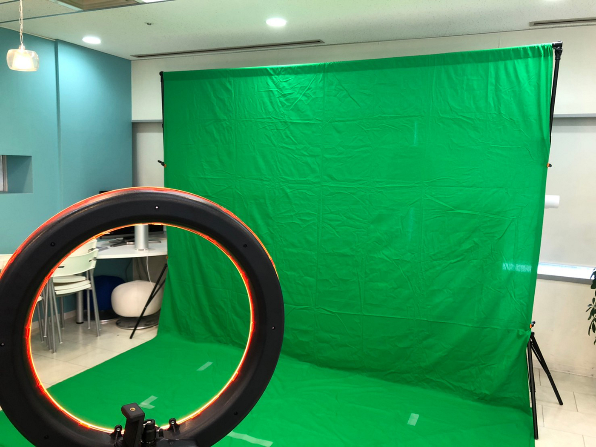
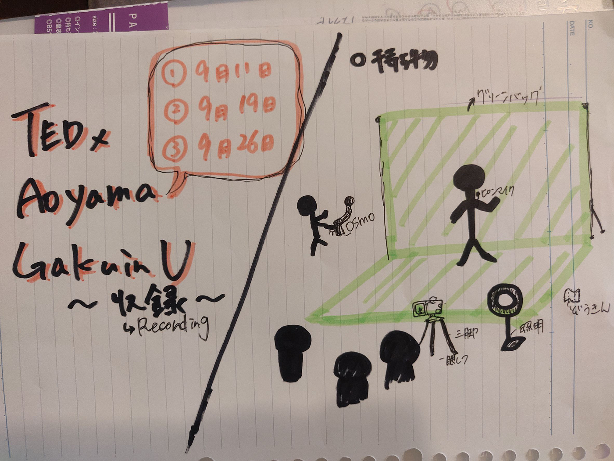

### TEDｘ撮影収録開始！

本番まで一か月切ったということでスピーカーの皆様の収録が始まりました！

> 〇活動チーム

> ・収録

> ・動画編集チーム

> ・stylyチーム

> ・配信チーム

> ・スピーカーチーム

> ・チケット販売

> 〇収録場所について

> ・相模原キャンパスB棟、、、古橋先生の全面協力にて相模原キャンパス のスタジオを借りることに成功しました！

> ・DHCスタジオ、、、渋谷のDHCが提供する無料スタジオ、しかし課題が 浮上！

(in DHCスタジオ)

> 〇撮影日スケジュール
●15日 @さがきゃん
13:00–15:00 田中さん
15:00–17:00 邦春
●19日 @DHCスタジオ
10:00–12:00 yutaさん
14:00–16:00矢島さん
15:00–16:30森さん
16:00–18:00 シーラさん
●26日 @DHCスタジオ new 新しく予約取りました
10:00–18:00
10:00~12:00エリックさん
14:00–16:00豊増さん
16:00–18:00片岡さん
●未定（21日以降 or 平日）
川崎さん

上記の日程で撮影を行い、多くの課題やトラブルが発生しながらも、TEDｘメンバーや先生、スピーカーの皆様の協力のおかげで無事六名のスピーカーの方々の収録が終わりました。

> 〇課題・トラブル

> ・スケジュール調整、時間調整がうまくいかなかった

> ・スタジオの騒音が予想以上に大きくてスピーカーの声が聞こえづらい

> ・スピーカーの方々との空間制作に対する誤解

> 〇今後の流れ

> 今後は収録した動画を編集、BGM探し、スピーカーの紹介VTR作成、配信方法に関して、チケット販売等終盤に向かっていくにつれてメンバー一同全力で活動を進めていきたいと思います。

