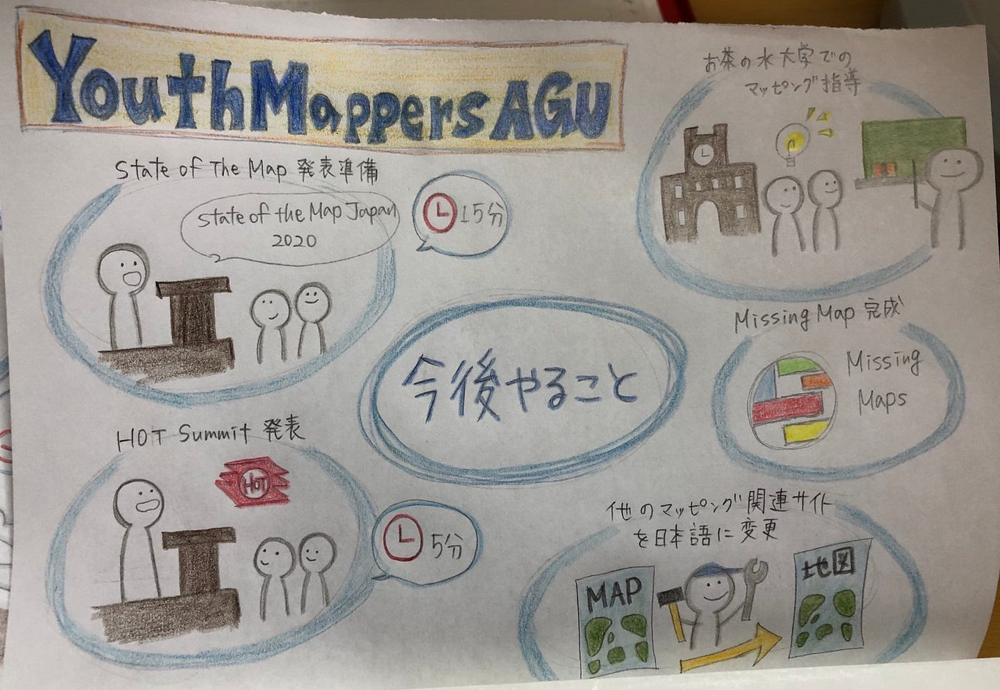

### YouthMappersAGUのこれまでとこれから

お久しぶりです！３年の日向野邦春です。

後期になってYouthMappersAGUとしての活動を再始動させていきます。

まず、私たちは前期期間にMapSwipeの日本語化や九州豪雨のクライシスマッピングなどを行なってきました。毎月行われていたハッカソンを迎えるたびに自分たちのスキルが上がっているのを感じれました。

**しかし、今までと同じことをしているだけでは成長はありません！**

後期は今までの経験を生かした活動を行なっていきたいと思います。

#### ①MissingMaps日本語化 完了

まずは、前期に取り組んだMissingMapsの日本語化を終わらせて目にみえるようにサイトを作る事です。MapSwipeとMissingMapsという2つのサイトを日本語化した実績は必ず生かされると思っています。

#### ②State of The Map,HOT summitでの発表

これまで取り組んできた事をアウトプットする舞台としてこの２つの国際会議で我々の活動を発表しようと思います。この２つの発表に向けた準備も進めていきます。

