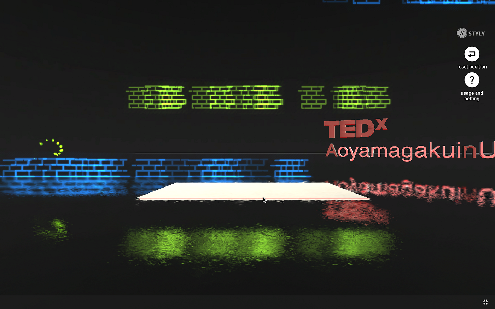
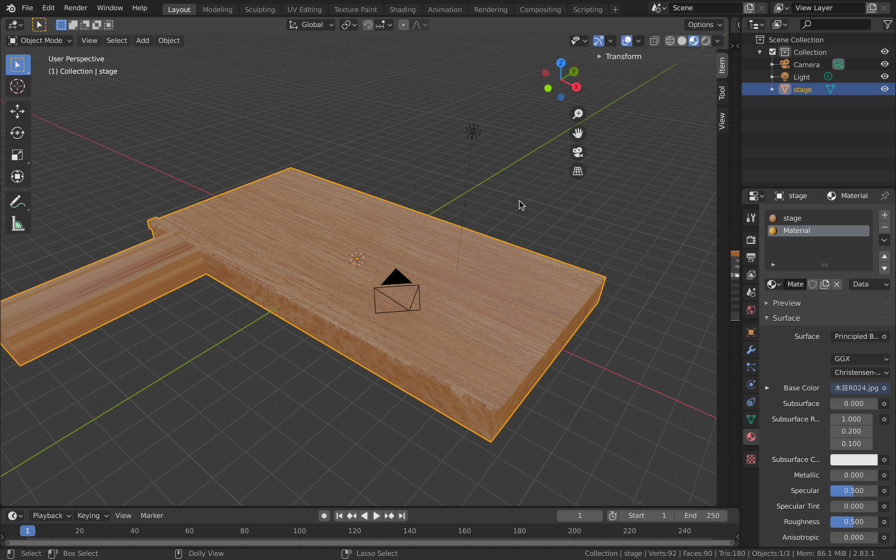
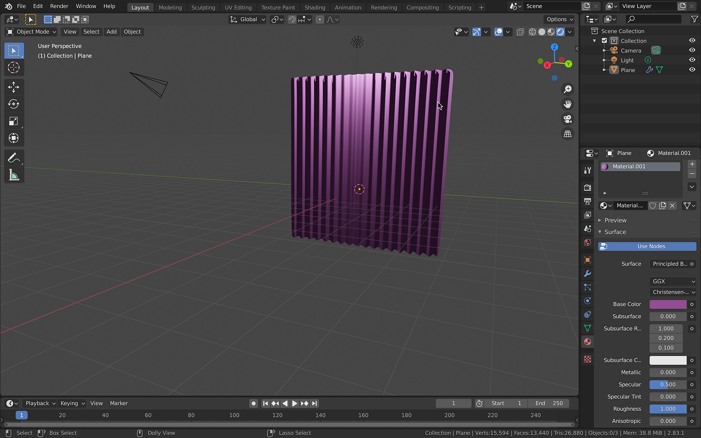
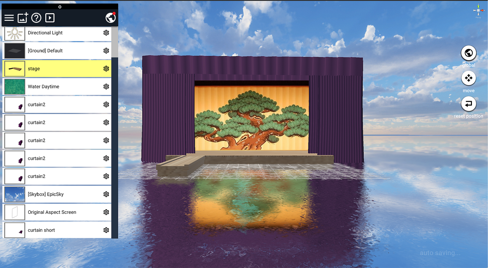
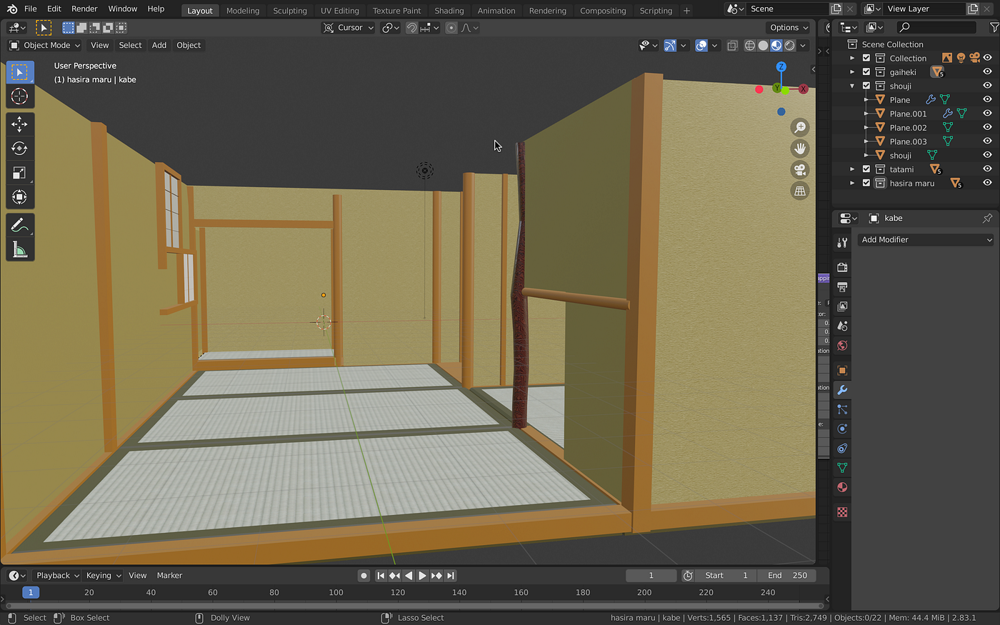
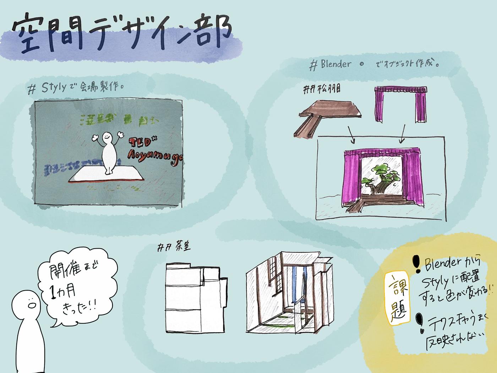

### 会場づくり奮闘中

空間デザイン部は前期に引き続き、10月18日開催のTEDxAoyamaGakuinU に向けて活動しています！

空間デザイン部、ものづくり部、TEDxAoyamaGakuinUの3部活合同で動いているのですが、今回はその中のStylyチームの活動を報告したいと思います。

その前に…

#### ＃役割分担を明確にしました！

> 全体リーダー：馬場 
サブリーダー：浜野 
ホログラムリーダー：青木
STYLYリーダー：川嶋 
配信担当：若松 
撮影リーダー：水谷

に決定。リーダーが多い！！

### #Stylyチーム活動報告

StylyチームではStylyを活用し、各スピーカーさんに合わせた空間を作成しています。

[STYLY - VR creation platform
3DModel Sketchfab TiltBrush Photogrammetry PDF Image/Video Architecture…styly.cc](https://styly.cc/ja/)

若松作、我らが古橋ゼミに所属している日向野さんの会場。

[kuniharu
Edit descriptiongallery.styly.cc](https://gallery.styly.cc/scene/4ea3d1cf-ba4f-496e-95b4-de8ca304aaf9)

#### ##Blenderでオブジェクト作り

Stylyにはすでに3Dオブジェクトがあるのですが、それだけでは再現できないものをBlenderで作成しています。

[blender.org - Home of the Blender project - Free and Open 3D Creation Software
Open source 3D creation. Free to use for any purpose, forever. Blender is the free and open source 3D creation suite…www.blender.org](https://www.blender.org/)

**歌舞伎 松羽目**

松羽目を再現するため、ステージと幕を作成し配置しました。

実際にStyly上に配置！

**茶室**

スピーカーの方から頂いた写真を元に茶室を作成しています。

Blenderに触れ始めたのがつい最近なのでyoutubeなどを参考に勉強中なのですが、

> Blenderで作成したものをStylyに配置すると色が変わってしまう

> テクスチャがうまく反映されない

といった問題が発生中。改善策を探しています。

いよいよ開催まで1ヶ月を切り、撮影や動画編集が本格的に始まりました。素晴らしいイベントになるよう心を引き締め頑張っていきます。

グラレコ

