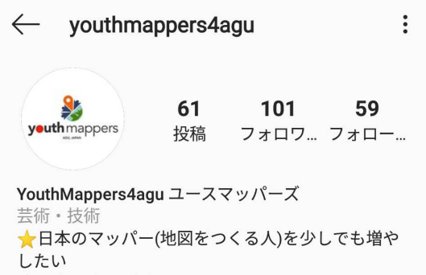
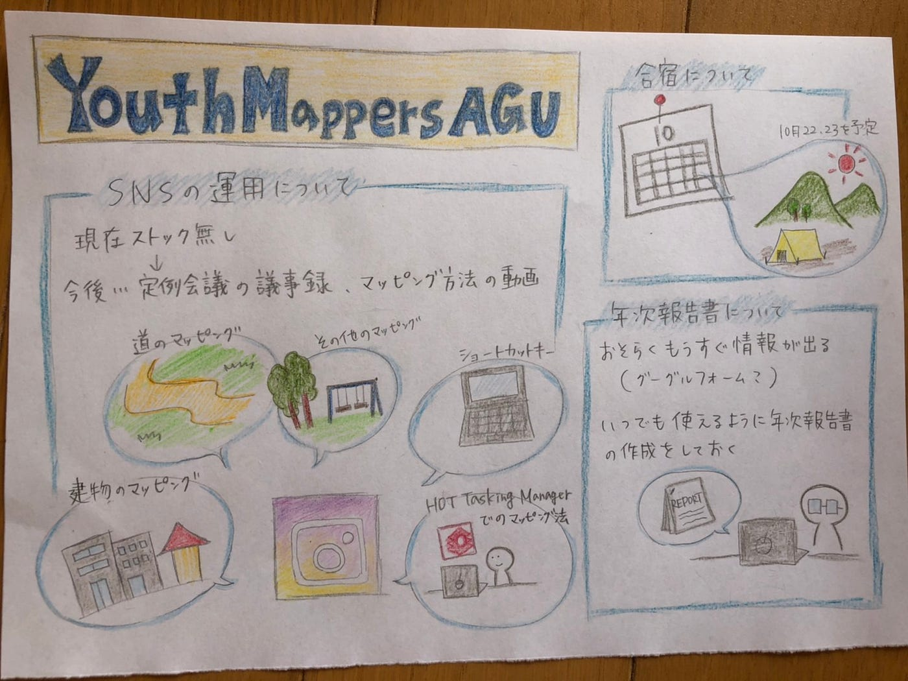

### マッピング方法の動画作成

今回は後期になって二回目の定例会議です

今後の具体的な活動について話しました

タイトルにあるように、Instagramでマッピング方法の動画を投稿することになり、まずはアカウント作成方法を今月中に投稿予定です

#### Instagramでは、先日フォロワー100人を突破しました！

投稿を見てくださっているみなさん、ありがとうございます

今後も継続して投稿できるように活動していきます！

また、YouthMappersの年次報告書の提出について、昨年の提出フォームから11月ごろに提出期限がくると思われます

まだ詳細がわかりませんが、今後どこかで活動について発表する機会があったときのためにこれまで一年間取り組んできたことをまとめたものを作成することになりました

上記に加えて、マッピング作業も続けていきます

担当：髙橋
