### ガチャムクかける？

こんにちは、グラレコ部大岸です。
今週もグラレコ部週報をお届けします！

#### ##描いてみようチャレンジ

久しぶりのミーティングだったので、アップがてら恒例の描いてみようチャレンジをしました！
今回はコロナ関連のワード4つ＋おまけ付きです。

**①ソーシャルディスタンス：20秒**

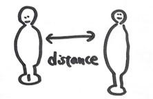

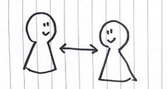

**②コロナウイルス：20秒**

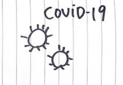

**③リモートワーク：30秒**

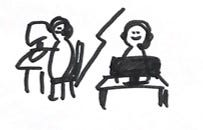

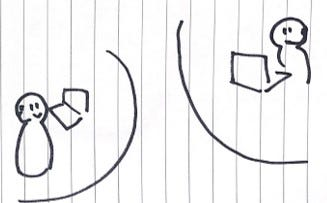

**④３密：2～3分**

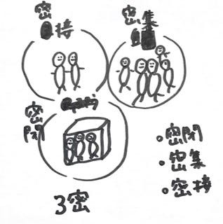

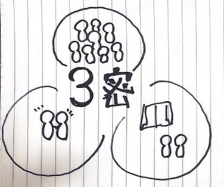

**おまけ（何も見ずに描いたガチャムク）**

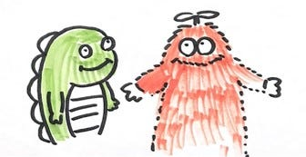

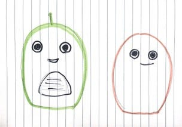

コロナワードの4つは、お互い似たような感じが多かったです。
共通していた部分は、多くの人にとってもイメージしやすいということだと思います！
対してガチャムクは、記憶力の差が歴然ですね…笑
皆さんにもぜひ何も見ずに描いてみていただきたいです！

#### ##宿題

次週から後期第1回目のハッカソンが開催されます！
今回はガチャムクとのコラボハッカソンということで、「ガチャムクハッカソンのロゴ」をそれぞれ考えてみました。

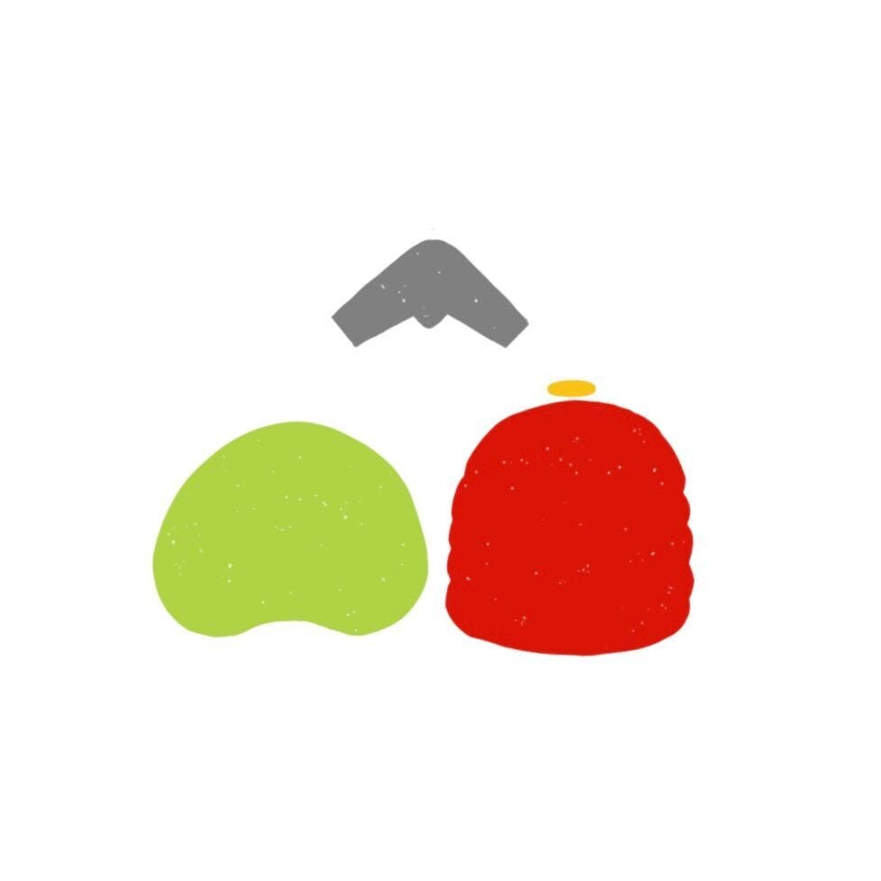

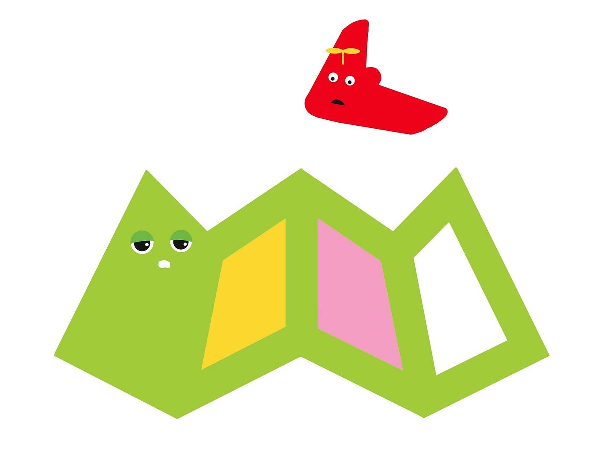

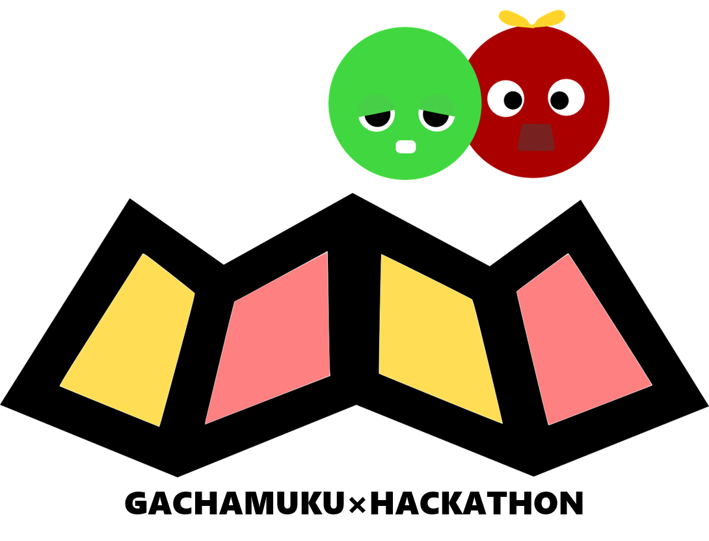

条件は、”古橋研らしさを入れること”。
見比べてみると似たようなアイデアを使いつつ、それぞれ独自の作品になりました。
今回のハッカソンで登場する機会があれば嬉しいです…！

#### ##グラレコ

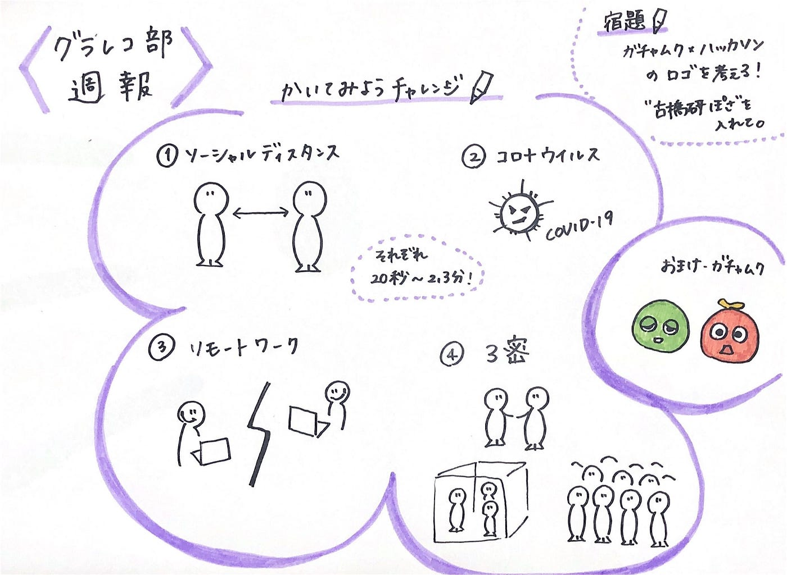

青山学院大学 古橋研究室 3年

大岸 裕紀
