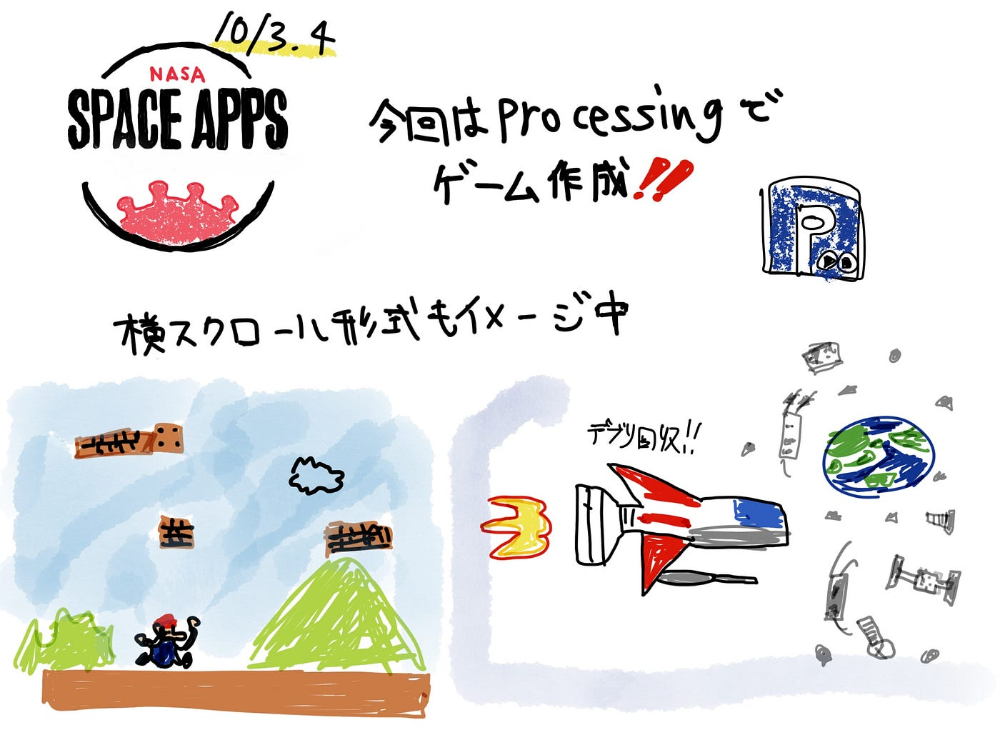

### SpaceApps これでいけそう？

#### Processing初心者

次回の[NASA Space Apps Challenge](https://www.spaceappschallenge.org)に向けての準備をしています。今回は[Processing](https://processing.org)というプログラミング言語を用いて簡単な子供向けゲームを作成するという方向でいこうと考えています。

Processingは電子アートとビジュアルデザインのためのプログラミング言語で、視覚的なアウトプットが簡単に得られるように設計されたプログラミング言語です。言語の構造はJavaと等しいので基本的な文法も学ぶことができるようです。ほぼ知識ないですががんばりたいと思います。

#### Processing × NASA Space Apps Challenge

SpaceAppsではNASAが公開するなんらかのデータを用いてプロジェクトを立てる必要があります。そこでインベーダーゲームのようなノリでプレイヤーの機体をNASAの公開する宇宙船かなにかの画像データとして使い、宇宙ごみ（スペースデブリ）を回収or破壊するミニゲームを考えました。またはNASAのスペースシャトルが次々と降りかかってくるデブリを避けまくるスクロール形式のゲームも考えました。

イメージと参考

[Processingで横スクロールアクションゲームをつくる【その１】
この記事で学べるもの processingでのキャラクターの描画 キー入力によるキャラクターの動作 突然ですが「ゲーム」と聞いてまず思い浮かべるのは何でしょうか。…harilab.com](https://harilab.com/2019/07/03/mario1/)

[[Processing]マップスクロールとかアニメーションとかやってみた - Qiita
ピクセル配列を使ってマップスクロールする Processingで ・キャラクターのアニメーション ・物理シミュレーション（重力） ・マップスクロール（ピクセル配列） Qなぜピクセル配列でマップスクロールするのか A.マップ...qiita.com](https://qiita.com/NekoCan/items/29352147ab6917a0bd50)

#### 目的

このゲームをプレイすることで子供たちが年々深刻化する宇宙ごみ（スペースデブリ）について意識できる機会を作り、またそれをきっかけに宇宙について関心を持つという期待を込めた教育的な遊べるコンテンツを目指します。少しググったところ[全く同じようなコンセプトのゲーム](https://bonusstage.net/debris/)が既にいくつか発見されましたが自分なりにオリジナル要素を模索していけたらと思います。素人でどこまでの完成度を目指せるか不安ですがチャレンジしてみます。

#### 参考

JAXA スペースデブリ除去システム

[https://youtu.be/ZM2QMBGU9xE](https://youtu.be/ZM2QMBGU9xE)

スペースデブリの問題点

[https://www.sfinter.com/topics/post-955/](https://www.sfinter.com/topics/post-955/)

#### グラレコ

