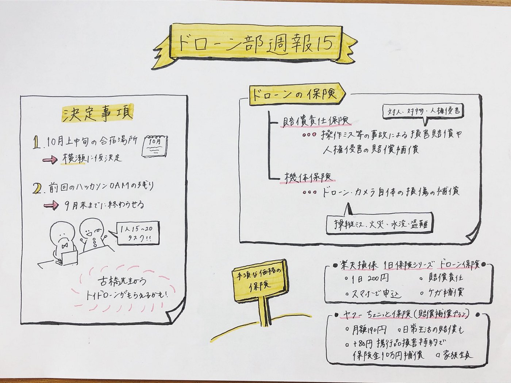

### ドローン部週報15

先週のミーティングでは今後の活動について話し合いました。

#### **＃＃決定事項**

・10月上中旬の合宿場所は横瀬に仮決定

・前回のハッカソンだった草津のOAMのアップロードの残りを、1人15〜20タスクに分担して9月末までに終わらせる

→古橋先生からトイドローンを頂けるかもしれません！

#### **＃＃今週のドローンニュース**

#### **「ドローンの保険」**

現在様々な場面で使われているドローンですが、事故やトラブルも多発しています。

農薬の散布中のヘリコプター型機体の回転翼が操縦者にぶつかり、死亡事故や重傷事故に、また岐阜県のイベントではお菓子をまく機体が墜落して軽症を負う人が出るなど、人命に関わる事故も、、、

→事故やトラブルに備えてドローンの保険に加入！

#### ＃＃一般的なドローン保険の種類

**１、** **賠償責任保険…操作ミス等の事故による損害賠償や人権侵害の賠償補償**

・対人賠償

・対物賠償

・人格権侵害

**２、** **機体保険…ドローン・カメラ自体の損傷の補償**

・操縦ミスによる破損

・火災、落雷

・水没

・盗難

・機体の回収、捜索

例→DJI保険（1年目は無料）、RCKのラジコン保険（2年間で4600円、趣味に限る）、日本ドローン協会の保険など

→１、２の保険の両方を保障しているものは少なく、高額な保険が多い

#### ＃＃手ごろな価格な保険

コロナ禍で飛ばす機会も少ないので、ドローン部としては**手ごろな価格**で入れる保険を探していました。私のおすすめの保険を２つ紹介したいと思います。

**１、[楽天損保 １日保険シリーズ ドローン保険**](https://www.rakuten-sonpo.co.jp/family/simple/tabid/1095/Default.aspx?ag=rs2#drone)

・１日200円

・スマホで申し込み

・賠償責任

・ケガで死亡、後遺障害、入院

**２、[ヤフーちょこっと保険（賠償補償プラン）**](https://insurance.yahoo.co.jp/member/pr_cho/new_select/baisyo.html)

・月額190円

・賠償責任なのでドローンに限らず日常生活の賠償も

・＋80円の携行品損害特約でドローンが壊れてしまったら保険金として10万円補償されるのではないか

・家族全員

