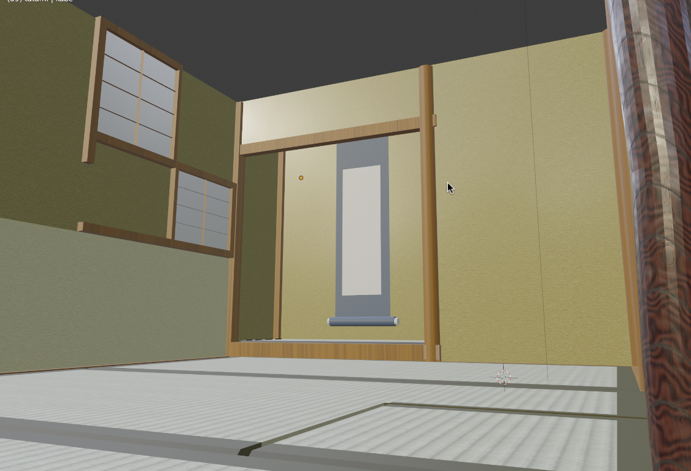
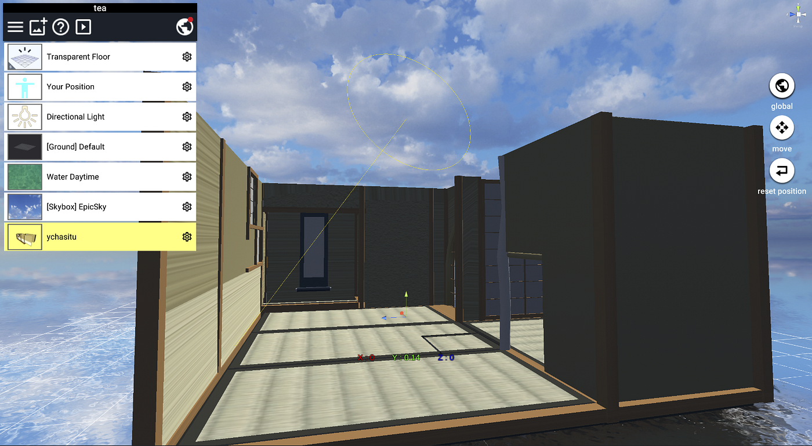

### 空間デザイン部がしっかり空間デザインしてる

空間デザイン部はしばらくものづくり部とTEDxメンバーと合同でTEDxの会場の制作を行っています。7~8月は一連の計画を立てたり、機材のテスト中心に行っていましたが、9月に入りスピーカーの方々の撮影が始まってから本格的に空間デザインらしいことをしています。

### 完成した空間のちょい見せ。

スピーカーの方から聞いた空間イメージからBlenderを使って制作しました！クオリティの高い茶室ができたので、後は動画編集で合成するのみになると思いきや。。

STYLYに落とし込むとテクスチャがうまく反映されない問題発生中です。
TEDx本番はもうすぐなのでこのようなバグは早急になおそうと思います。

他にも、それぞれのスピーカーの方々がイメージする空間や動画演出を考えています。

### ＜動画編集の課題＞

空間が完成してきているので、次はいよいよ動画編集で演出していくのですが、今回は動画編集をする上での課題や難しい部分があったので紹介します。

#### 使用する素材の許可どり

演出に必要な素材を使うためには許可取りが必要で、特に大きな組織や機関のロゴなどは許可を取るだけでなく、使用規約があったりします。

例えば、SDGsのロゴは
・色を変えてはいけない
・形を変えてはいけない（寸法）
などのルールがあります。
演出において、「少しホログラムっぽくしたい」や「角度を変えて立体に見せたい」などがどこまで許されるのかが分かり辛いのが課題です。

#### チームで制作する場合のタスクの振り分け方

チームで動画制作をする場合に、どこまでみんなにやってもらうのかが課題になっています。

演出は具体的に決まっているようなものではなく、「こんな感じ」というイメージしか固まっていないのでチーム全員に共有するのも難しい現状があります。

使うフォントやカットのタイミングなど、全体的にテイストを似せたいのでタスクわけを慎重に行っていきます。

＜グラレコ＞
画像を貼る予定
