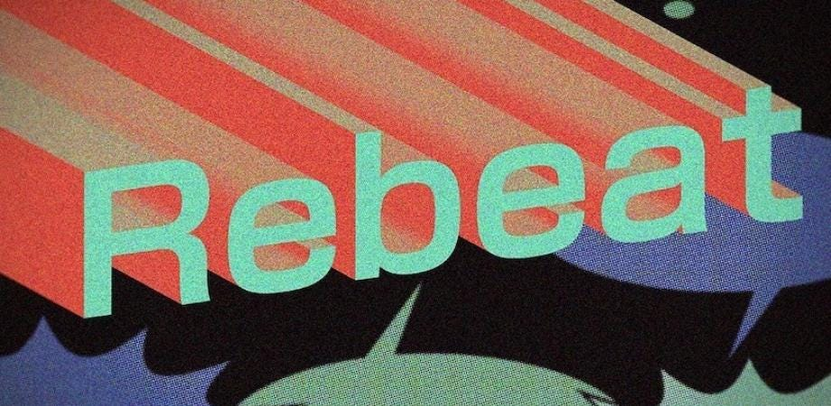
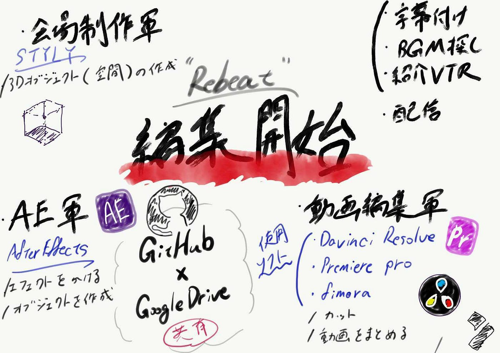

編集作業開始！

収録が八割ほど完了し、動画編集作業に移ろうということで、、、

《今後の流れについて》
onlineチーム以外のメンバーで新生チームを作り振り分けを行いました。

〇会場制作チーム

〇アフターエフェクト(オブジェクト担当)
・バビー
・さほ
・(はる)
・(れん)

〇動画編集（カット、一本の動画にまとめる）
・れん→yutaさん、森さん
・(さほ)
・ばびー→田中さん
・はる→エリックさん、川崎さん
・あつこ→シーラさん
・すず→くにはる
・さち→矢島さん
・おーだい→千之介さん

〇紹介VTR、字幕付け、BGM探し
ゆい、たいせい、すけ、りさ、ひかるさん、かずな、ゆうか、その他メンバー

〇配信

> ・アフターエフェクトの担当者が足りないので、アフターエフェクト興味あったり、マスターしたい人いたら連絡してください！

> ・動画編集の例や手順はこの後作ってGitHubに載せておくので少々お待ち下さい！

> ・紹介VTR〜のメンバーはそのメンバー内でリーダーを決めて活動

> ・使用ソフト

> ・After Effect ,

> ・Davinci Resolve,

> ・premia pro,

> ・fimora,

〇あとは千之助さん、川崎さんの収録が10月3～4日に決行！

