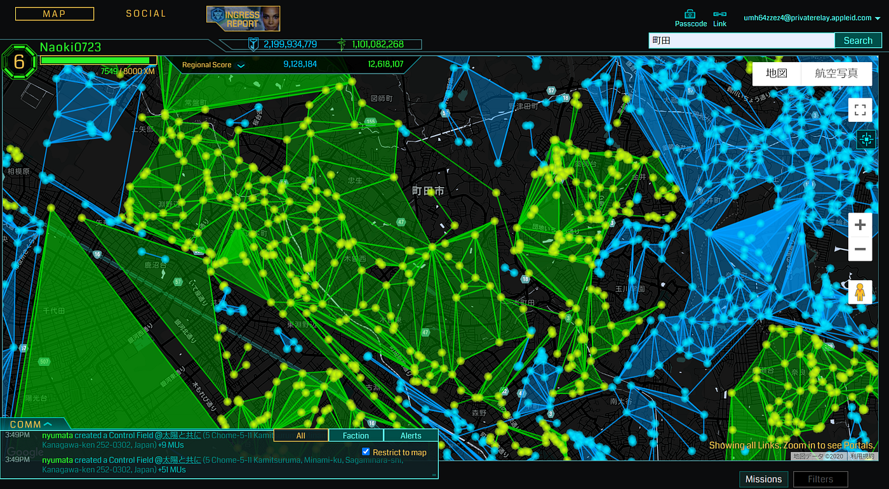
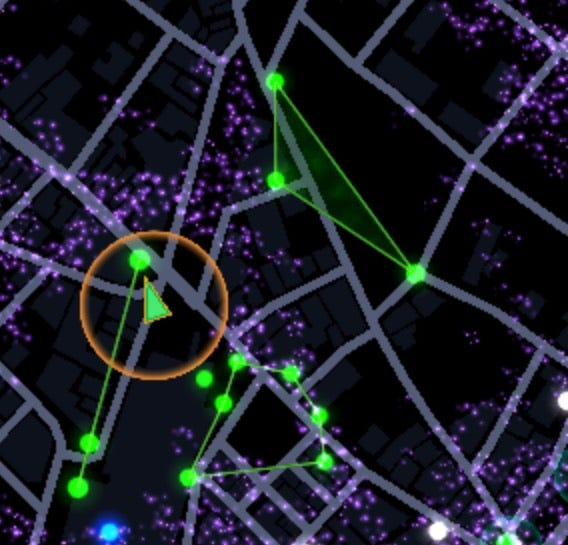
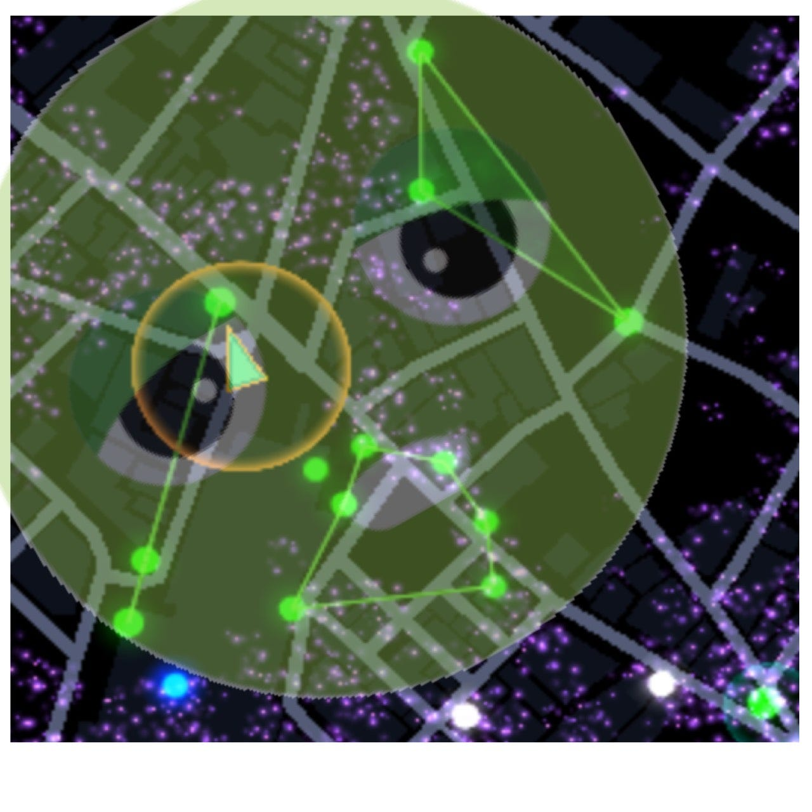
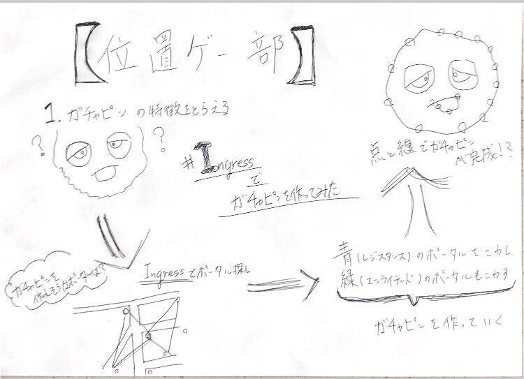

### 位置ゲー部：ハッカソン Ingressでガチャピンを作ることに挑戦

**# Ingressでガチャピンを作ってみた**

今回、私たち位置情報ゲーム部ではIngressを用いてガチャピンの絵をシンプルに描くということに挑戦しました。実際にどのように描いていったのか説明していきたいと思います。

**## 場所の選定**

まずガチャピンを描くうえでどこの場所でガチャピンを作るかという議題になりました。その際に実際に[Ingress Intel Map](https://intel.ingress.com/intel)を用いてなるべく位置情報ゲーム部員の家から遠くなく、ポータルが密集している地域を選ぶことにしました。なぜならポータルが多く密集している方が絵を細かく描くことが出来ると思ったからです。そして実際に選んだ場所は町田にしました。

##実際に町田駅に着いてガチャピンを描いていく

そして10/1日に実際に位置情報ゲーム部が町田に集まりガチャピンを描く作業を始めました。

やり方として

1. 大まかなガチャピンの特徴を考える（今回は垂れた目と出っ歯の再現）

1. 再現ができそうなポータルを見つける

1. 青（レジスタンス）のポータルを壊して、作成に邪魔になりそうな緑（エンライテンド）があればそちらもポータルの破壊

この方法で実際に完結にガチャピンを作成していきました。

**## 成果物**

こちらが成果物です。

一番下の四角（◇）が出っ歯部分、左右のリンクで垂れ目を表現してみました。しかしこれだけではガチャピンと思う方は少ないと思うのでガチャピンの絵を透過させてみたいと思います。

これでガチャピンっぽく再現できたと思います。

**## やってみて分かった点**

1. 町をより深く知ることが出来る。

今まで行って事がない場所や通っていても知らなかった場所に行くことが多くありました。そのため災害時にどのような場所があるのか事前に自分の町を知ってリスク回避することもできると思いました。例：危険な川、がけ・目印になりそうな場所の発見

2. 陣営関係なく遊ぶことが出来る

日ごろは敵対している陣営でしたが、絵を描くことだけで考えてみると両方楽しくゲームをすることが出来ました。そのため今後位置情報ゲーム部が遊びの企画をする上で絵を描くということはありかもしれないです。

**## 反省点**

今回ガチャピンを描いたことの反省点を上げていきたいと思います。次回また絵を描くときがあれば改善していきます。

1. 場所選び

町田でガチャピンの再現をすることが出来るポータルが少なく、難しいかったです。特に口の部分を見つけるのが困難だったので、[Ingress Intel Map](https://intel.ingress.com/intel)で場所を見る際にあらかじめの場所の候補を次回から考えていきます。

2. シンプルさとクオリティのバランス

今回はいかにシンプルに再現するかを重要視したためクオリティがかなり低くなってしまいました。そのため次回以降は顔のパーツだけではなく顔全体の再現に挑戦していきたいと思います。

**## 今後のアプリの候補**

10/1に[テクテクライフ](https://www.tekutekulife.com/)という真っ白な世界を自分が移動し、マップを塗っていくというアプリがリリースされました。上手く利用することができればより簡単にキャラクターを再現することが出来るかもしれません。

[App store](https://itunes.apple.com/jp/app/id1477798690?mt=8) ,[Google Play](https://play.google.com/store/apps/details?id=jp.co.tekutekulife.tekutekulife)

