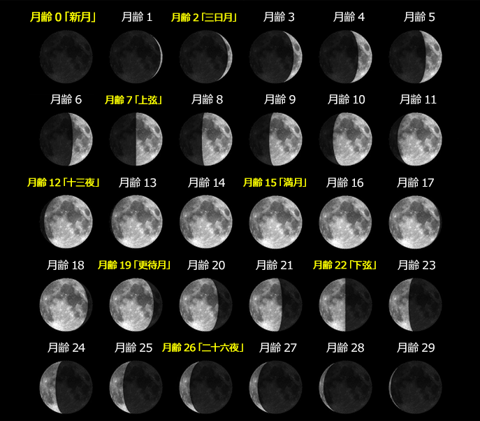
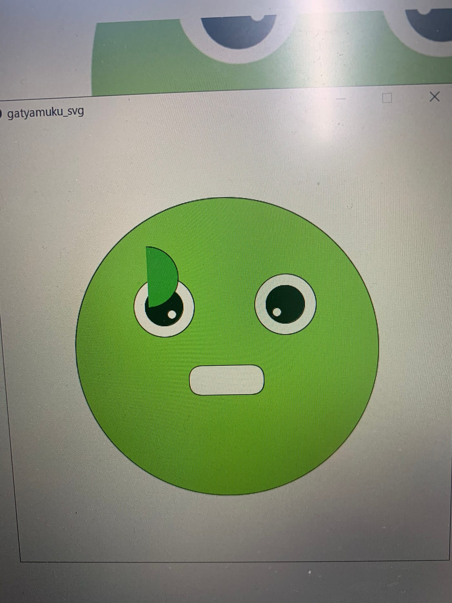

### Processingはじめました

先週末のSpace AppsではProcessingを用いて簡単なゲームを作成する方針を変更し、0～29月齢に合わせそれぞれの形のSVGを自動生成する月の満ち欠けシミュレーションプログラムプログラムを書くことに挑戦しました。

円弧（arc）を二つ重ね、その位置を変数で自動生成することで月を表現するアプローチで攻めてみました。まだ途中ですが次はMoonAge変数を月齢として扱えるように修正すること目指します。

[Processingで前回SpaceAppsのSVGデータを生成する · Issue #4 · furuhashilab/fabla-bu
Dismiss GitHub is home to over 50 million developers working together to host and review code, manage projects, and…github.com](https://github.com/furuhashilab/fabla-bu/issues/4#issuecomment-703267477)

### ガチャムクをSVGで生成する

今週はガチャムクハッカソンなので本当はこっちが本命なのですが連日のSpaceAppsに向けたprocessingとの格闘に疲弊し今日から手をつけています…

このくらいのシンプルさだととりあえず今回学んだellipseとarcを使ってかけそうです。

https://github.com/furuhashilab/fabla-bu/issues/5

#### 現状

