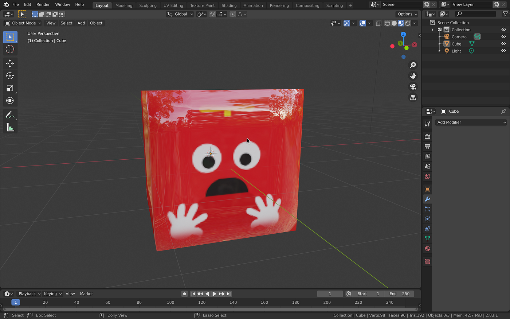
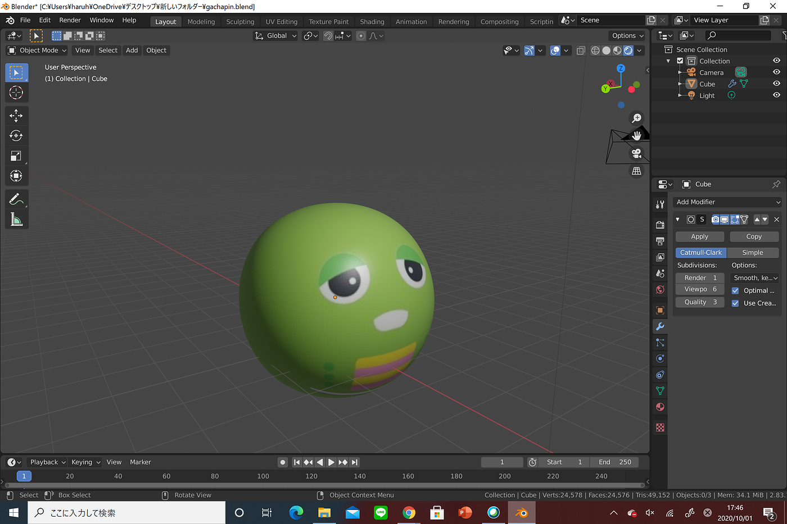
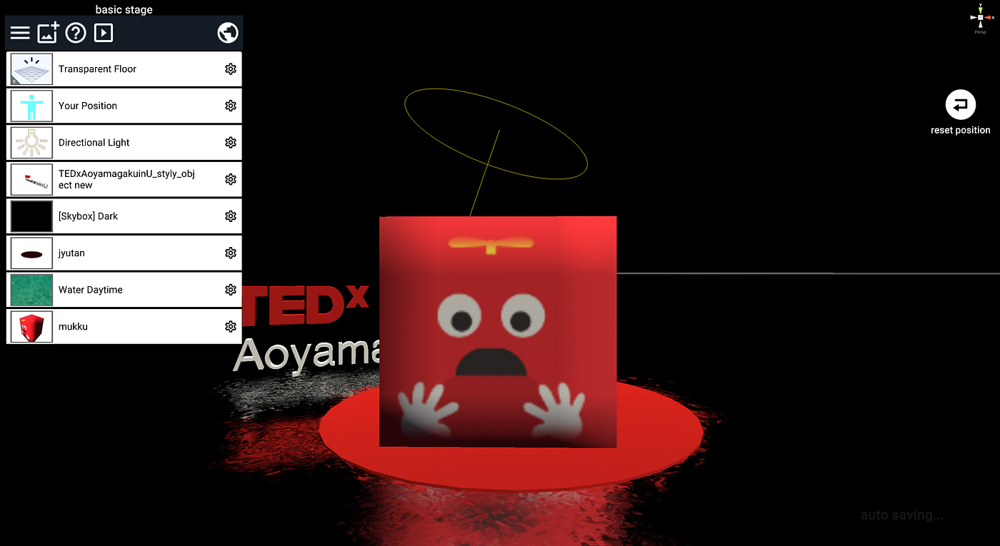
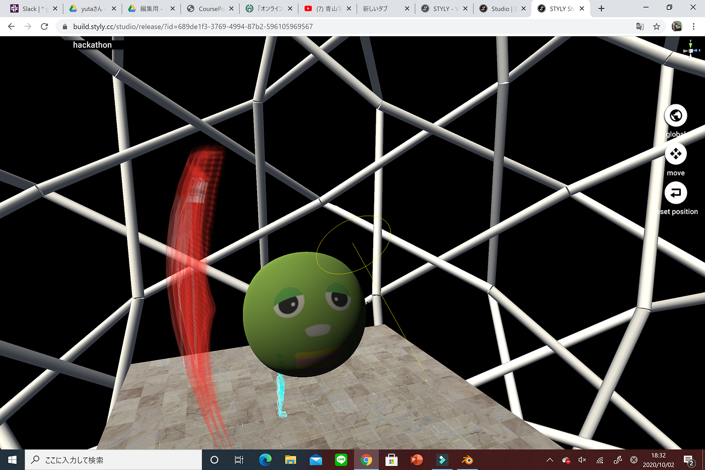
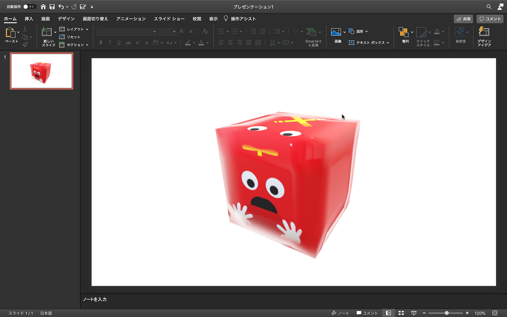
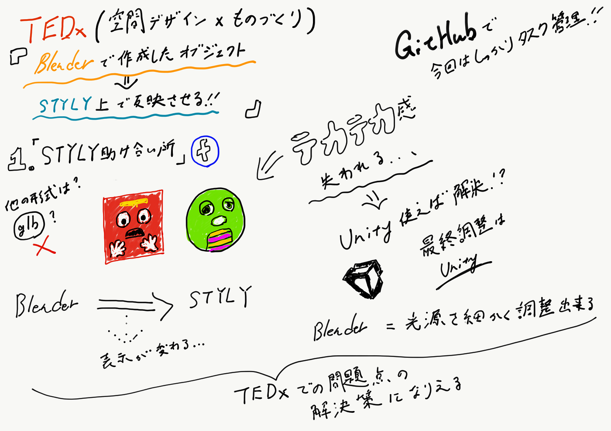

### ガチャピンムックを３Dデータ化！！

▶︎ガチャムクハッカソンGitHubプロジェクト

[furuhashilab/2020_TEDxdesign
You can’t perform that action at this time. You signed in with another tab or window. You signed out in another tab or…github.com](https://github.com/furuhashilab/2020_TEDxdesign/projects/9)

＜TEDxチーム（空間デザイン×ものづくり）のハッカソン課題＞

**BLENDERで作成したオブジェクトをSTYLY上に反映させる！**

＜ハッカソン開始の背景＞
現在作業中のTEDxにおける会場デザインのなかでBLENDERで作成したテクスチャつき３DデータがSTYLY上にうまく反映されないという現状が！これを解決するためにガチャムクをサンプルデータとしてstylyチームと共有、解決に向けて動きました！

＜今回の活動＞

①Facebookグループ「styly助け合い所」への相談

②ガチャピンムックの利用可能データをテクスチャ付きでblender上で作成

③解決策の提案

**①stylyの助け合い所に現在のTEDxで使用予定の３Dデータの問題点を共有**→[前回のメディウム参照](https://medium.com/furuhashilab/%E7%A9%BA%E9%96%93%E3%83%87%E3%82%B6%E3%82%A4%E3%83%B3%E9%83%A8%E3%81%8C%E3%81%97%E3%81%A3%E3%81%8B%E3%82%8A%E7%A9%BA%E9%96%93%E3%83%87%E3%82%B6%E3%82%A4%E3%83%B3%E3%81%97%E3%81%A6%E3%82%8B-9463f4877586)

・他の出力形式ならいけるのでは？

> _→blender内にある他の出力形式を全て試しても、解決ならず。_

・出力されたデータはstylyだけでうまく表示されていないのか？他のところでは？

> _→glbデータをweb上で確認できるサイトでみてみたら、そこでもうまく反映されていなかった。_

➡︎出力の時点での問題では！？
（しかし、サイトではちゃんと反映されているところがstylyではうまく行ってないところも：畳の目の荒さ）

↓それを踏まえてムックのテストデータを作成

**②ガチャムクのデータ作成**

➡️テクスチャの反映は行われるが、マテリアルの反映が行われない。

テクスチャ：模様を再現するもの、表面の画像や絵。（ 例）ムックの絵柄自体
マテリアル：質感を再現するもの（ 例）ムックのテカテカしている部分

blender上

styly上

### テカテカ感どこ行った？！！！！！

⬇︎

styly助け合い所によるとフォーマットとソフトウェアの相性によって表示が元のソフトと同じにならないことは3Dソフトウェアではまだ多々ある状況であるとわかった！

### ➡︎blenderの出力方法やstyly側の問題ではない！！

試しに、powerpointに今回作成した３Dモデルをいれてみた！
blenderとパワポは相性がいいらしく、ちゃんとテカテカしてます！

**③解決案**

→UNITYを使用する
styly助け合い所からの返信によると、、、

> 「STYLYがUnityをベースにしているためUnityで表示されている状況とほぼ同じ形で表示されるため、Unity側で最終調整していただくとSTYLY上での見た目がそのとおりになります。」

とのことなのでUnityを利用するのが一つの手だとわかりました。

→blender上のものをレンダリングする。
blender内では光源を細かく調節できるなど利点が多いそうです！

レンダリング：編集した映像や動画をパソコンなどで描き出すこと。
スクショの進化版的な？

＜今回の作成物＞

[https://github.com/furuhashilab/2020_TEDxdesign/issues/41](https://github.com/furuhashilab/2020_TEDxdesign/issues/41)

＜余談＞

６月のハッカソンでは全然活用できていなかったGitHub、、、！

しかし今回のハッカソンではやることが決まると同時にプロジェクトが立てられ、issueが立てられ、自らアサインをし、と初動がとても早くなったように感じました！

マイルストーンを起き、現状報告をしあう場所、そして期日までにプロジェクトを動かすツールとしての利用が以前よりはできるようになったなと少し実感しました。

＜グラレコ＞

＜発表用資料＞
