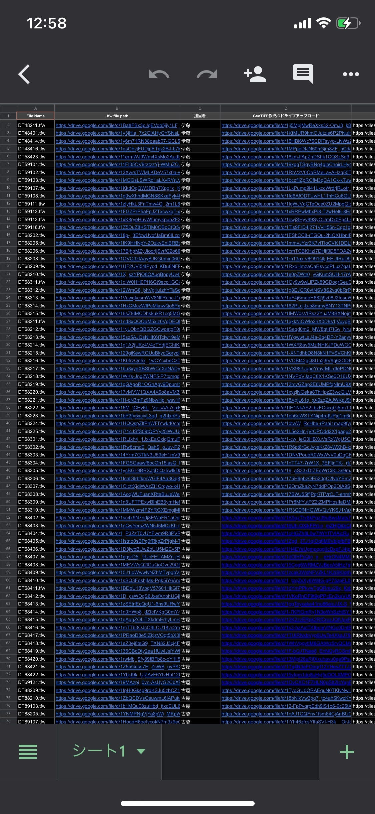
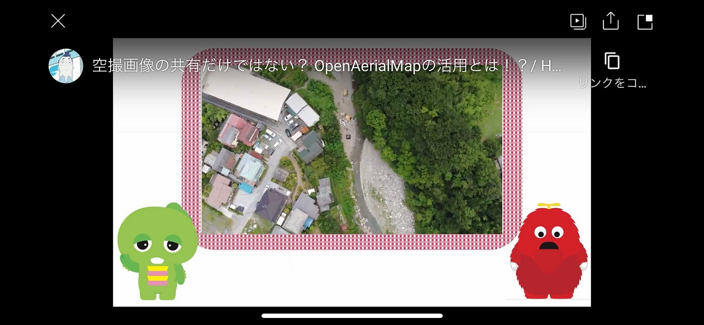
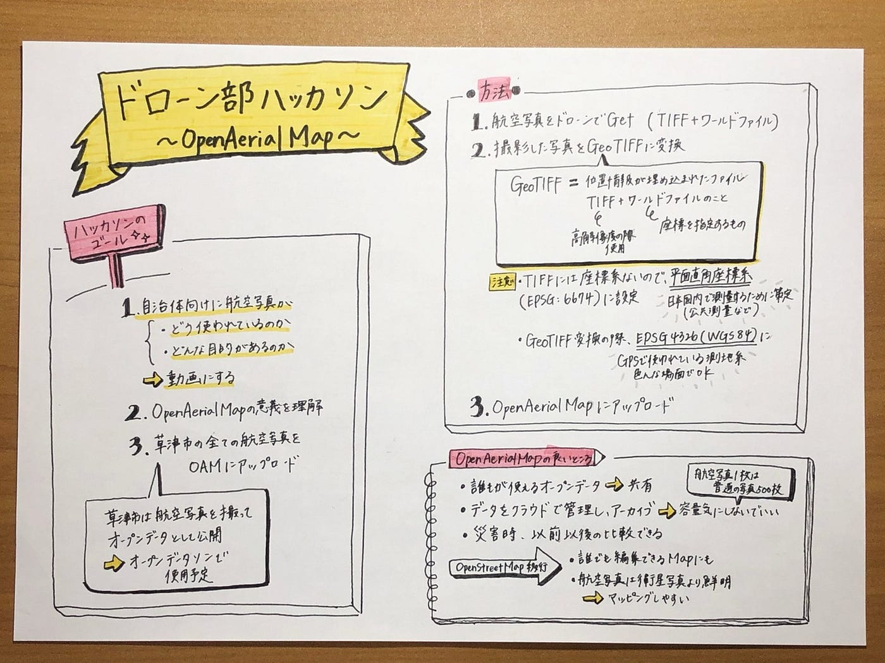

ガチャムクがOAM解説員だった話

今回のハッカソンでは、我々ドローン部はまず前回のハッカソンで終わらせることができなかった残りの作業をまた新たに進めるところからスタートしました。

その前回の作業というのは[草津市の航空写真をOAM(OpenAerialMap)にアップロードする](https://github.com/furuhashilab/oam4kusatsu)ことです。これだけ聞くと、そんな難しくなさそうって思われるかもしれませんが、その真逆です。難しいというより量が膨大で少人数で終わらせるには中々に苦労しました。

[furuhashilab/oam4kusatsu
草津市航空写真データの OpenAerialMap 投入 ガチャムクOAM解説動画 ・ガチャピン OAM解説動画 ・発表スライド ・Medium(グラレコ付き) QGIS 3.14 をインストール…github.com](https://github.com/furuhashilab/oam4kusatsu)

データの一覧が[これ](https://docs.google.com/spreadsheets/d/1f9-mlXkaxld9TZroGTvkc4dBFSnolbSo1ffRgwdGz9k/edit?usp=sharing)です。とても夥しい量で見てすぐさまブラウザバックしました。全部で501項目あります。ここでの作業内容は前回のハッカソンmediumに詳細を記載しているので今回は割愛します。

さて本題。今回のハッカソンでは、OAMに投入した草津市の航空写真データの使い方を享受する動画マニュアルを作成することになりました。また今回ガチャムクハッカソンということで、動画内での解説員をガチャムクに担当してもらっています。

[こんな感じに](https://youtu.be/Q5NfA3FkqQc)。現在ガチャムク・ハッカソンで協力いただいているフジテレビ側に動画確認してもらっています。

そして今回データをOAMにアップロードしたわけですが、それを受けてのメリットは以下の通りとなっています。

1. OSMにてマッピングしやすくなる

1. 誰でも簡単にアップロードできる

1. クラウド管理のため、容量を気にしなくて済む

1. 災害時にとても役立つ(災害前後の比較)

自分自身今回のハッカソンを通じてOAMがもたらす恩恵を学ぶことができました。災害前後の比較ができる点に至っては、普及すればより人命救助に貢献できることは明白であると感じました。

またガチャムクのような親しみあるキャラクターがやや専門的な話をしている点に至ってはまぁシュールではありますが、子供たちやこの分野の初心者の方にとってはわかりやすく学べることができるいいきっかけとなるのではないでしょうか。私自身ガチャムクの動画で知った知識も少しばかりありますので笑

[Gachamuku.mp4
drive.google.com](https://drive.google.com/file/d/1iPi6zBHN1XjR6N6p-fIMbg2g3csLot5e/view)

これが今回作成した動画です。

グラレコです。
