### ガチャムクこれでかけるはず…！！

9月のハッカソンはガチャムクとコラボ！

私たちグラレコ部は、

> _**❶ガチャムク絵描き歌動画作成_**

> _**❷使いやすいガチャムクグラレコ素材集作成_**

を行いました。

**こちらが素材置き場です。↓**

[furuhashilab/grareco4gachamuku
New issue Have a question about this project? Sign up for a free GitHub account to open an issue and contact its…github.com](https://github.com/furuhashilab/grareco4gachamuku/issues)

### ❶ガチャムク絵描き歌動画作成

さっそく、ガチャムク絵描き歌を紹介していきたいと思います。これを見ればガチャムクを簡単にかける…はず！

#### 川嶋作：

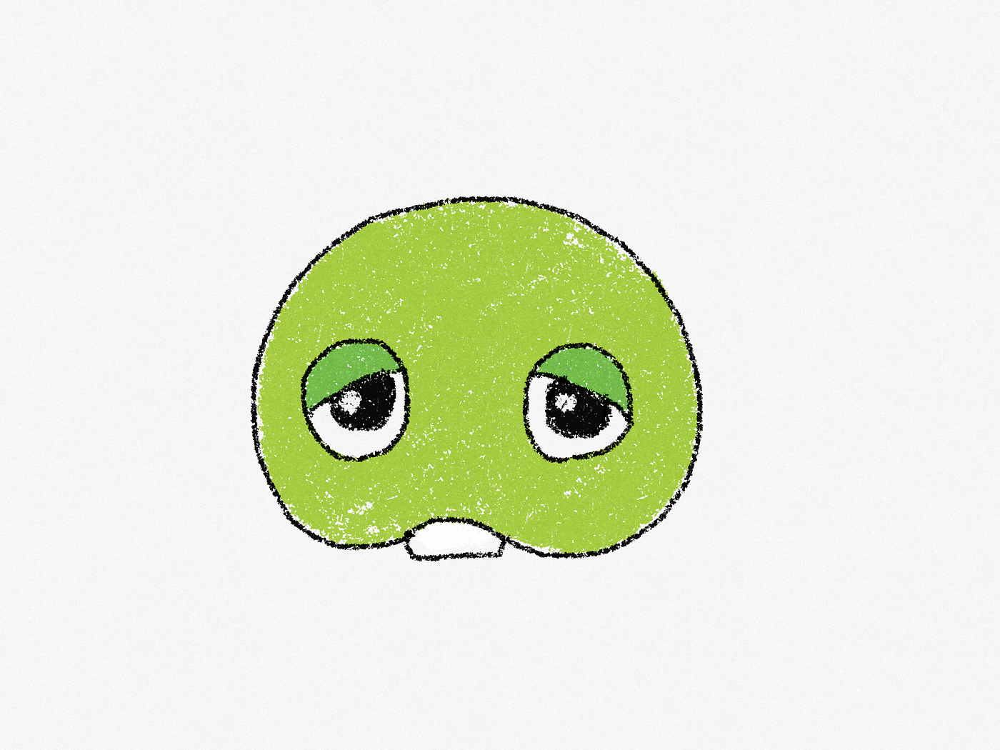

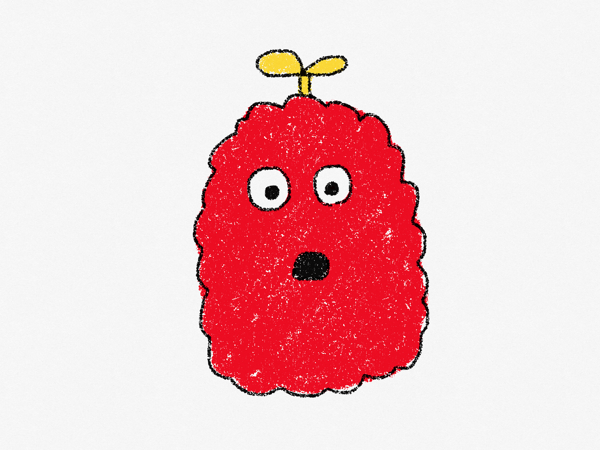

[ガチャムク絵描き歌 .mp4
Edit descriptiondrive.google.com](https://drive.google.com/file/d/102T567q18IJjWdbl7YZUvPdr_Q2r8zT_/view?usp=sharing)

#### 大岸作：

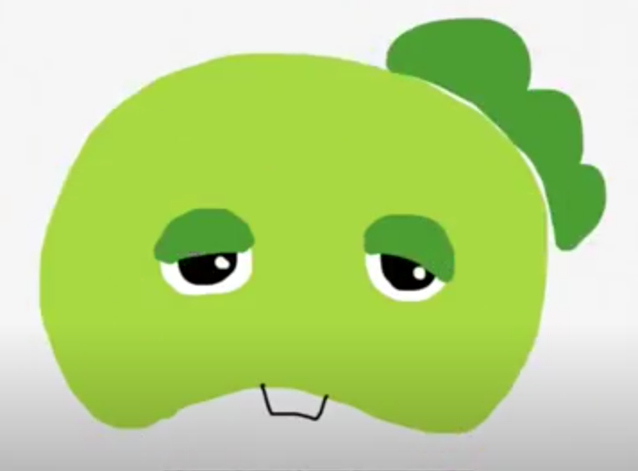

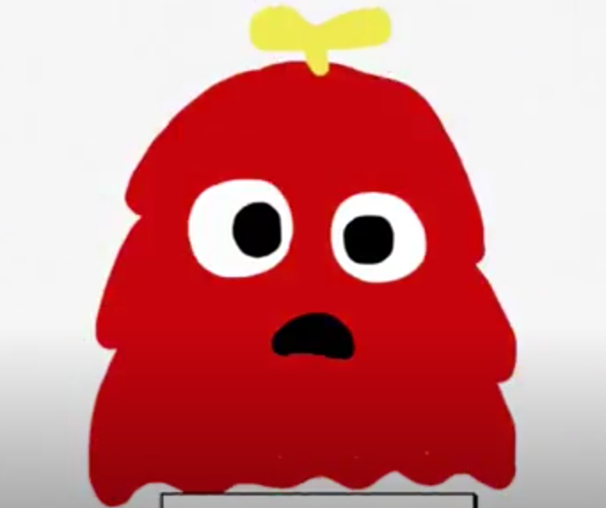

[ガチャムク絵描き歌.mov
Edit descriptiondrive.google.com](https://drive.google.com/file/d/1gBHWTLKmsGBUc_48WSc-XUn2NedQWzXz/view?usp=sharing)

#### 早崎さん作：

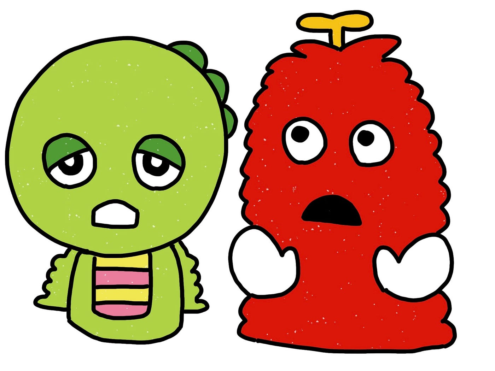

[1080p.mov
Edit descriptiondrive.google.com](https://drive.google.com/file/d/1EaiIsgqNIoJAPJx-TlB99fZtCwg7tk2F/view)

### _**❷使いやすいガチャムクグラレコ素材集作成_**

お次は、グラレコ素材集です！以下の4つの項目に分け作成してみました。

> _**・ 防災「おかしも」_**

> _**・Covid-19 関連素材_**

> _**・サークルロゴ①
（ドローン部、YouthMappers部、位置ゲー部、横瀬部）_**

> _**・サークルロゴ②
（ものづくり部、グラレコ部、空間デザイン部、TEDx AGU）_**

#### _**防災「おかしも」_**

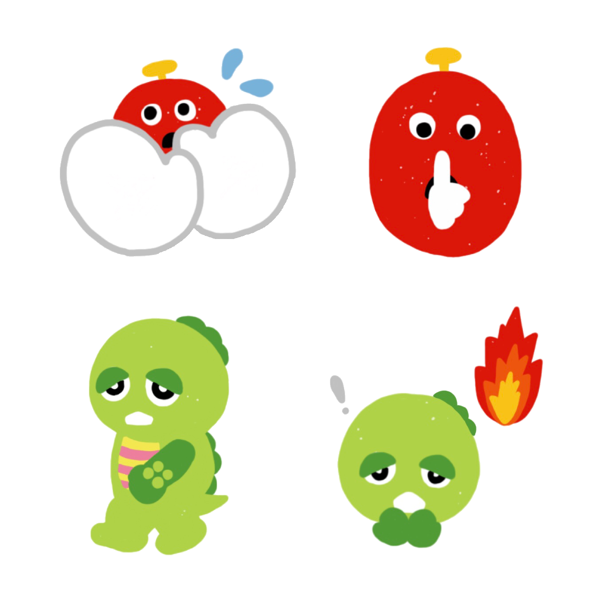

#### **Covid-19 関連素材**

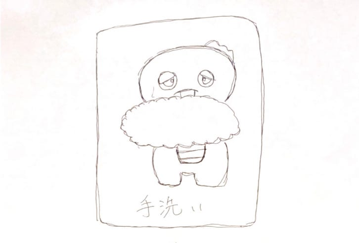

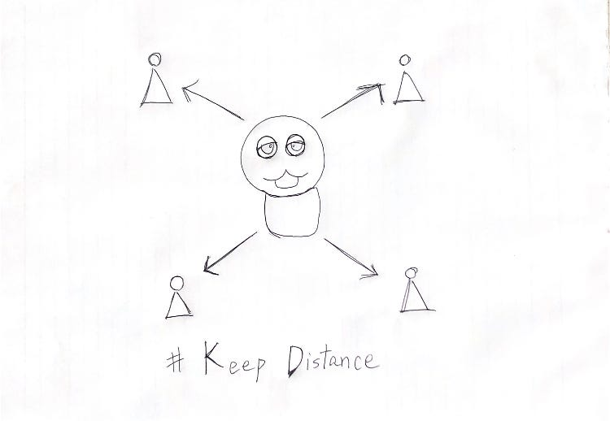

#### **サークルロゴ①**（ドローン部、YouthMappers部、位置ゲー部、横瀬部）

#### サークルロゴ②_（ものづくり部、グラレコ部、空間デザイン部、TEDx AGU）_

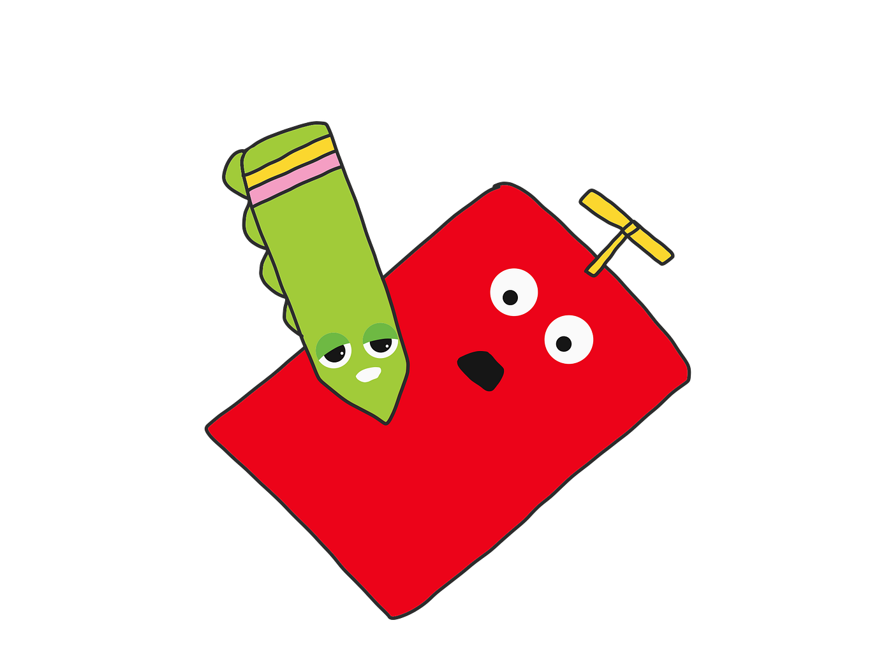

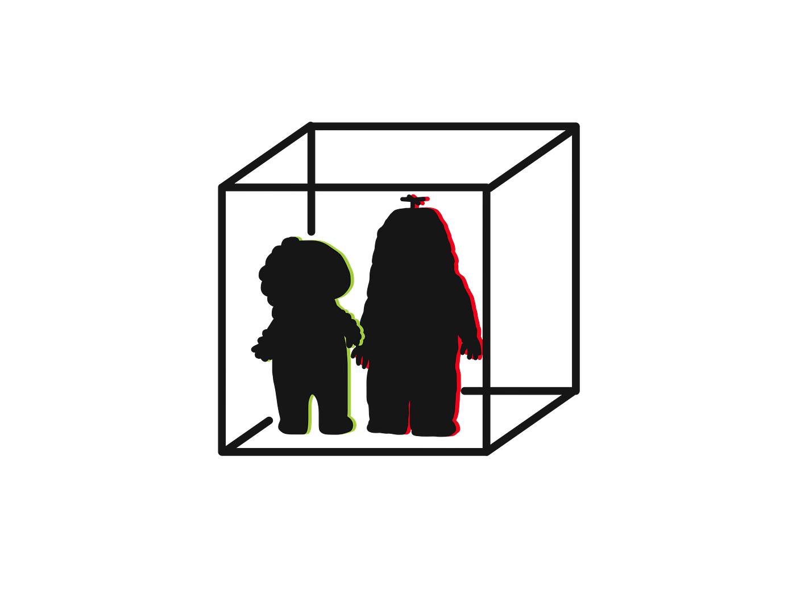

### まとめ

絵描き歌動画作成と使いやすいガチャムクverグラレコ素材の作成を行い、ガチャピンとムックの特徴を簡単に捉えられた気がします。

> _ガチャピン：垂れ目、歯_

> _ムック：雪男らしい（？）もこもこした輪郭、頭のプロペラ_

この要素が今回作成したほとんどのもので使われていると思います。また、ガチャピンの緑、ムックの赤と言った色要素の重大性に気づくことができました！

ぜひ、絵描き歌を視聴してガチャピンとムックをかいてみて下さい！！

グラレコ

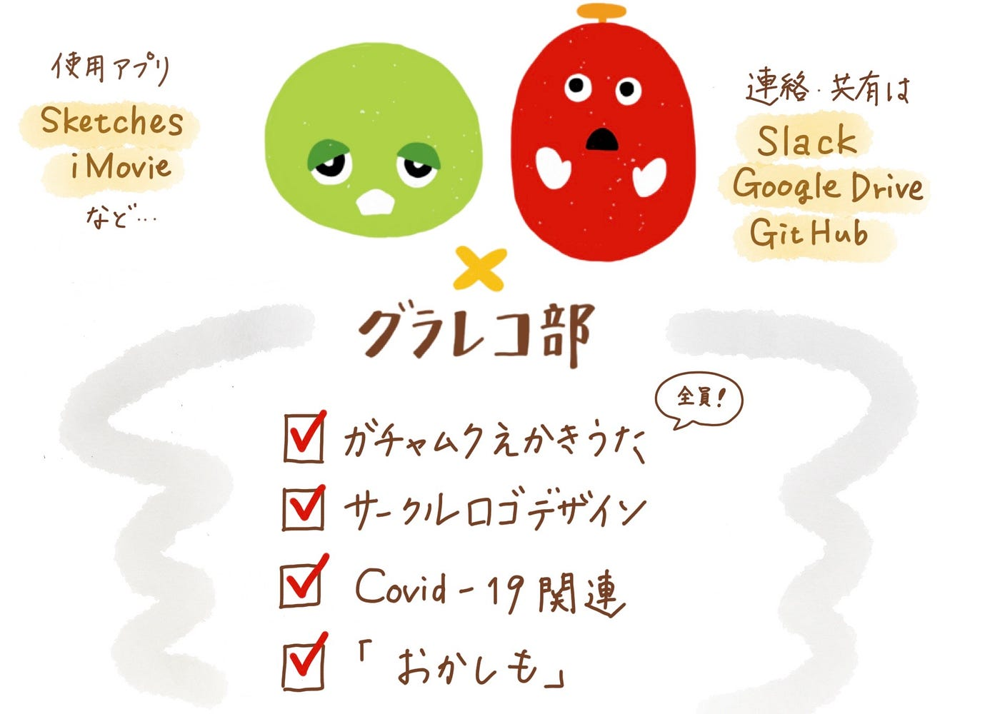

発表用資料
