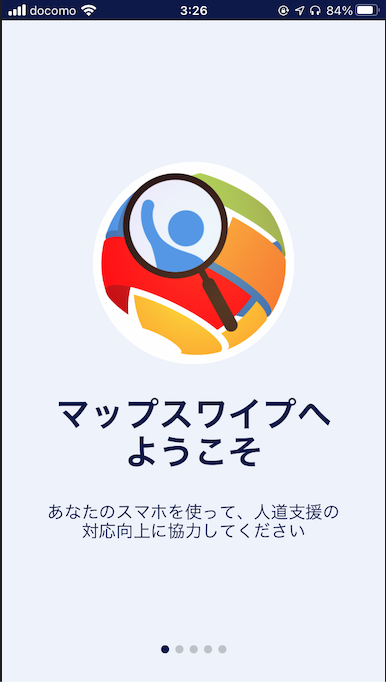
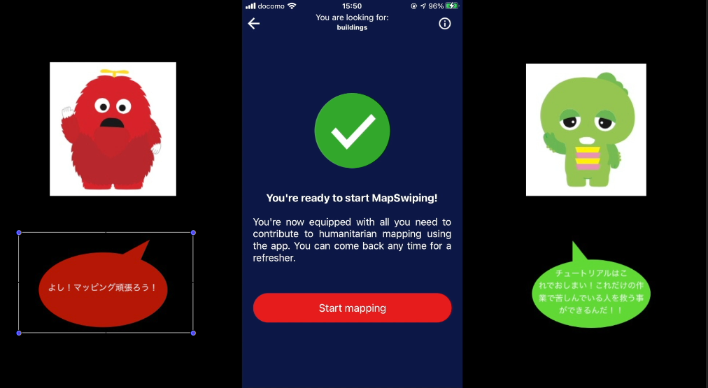
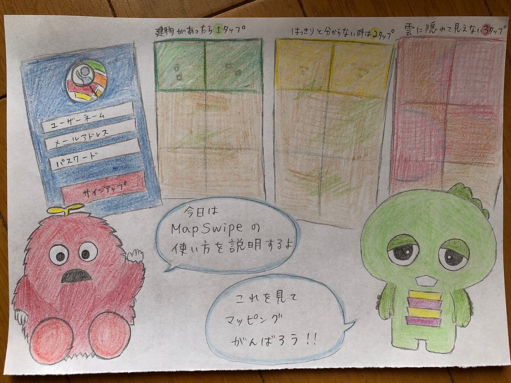

### ガチャムクと一緒にMapSwipe!!

こんにちは、3年の日向野邦春です。今回は古橋ゼミではお馴染みのガチャムクを使ってMapSwipeの紹介動画を作りたいと思います。

今回の動画作成でポイントとなるのがオンライン感を出す事です。MapsSwipeはスマホで行うマッピングアプリなので、出来るだけ簡単に出来るということをアピールしなければなりません。

#### 動画の目的

この動画はYouthMappersのInstagramに載せようと思っています。そのためには出来るだけシンプルで相手が最後まで見てくれるような動画にしなければなりません。

なので出来るだけシンプルな動画作成にしようと思いました。

#### 使ったツール

**iMovie**

今回は編集作業にiMovieを使いました。出来るだけシンプルに作るという事でこれにしました。

そして、MapSwipeが日本語アプリverがついに公開されていました。タスクの説明文などはまだまだ英語表示ですが、とりあえず一般の方々が触れやすくなったかなと思います。

#### 動画の作り方

まず先生がslackに載せてくださったガチャムクの素材を切り取ってiMovieの左右に配置しました。

真ん中にはMapSwipeのスクリーンショットを配置してガチャピンが説明してムックが教わるというシチュエーションにしました。

今回は実際にタスクをマッピングしたわけではなくチュートリアルの解説を行いました。

#### 反省点

しっかり動画作成に取り組んだのは今回が初めてだったのでどの程度のクオリティを求めるべきかを最初にきっちり決められなかったことかなと思います。

あとはこの動画をYouthMappersAGUのInstagramに載せようと思っているので出だしにメンバーの誰かが登場して解説するのもありかなと思っています。

[マイムービー 11.mp4
Edit descriptiondrive.google.com](https://drive.google.com/file/d/1alTo061PYQamnnyhM3bER75quT02xLlX/view?usp=sharing)

[furuhashilab/-MapSwipe
You can't perform that action at this time. You signed in with another tab or window. You signed out in another tab or…github.com](https://github.com/furuhashilab/-MapSwipe)
