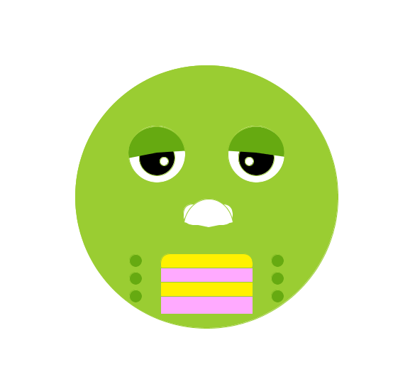
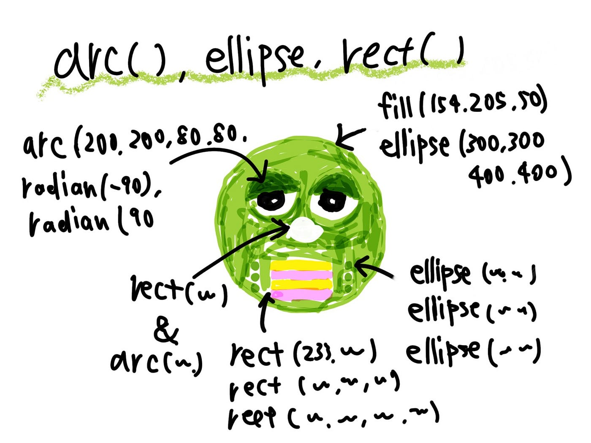

### ガチャピンSVGほぼ完成

### けっこう似た

今週は前回途中で終わっていたガチャピンのSVG作成をほぼ終えることができました。細かな調整ができていないところがありますが月のシュミレーションプログラムで身についた知識のアウトプットとしてとりあえず簡単な関数に慣れることができたのでよかったと思っています。

どの数値をどう変えて実行すればどういう結果になるというのを実際に手を動かしてトライアンドエラーすることでより実感できました。。。

#### ガチャピンSVGのコード

[https://github.com/furuhashilab/fabla-bu/issues/5](https://github.com/furuhashilab/fabla-bu/issues/5)

### 月齢シュミレーション

今週はこちらのプロジェクトも進めたかったのですがいろいろあってあまり手をつけることができませんでした。変数の使い方について勉強と試行錯誤を続けて着実に完成に近づいていけたらと思います。

[Processingで月齢自動生成シュミレーションプログラムを作る · Issue #4 · furuhashilab/fabla-bu
Dismiss GitHub is home to over 50 million developers working together to host and review code, manage projects, and…github.com](https://github.com/furuhashilab/fabla-bu/issues/4)

#### グラレコ

