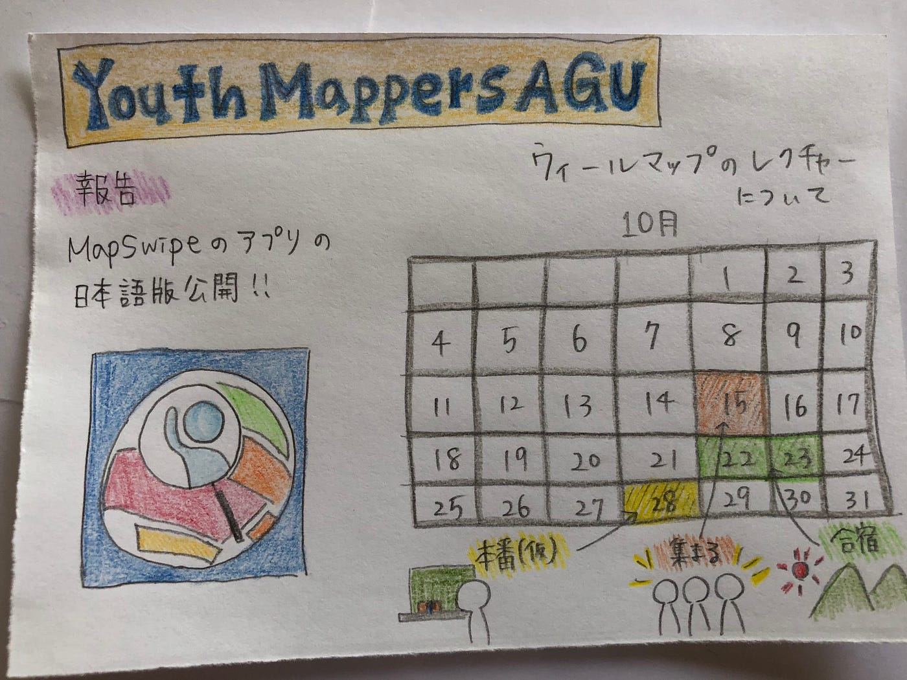

### ついにマッピングをレクチャーする時が…！

こんにちは！medium書くのが久しぶりすぎて少し苦戦した吉田涼香です。先週のゼミ後、18:30より、広島のワークショップ運営の方々とMTGを行いました！

そこでついに私たちがwheelmapアプリの使い方や、マッピングの方法をレクチャーする機会をいただけました！

[https://wheelmap.org/?locale=ja](https://wheelmap.org/?locale=ja)

本当は広島まで行って直接レクチャーしたいところですが、この状況下なのでオンラインで我慢…ということでメンバー全員で日程調整も行い、これから合宿も挟み、準備万端で迎えようと思います！

もしかしたら英語を使う方々の方が多いかも！ということでこちら側はゼミ始まって以来初のYouthMappers全員集合したいと思っています。

学校も始まり３年生はたくさん大変な時期ですがいろんなことを楽しみにみんなで頑張って行けたらなと思います！

