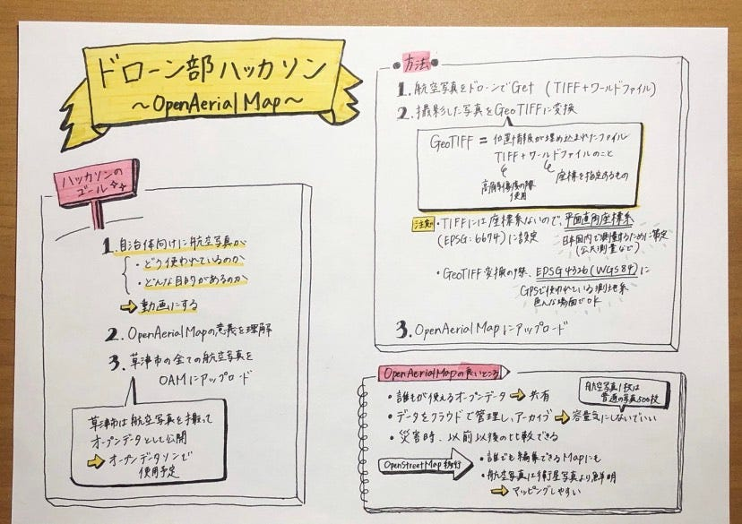
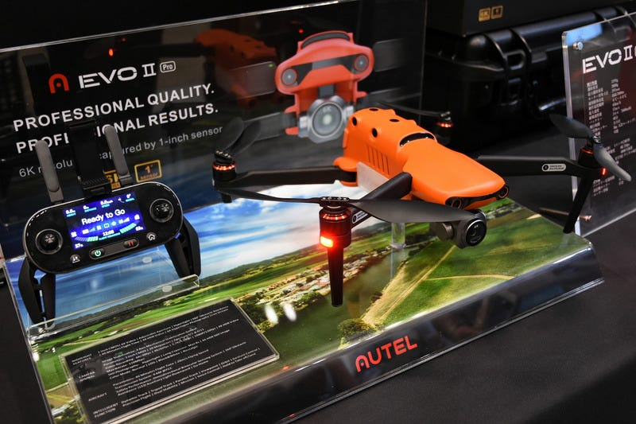
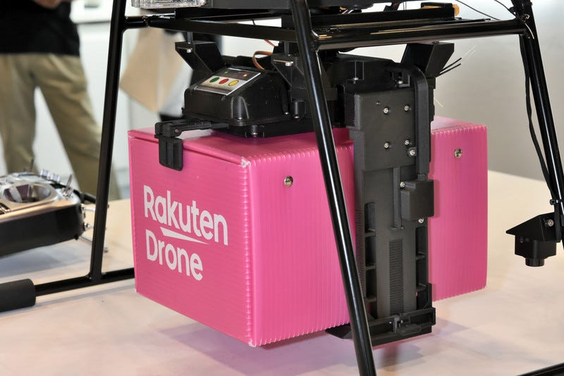
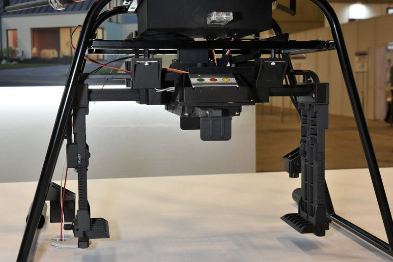
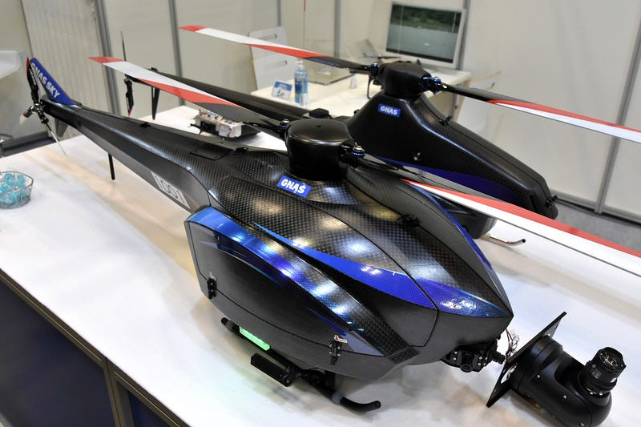
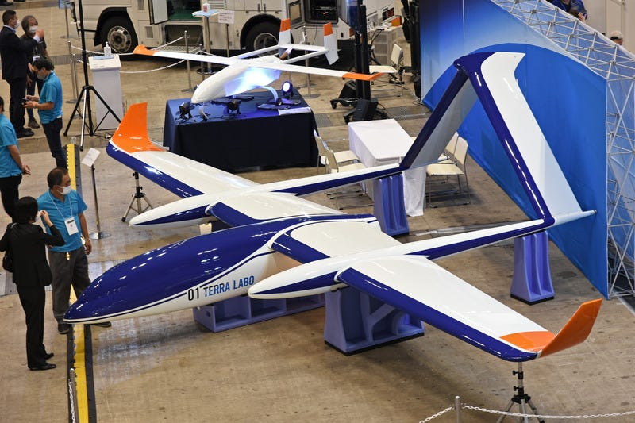

### ハッカソンつづき

ガチャムクハッカソンではOAM（OpenAerialMap)にアップロードした草津市の航空写真データの使い方に関してのYoutube動画を作成しました。

[Gachamuku.mp4
Edit descriptiondrive.google.com](https://drive.google.com/file/d/1iPi6zBHN1XjR6N6p-fIMbg2g3csLot5e/view)

#### これからやること

・タイルが生成されているかのチェック

・XYZタイルが生成されていない場合は、修正作業を行う

・動画のマニュアル作成

### ジャパンドローン２０２０コロナ禍で開催

春から延期となっていたドローンの総合展示会である「Japan Drone 2020」が9/29、30の二日間にわたり開催されました。出展社は104社・団体にのぼりいろいろと新型ドローンが発表されました。

#### KMT

仏Parrotのエンタープライズ製品を輸入販売するKMT

「EVOⅡ」シリーズ

「EVOⅡシリーズはスマートフォンを使わなくてもコントローラーだけでカメラ映像を見ながら飛行させることができる。また、合計12個のカメラで6方向の障害物を回避しながら飛行させることが可能。さらにカメラを取り外せるため、ひとつの機体でミッションに応じてカメラを交換することができる」（説明員）

#### ニックス

プラスチック製品メーカーのニックスは配送用ドローンの荷物搬送ユニット「ドローンキャッチャー」と荷物昇降ユニット「ウインチリールフック」を発表しました。

[https://youtu.be/mRznJ_wzr9Y](https://youtu.be/mRznJ_wzr9Y)

荷物昇降ユニット「ウインチリールフック」。主にレスキューの場面で必要な5kg程度の物資を吊下げて運ぶ

#### 東京航空計器

東京航空計器は航空機用機器の技術を活かし、独自のフライトコントローラーやドローンを開発しています。シングルローター機は資輸送や長距離飛行による監視業務を想定、クワッドコプターは点検用途などを想定しているそう。

### 大型ドローンゾーン

2020年は特別企画として大型ドローンゾーンが設けられ、全長5m以上または自重50kg以上の機体が展示されました。テララボが発表した大型機は高高度からの情報収集を目的としており、高度1万～2万mから地上を撮影することを目指しています。

#### 記事・写真の引用元

https://drone-journal.impress.co.jp/docs/event/1183217.html
