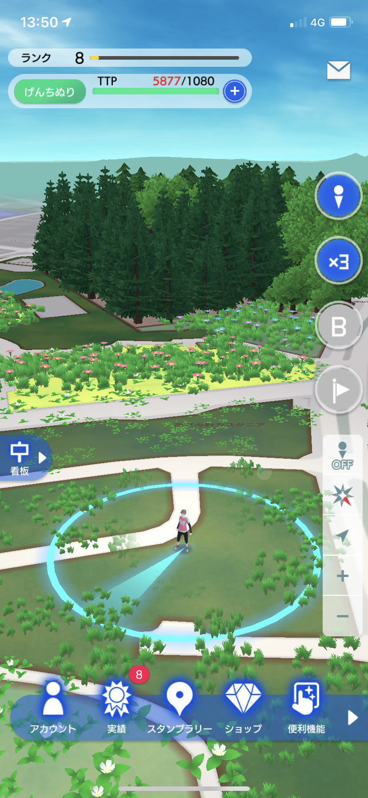
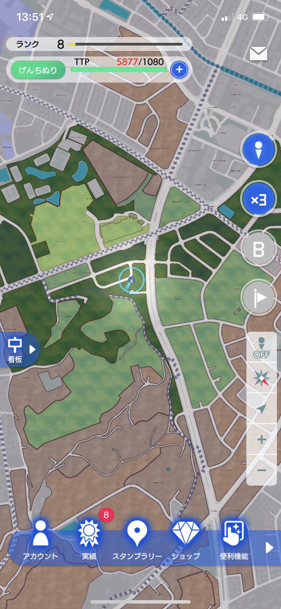
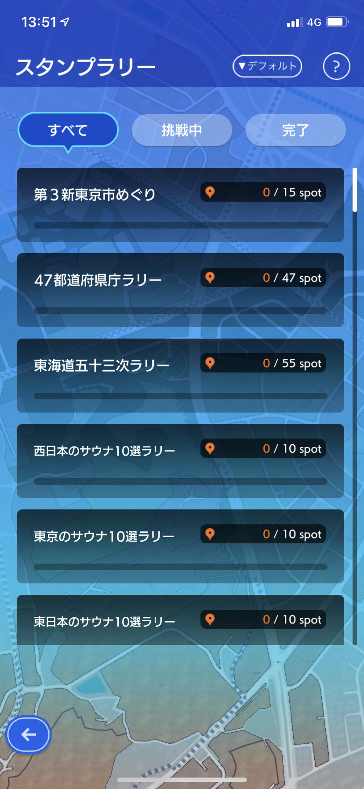
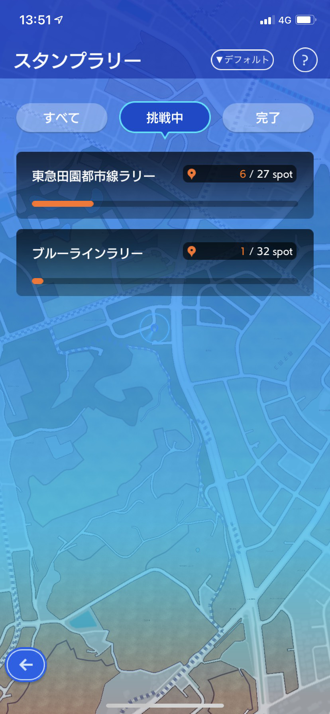
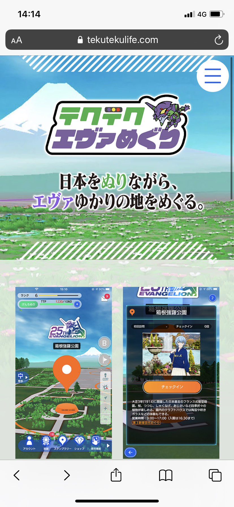
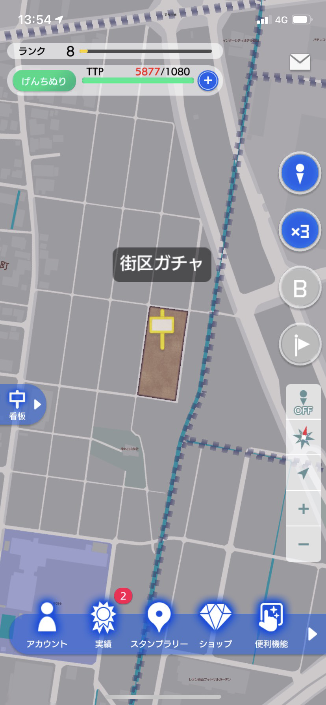
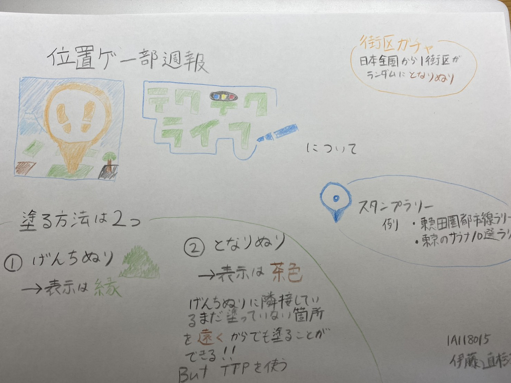

### 位置ゲー部週報：テクテクライフを実際に使ってみた

#テクテクライフを今回実際に使ってみた

前回のハッカソンでガチャピンをIngressで描くことに挑戦し、テクテクライフでも同様にすることが出来るかもしれないと思い、今回は[テクテクライフ](https://www.tekutekulife.com/)がどのようなアプリかを紹介していきます。

まずアプリのインストールは

iPhoneは[こちら](https://itunes.apple.com/jp/app/id1477798690?mt=8)から

androidは[こちら](https://play.google.com/store/apps/details?id=jp.co.tekutekulife.tekutekulife)から

##町の塗り方

テクテクライフには町の塗り方が大きく2つに分けてすることが出来ます。それは「げんちぬり」と「となりぬり」です。

1. げんちぬり

「げんちぬり」は自分を囲っている青いサークルが触れている街区を塗ることが出来ます。表示は緑で表示されます。

2. となりぬり

「となりぬり」は「げんちぬり」で塗った街区から隣接している箇所を遠くからでも塗ることが出来るという機能になっています。「となりぬり」をする際にはTTPを消費します。TTPを増加させるには、時間経過、歩行石（課金要素）、ランクアップの際に入手をすることが出来ます。表示は茶色で表示されます。

このように2つの塗る手段を用いて白紙の地図を自分の地図に塗ることが出来るというのがこのアプリの楽しさです。それ以外にも看板（課金要素）でメモを残したりすることが出来ます。看板は他の人には見られないので自分専用のものになります。

##スタンプラリー

塗るということだけでも楽しいですがテクテクライフにはスタンプラリーという機能があります。

このように塗りながらスタンプラリーを楽しむことが出来ます。

また新世紀エヴァンゲリオンとのコラボも現在行っております。私もこのイベントに参加し称号と歩行石を入手しようと思ったのですが主に[箱根](https://www.tekutekulife.com/evameguri-tokyo3)で開催されていたので参加を断念しました。[エヴァ公式ストア](https://www.tekutekulife.com/evameguri-store)でもスポットとしてあるようです。

##街区ガチャ

日常使っていても最近では旅行に行く機会が減ったので関東以外を塗ることが難しいです。そのため日本全国から1街区だけランダムに「となりぬり」をすることが出来る機能があります。その機能を一度使えば「となりぬり」でどんどん地域を拡大することが出来ます。

##絵を描くことに向いているのか

結論かというと街区ごとに隙間が生じてしまうので絵を描くことはかなり難しくなってしまうかもしれないですが、大きな絵を描くことが出来ればその問題は解消しそうです。また色もガチャピンとムックの色に似ているので今度機会があれば絵を描くことに挑戦してみたいと思います。

グラレコはこちらです。

