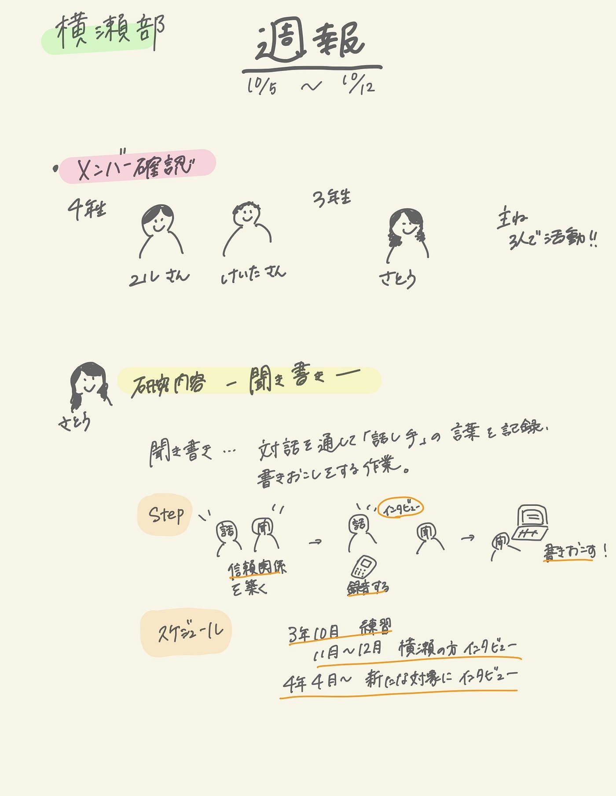

### 横瀬部生きてます！

こんにちは。
今週から横瀬部として活動することになりました、3年の佐藤です。

横瀬部といえば最近4年生の顔を見ていない・・・・・
しかし、横瀬部に入るにあたりユルさんと連絡が取れたので一安心しました。
そのほかの4年生方は連絡が取れていません(´Д` )

現在メンバー２人しかいませんが、今週から活動していきましょう！

今回は主に活動内容整理をしました。
ガチャムクハッカソンは4年生メンバーが後日行います♪(´ε｀ )

#### 1. 活動の整理

佐藤は個人研究をするために横瀬部に入りました！
その目的と内容をまとめます。

＜活動目的＞
 ゼミ論/卒論で「聞き書き」について研究をする。
（「聞き書き」とは一対一の対話を通して「話し手」の人生観などを聞いて、記録し、書く作業のこと。）

＜活動内容（予定）＞
３年次：
①「聞き書き」の練習として友人を対象に実践。スキルを磨く。
② 最終的に横瀬の方を対象に「聞き書き」。
（対象の方がまだ決まっていないのでテーマは考えていません）
③４年次に対象としたい人物を定め、信頼関係を築いておく。

４年：
③の方を対象に「聞き書き」。

＜活動理由＞
人の物事の考え方や行動の基準を知りたいと考えていた。
「聞き書き」を通して、人の内面を知れるチャンスだと思った。

#### 2.「聞き書き」とは

「聞き書き」とは一対一の対話を通して「話し手」の人生観などを聞いて、記録し、書く作業のこです。

現在は「聞き書き」をした著書を多く出版している[塩野米松](https://ja.wikipedia.org/wiki/塩野米松)さんの
『[技を伝え、人を育てる 棟梁](https://www.amazon.co.jp/棟梁―技を伝え、人を育てる-文春文庫-小川-三夫/dp/4167801205)』という本を読んでいます。
塩野さんは名人と呼ばれるような、技術系の方を多く対象に聞き書きをしています。
その中で、「聞き書き」の魅力についていくつかまとめました。

#### ・「話し手」すら気づかない「話し手」の考え方がわかる

皆さんも、誰かと話す時、以外と自分の考えがまとまって口に出たり、こんなこと思ってたっけと考えを言葉に出すことで再認識する経験があると思います。
聞き書きは「話し手」の言葉を書くだけの作業です。その中で「話し手」すら気づいていなかった思いが言葉に出てくることがあるそうです。
そういった言葉をまとめると、「話し手」の内面が整理され、より理解が深くなるところが面白いと思いました。

#### ・雑誌によくあるアイドルのインタビューみたい

「聞き書き」では、「話し手」の言葉遣いや訛りをそのまま記録します。なのでよく女性誌の後ろについてくるアイドルや女優のインタビュー記事みたいで読んでいるとその人の雰囲気が伝わってくるのも面白いポイントです。

#### ・聞き手スキルが上がる

人のコミュニケーションでは、「話し方より聞き方」が大事だと聞いたことがあります。聞き書きでは、「話し手」が自分自身を語る訳ですから、聞き手として信頼関係を築いたり、「話し手」が話しやすい空気を作ることが大切だと考えます。「聞き書き」を通してそういったスキルの向上も図れるのではないかと思います。

以上です！

来週からは横瀬部としての活動をどうするかを決めていきたいと思います♪(´ε｀ )

今週のグラレコ

