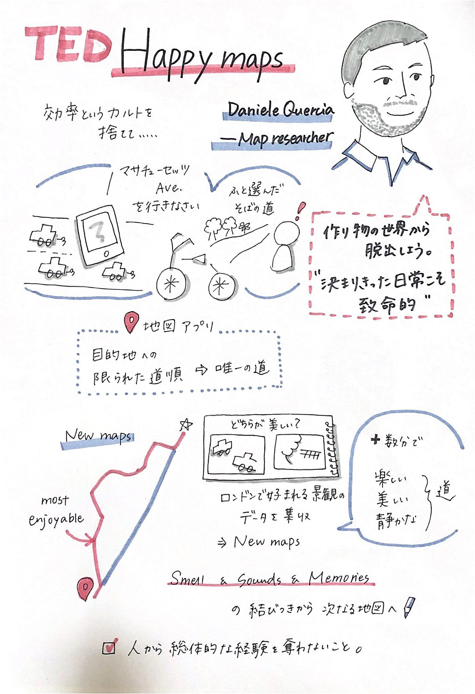
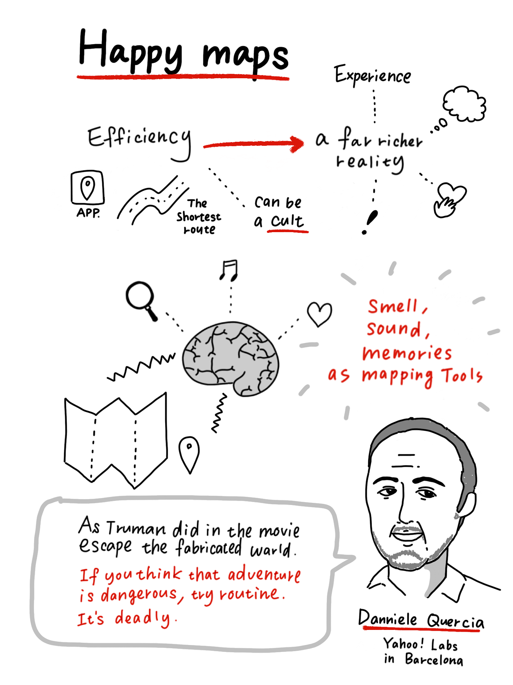
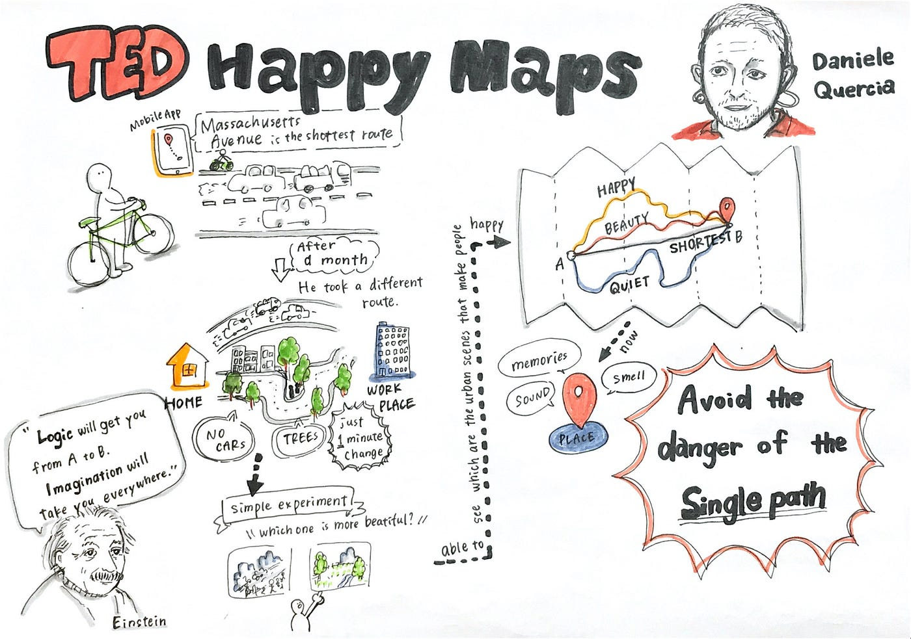

### TED グラレコ TEDx

前回に引き続き、グラレコ部ではTED動画を各自でグラレコしました。

課題となったTEDの題名は” Happy Maps” ということでいかにも古橋研らしい題材ではないでしょうか。

### #実際に書いてみたグラレコがこちら

**大岸さん作：**

**早崎さん作：**

**川嶋作：**

### #感想

**今回の動画は7分だったのですが、一枚に収めるのが難しい…！**

前回に引き続き、私以外の大岸さんと早崎さんは紙を**縦にして**グラレコをしていました！お二人にお話を伺うと、、

**10分未満の場合**、**縦**の方が書きやすいとのこと！**長時間**のものだと**横**で書くことが多く、縦と横を使い分けているそうです！レイアウトが決まっていない場合も縦の方がまとめやすいらしい！！

また、TEDグラレコのポイントもお聞きしました。

> _**##TEDグラレコを書くポイント！_**

> _①最初に題名と似顔絵を描く。_

> _②最後に伝えたいことをまとめる。_

縦と横の書き分け、ポイントを活用していきたいです！！

### #グラレコ部、TEDx AoyamaGakuinU参戦予定

前回はスタッフ枠としてグラレコ部も当日に参加していたそうなのですが…。新型コロナウイルスの影響により今年度のTEDx AoyamaGakuinUはオンライン開催ということで、グラレコ部は後日グラレコを作成することとなりました。

以前グラレコ部がTEDx に参戦したブログを発見！

[TEDxUSHでグラレコしました
11月３日、聖心女子大学で開催されたTEDxUSHにて、グラフィックレコーディングを行いました。今回、古橋研グラレコ部から参加したのは、TEDxAoyamaGakuinUのメンバーでもある末光と、早﨑の２名です。medium.com](https://medium.com/furuhashilab/%E3%82%B0%E3%83%A9%E3%83%AC%E3%82%B3%E9%83%A8%E9%80%B1%E5%A0%B1-tedxush%E3%81%A7%E3%82%B0%E3%83%A9%E3%83%AC%E3%82%B3%E3%81%97%E3%81%BE%E3%81%97%E3%81%9F-8ff29caeff9c)

TEDxグラレコは私、初めてなためうまくできるのか不安を感じております…！！しかし！日頃のTED動画での練習などを生かすチャンスでもあるのかもしれません！！！

青山学院大学 古橋研究室

川嶋彩香
