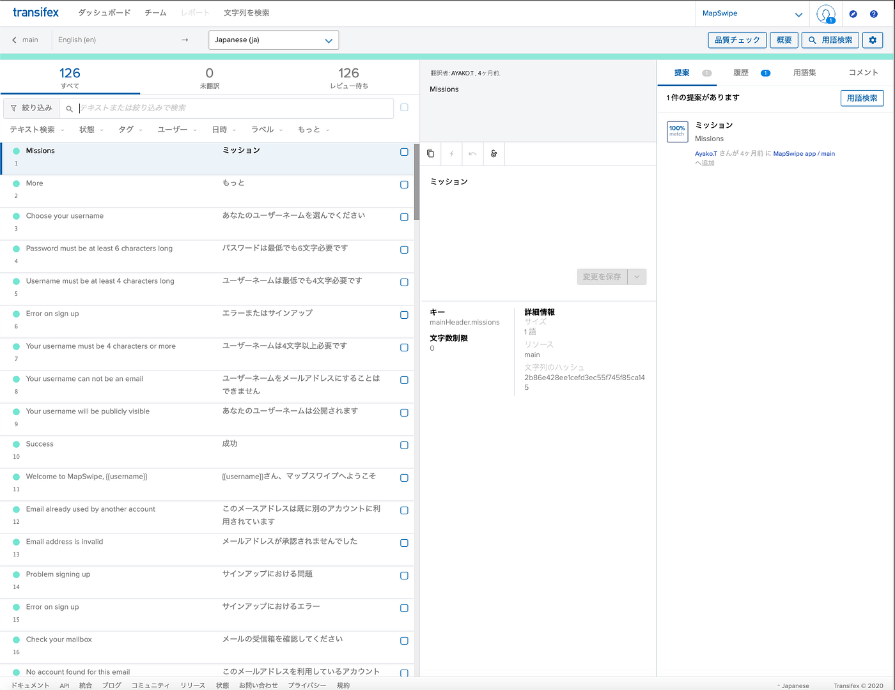
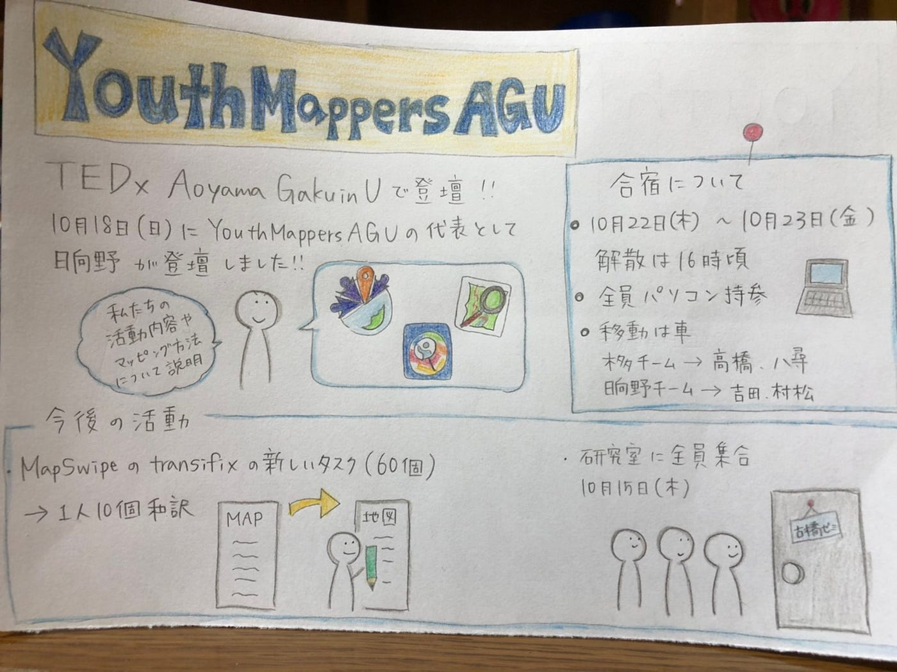

### TEDxも終わりTransifexも終わり次のYouthMapersAGUに

こんにちは、３年の日向野邦春です。

昨日、無事にTEDxでの発表が終わりました。私は話しただけなので何も言えませんが、TEDチームの皆さんには感謝しかありません。本当にありがとうございました。

YouthとしてもこのTedxが一つの目安となっていました。このイベントが終わった事でYouthは次の段階に進まなくてはならないと思っています。

#### Transifexでの翻訳作業が完了

そして、今週はみんなでMapSwipeの翻訳作業を進めました。全員でTransifexにログインして60個ほどあった翻訳を終わらせました。

#### ついに全員で会いました

先週の木曜日にみんなで会うことが出来ました。活動を始めてから全員で集まったことがなかったので少し感動でした。

合宿に向けて一度集合できたのでよかったです。

#### 合宿について

日程:10月22日~23日

場所：横瀬

移動は全員車

木多チーム→高橋、八尋

日向野チーム→吉田、村松

