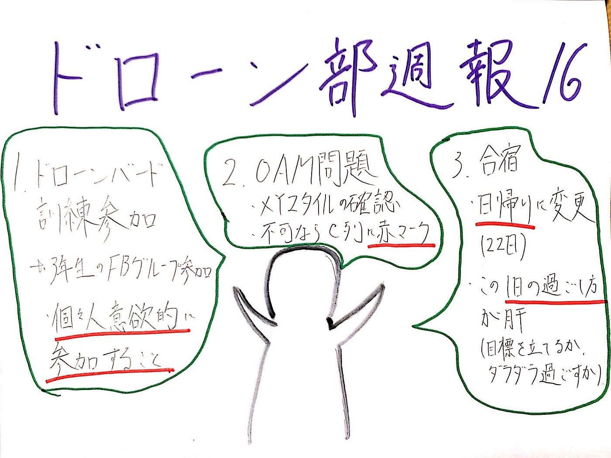

### ドローン部週報16

こんにちは。ドローン部の佐野です。

今回のドローン部のミーティングでは主に以下の3つのことについて話し合いました。

1. ドローンバードの訓練参加について

→10月13日に行われた訓練の参加者は0人。(3年生はそもそもFacebookの非公開グループに招待されてなかった)

個々人予定があるのは仕方ないが、日程を調整して参加することが望ましいとの結論に至る。

2. OAMの問題について

→前回のハッカソンで取り扱った自分の担当タスクのXYZタイルがしっかり作動するか一人一人確認すること。仮に問題が有れば、C列に赤マークをつけ視覚的に一発でどれが不具合かを示すこととなった。

3. ドローン部合宿について

→当初の予定では10月22〜23日に行う予定であったが、急遽日帰りで22日のみの開催となった。1日分ドローンを扱う日が減ったわけだが、この1日をどう過ごすことで自分のスキルアップにつなげることができるかまず考えることが大切である。(参加メンバー: 伊藤、本間、神田、松山、森田、中西、佐野　計7名)

さて、最近ドローンについて少し驚いたニュースがあったので共有したいと思います。

それは、中国で自爆ドローンが出現したと言うニュースです。最近中国情勢として軍事的に緊迫した様子なら世界中が懸念を抱いていますが、まさかドローンがこれに絡んでいるとは思いませんでした。

簡単にこのニュースをまとめると、

1. 自爆ドローンが誕生

2.中国が軍事作戦を強化させている

3. ドローンの自爆映像を流すことで中国の戦闘態勢を意図的に窺わせているのではないかと言う推測

ここでのドローンの役目は太平洋戦争の日本軍の特攻隊をイメージして貰えばわかりやすいと思います。目標に機体ごと突っ込んで攻撃すると言う、まぁなんとも単純明快なものです。

私はドローンがこのような使われ方をするとは想像すらしていませんでした。これから先、案外人にとって予想外の用途としてドローンが使われる可能性は大いにあり得ることではないでしょうか。逆に自分が、この「ドローンを活かせる意外な方法」を見つけられるように日々色んなものに目を向けて生活するのも悪くないかもしれませんね。

グラレコです。
