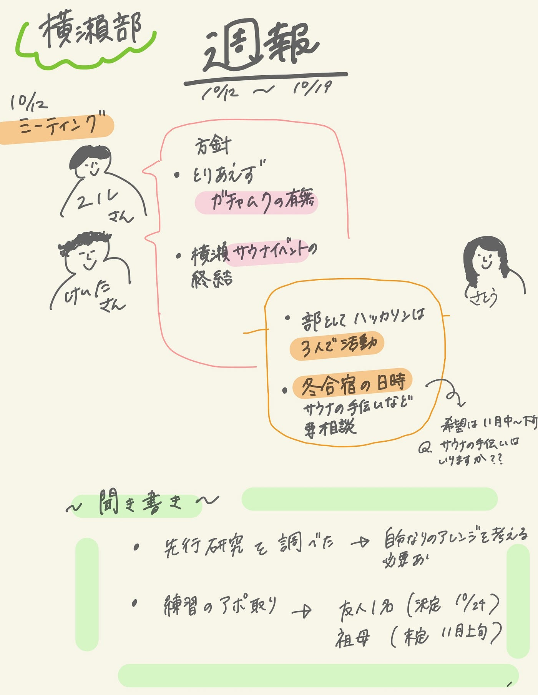

### 大まかな活動方針

こんにちは！横瀬部３年の佐藤です。
TEDxAGU製作陣のみなさんお疲れ様でした！
リアルタイムで見ていましたが、編集とても良かったです。😽
個人的にはエリック先生のトークが就活生に向けたメッセージに聞こえて印象に残りました。
本当にお疲れ様です！

1. 横瀬部の活動

12日にミーティングを行いましたのでまとめます。

４年生
→まずガチャムクハッカソンの有無と、内容・時期を決める。
→横瀬テントサウナイベントの実行。

横瀬部
→部でのハッカソンは３人共同で行う。
→冬合宿の決行。（11月中旬〜下旬希望）
Q. テントサウナ設置のために他のサークルの合宿の時期に合わせる必要があるか確認。

2. 聞き書きの進捗

・先行研究の調査
→ただの聞き書きではなく、自分なりの挑戦・工夫を見つけることが必要。練習聞き書きを行ってから考える。

・「話し手」アポ取り
決定：友人１名（10月24日）
未定：祖母（11月上旬）

