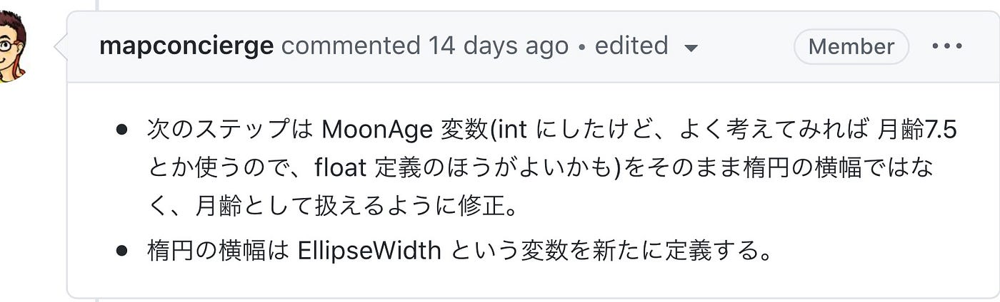
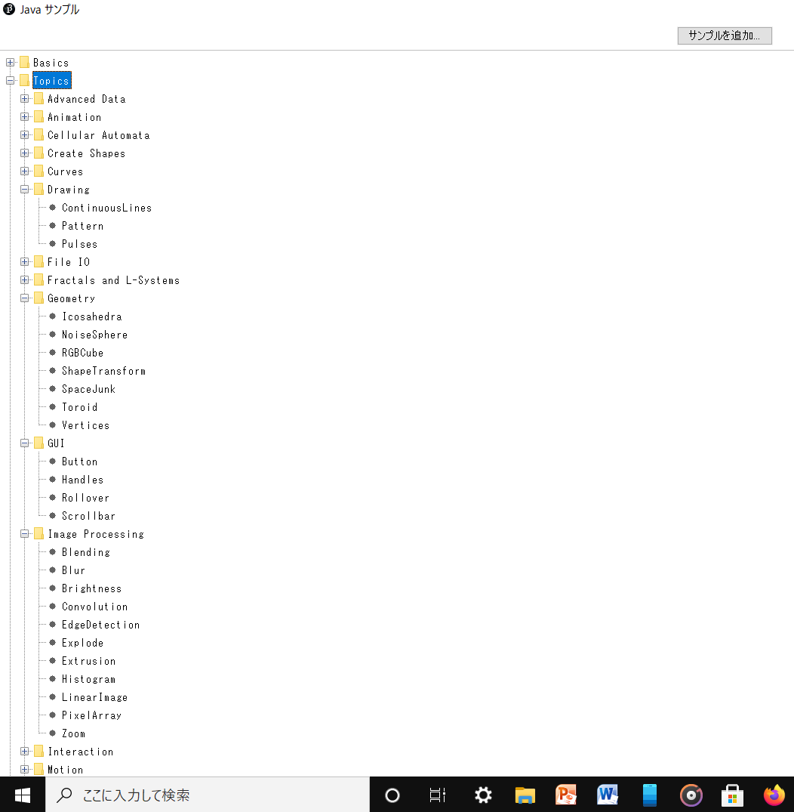
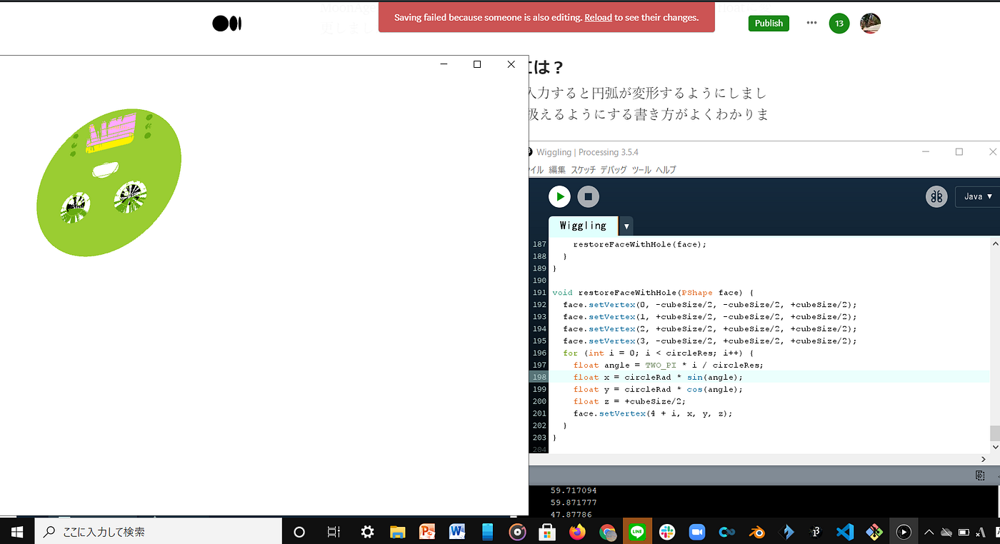
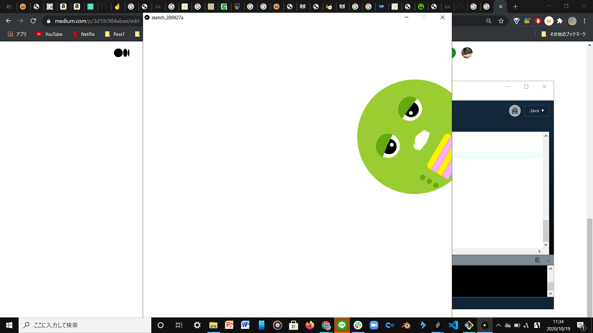
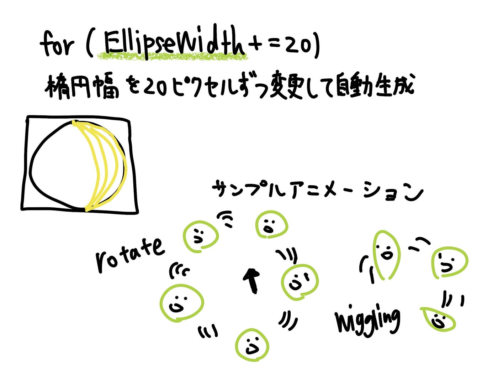

### 月齢変数MoonAge

[Processingで月齢自動生成シュミレーションプログラムを作る · Issue #4 · furuhashilab/fabla-bu
Dismiss GitHub is home to over 50 million developers working together to host and review code, manage projects, and…github.com](https://github.com/furuhashilab/fabla-bu/issues/4)

今回は月齢シュミレーションプログラムをいじってみました。

#### 修正点



まず前回は円弧の横幅に直接MoonAge変数を入れてしまっていたので新たにEllipseWidthという変数を定義して当てはめました。

```
// 楕円幅を20ピクセルずつ変更して MoonAge変数で自動生成
for (MoonAge=0; MoonAge <=400; MoonAge +=20){
   stroke(#FFFF00);  //線の色は黄色
   arc(200, 200, MoonAge, 400,radians(-90),radians(270));
//println(MoonAge);
//delay(100);
}
```

MoonAge変数のほうですが月齢よっては小数点を使うことにもなるためintからfloatに定義し直しました。

#### MoonAgeを月齢として扱うには？

今回はここでつまずいてしまいました。前回は円弧の横幅に変数を適用して月の形を自動で生成できるようにしたのですが月齢を直接入力して月の形を出すための書き方がよくわかりません。。。

#### Processingのアニメーションを試してみた。

月齢変数の扱いに苦戦してしまったのでガチャピンを利用してProcessingに最初から入っているJavaサンプルのなかからいくつかアニメーションを実行してみました。



**Wiggling =揺れる**



こちら実行すると突然ガチャピンがゆらゆらと振られ始めました。一定の動きを繰り返しているという意味では規則的ですがあまりよくわからない動きです。あと、球体なら映えるのでしょうが平面の図形だからか顔がおかしなことになってしまいました。

#### Rotate =回転



こちらはスケッチ上に置いたマウスポインタを中心にして回転をするというものでした。これは先ほどのとは違い平面のままこちらを向いて回り続けるためか画像が乱れることはありませんでした。回転の速さをいじると高速で回りだしました。

void draw() {
translate(mouseX, mouseY);
rotate(angle);

//回転の速さ変更

angle += 0.1;

カーソルに合わせて実行されるアニメーションは雪を降らせるなど他にもいろいろありました。Javaサンプルやオープンコードのアニメーションを参考に数値などいじってみるなどして学んでいけたらと思います。

### グラレコ


