### DRONEBIRDは災害時に何を行うのか！？

#### ドローン部週報⑰ 森田浩徳

- [OpenStreetMap](https://www.openstreetmap.org/)

- [Pokémon GO](https://www.pokemongo.jp/)

- [GitHub](https://github.com/)

- [DRONEBIRD](http://dronebird.org/)

古橋教授の授業を履修していれば、誰もが聞いたことある言葉シリーズとして、上記が挙げられるとは思います。そしてOSM、Pokémon GO、GitHubは嫌でも課題でやらされますよね。空間情報システム入門Ⅰでは、クラスの大半が何をやらされているのかわからないまま、終講を迎えたのではないでしょうか。

しかしDRONEBIRDは聞いたことはあるけど、実際に何が行われているのかまで踏み入ったことはないのではないでしょうか？ DRONEBIRDが撮影した航空写真を利用して、OSMでマッピングをしたことがある人はいるかもしれませんが、実際にDRONEBIRDとしての活動まで参加する方はごく少数だと思います。

DRONEBIRDのイメージとして、**災害時に空撮を行う団体**との印象が深いと思います。まさにその通りで、災害時に世界中に溢れるマッパー達に、**災害の現状を受け渡す架け橋**として、迅速に空撮を行い航空写真を提供することが目的とされています。そこで今回はDRONEBIRDがどのような活動を行なっているのかの具体的な内容を記載していきたいと思います。

今週は、横瀬にて合宿を行いました。雨予報でしたが、日頃の行いが良いせいか晴れたため、無事に空撮を行うことができました。

今回はDRONEBIRDの一員として恥ずかしくないよう、オートパイロットによる空撮からオルソモザイクの作成、OAMに投稿までを行いました。

[OpenAerialMap
Browse the open collection of aerial imagery.map.openaerialmap.org](https://map.openaerialmap.org/#/139.1033935546875,35.98252081174413,13/square/133002103110303?_k=g9z9fm)

#### ## 全体の流れ

1. [Pix4Dcapture](https://www.pix4d.com/jp/product/pix4dcapture)を用いてオートパイロットで空撮

1. [Pix4Dreact](https://www.pix4d.com/jp/download/pix4dreact)で空撮データを解析＆オルソモザイク生成

1. [OpenAerialMap](https://openaerialmap.org/)に投稿

1. GitHubでデータ管理

### 1. Pix4Dcaptureを用いてオートパイロットで空撮

①Pix4Dを開く

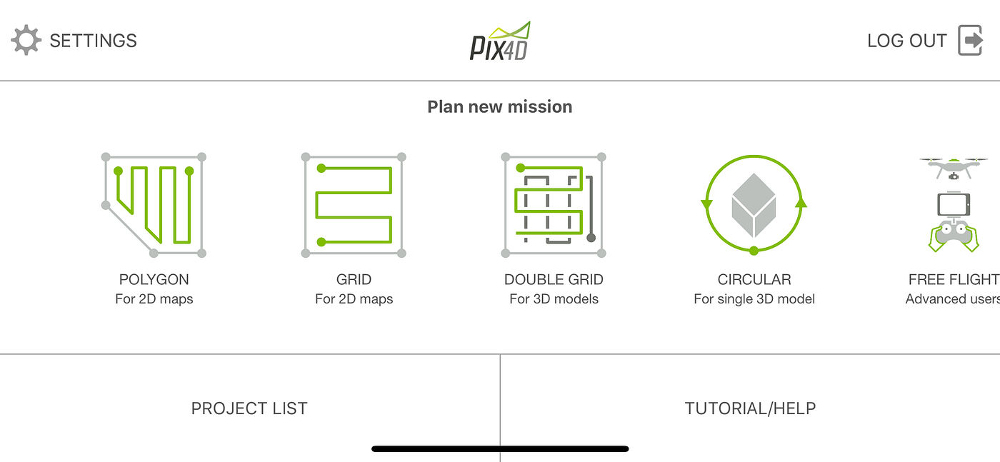

②設定を選択

③ドローンを選択

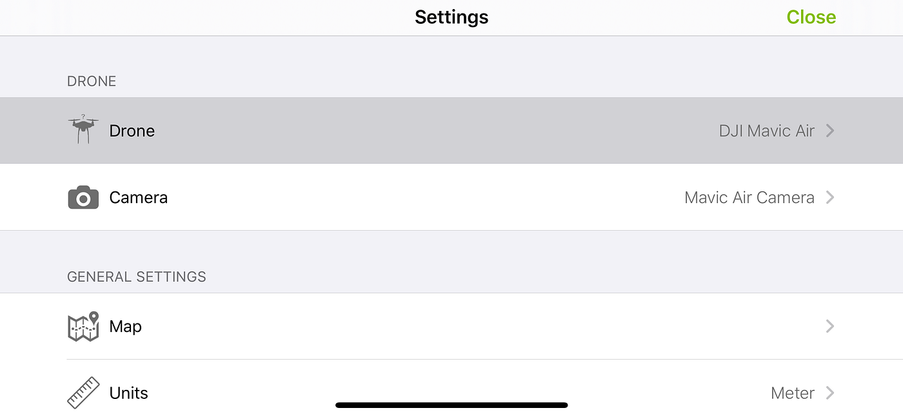

④使用する機種を選択

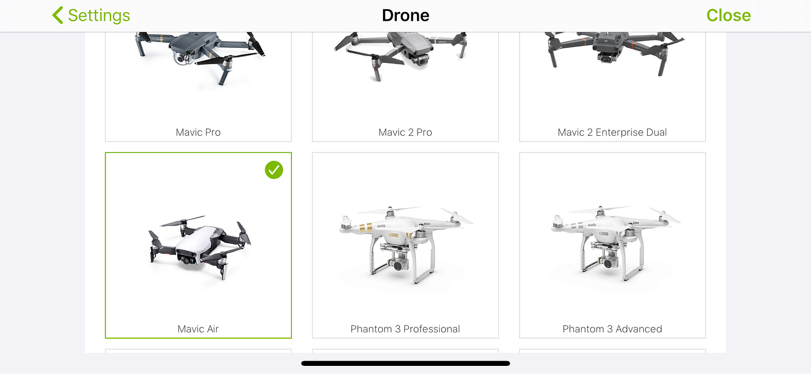

⑤Closeを選択

⑥2Dマップ用のポリゴンを選択

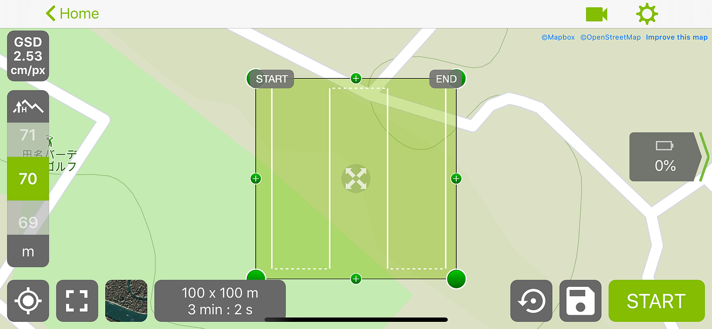

⑦飛行させたい場所を選択

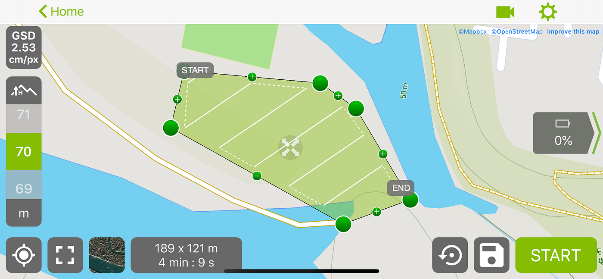

衛星写真への切り替えも可能

⑧飛行高度を選択（ここでは70m）

基本災害などの緊急時では、5cm/pxで撮影すれば良いとされています。測量とかの場合、1cm/pxで行うこともあるみたいです。地上サンプル距離を変更すると、1ピクセルあたりのcmが変わってくることがわかります。

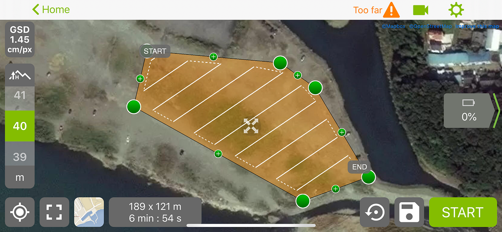

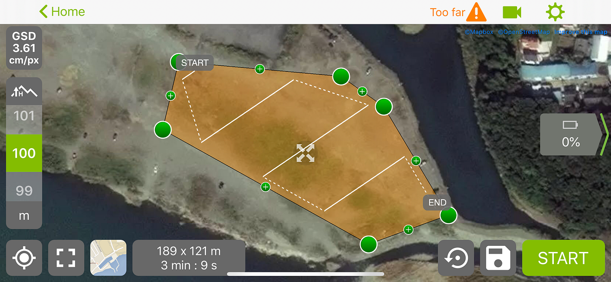

1ピクセルあたりのcm値が小さくなればなるほど、より高精度の空撮ができますが、撮影箇所が多くなるため時間がかかってしまうという欠点があります。対し、1ピクセルあたりのcm値が大きくなれば、撮影範囲が広がるため短時間で撮影が終わります。

他にも色々な設定ができます。

今回は2Dマップの作成のため、カメラは90°で設定をします。0°であれば、ドローンに対し正面を向いた状態、90°は垂直に真下を見下ろしている状態になります。3Dモデルの計測の場合は、このカメラの向きが斜めになって撮影するように設定します。

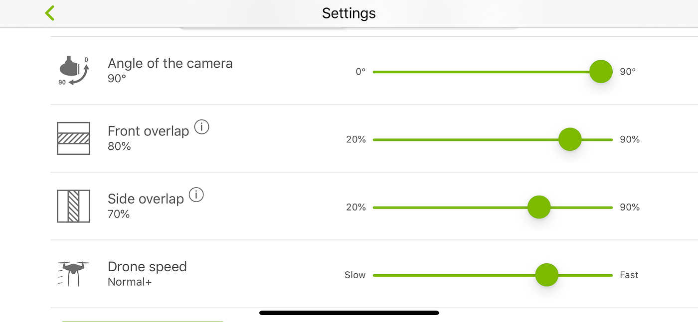

フロント・オーバーラップとサイド・オーバーラップは、空撮したデータを分析する際に、より正確なデータを算出するために設定します。写真と写真を組み合わせる時に、どれぐらい重ねるかを設定するのですが、オーバーラップ率が高ければ高いほど精密な結果が出ます。フロント・オーバーラップは最低80%以上、サイド・オーバーラップは最低70%以上がお勧めとのことです。

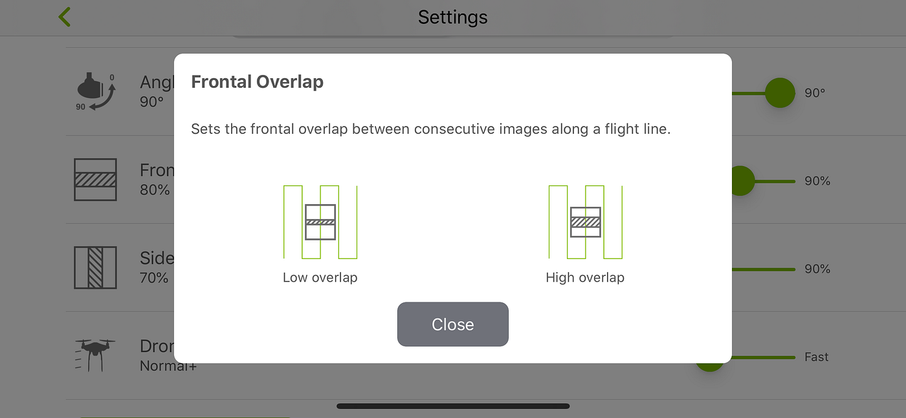

⑨飛行ミッションをセーブ

ここまで設定が終わったら、スタートの横にあるセーブボタンでミッションを保存します。

⑩DJI GO 4を開いてデバイスを接続

⑪ Pix4Dcaptureを開いて、先ほど設定したプロジェクトを選択

⑫スタート

### 2. Pix4Dreactで空撮データを解析＆オルソモザイク生成

①撮影したデータをパソコンに読み込む

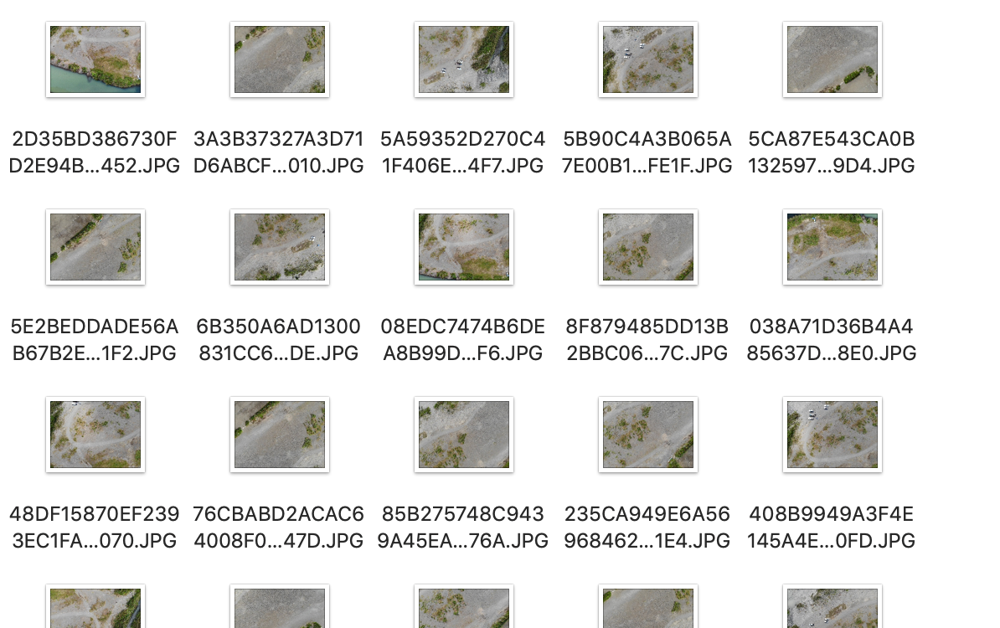

②Pix4Dreactに画像をインポートする

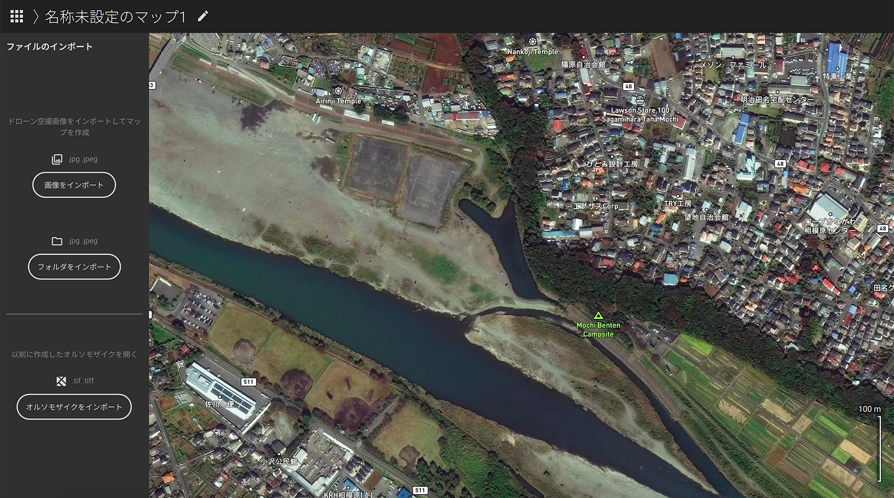

③撮影した位置が埋め込まれる

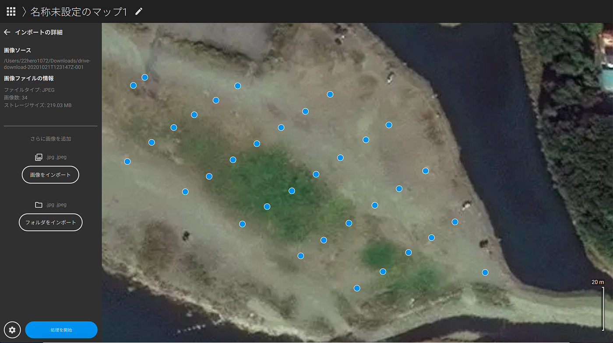

④処理を開始

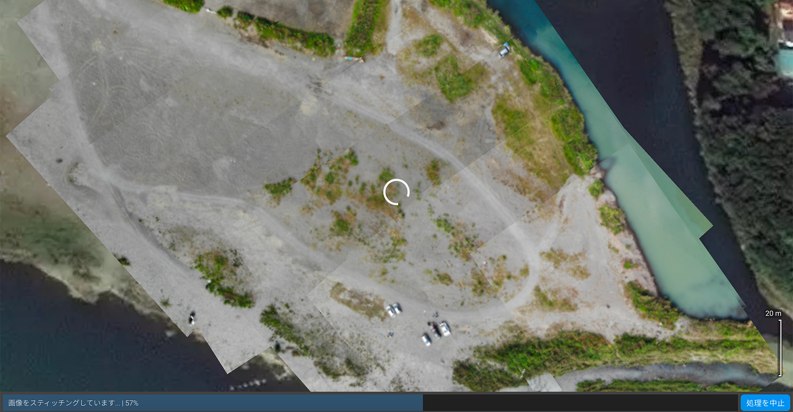

⑤オルソモザイクが作成される

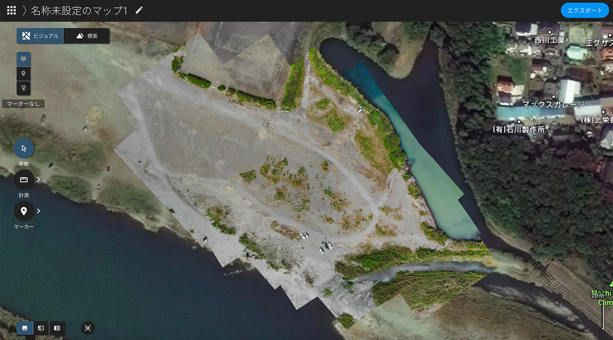

このデータは標高データや計測が可能になります。先ほどピクセルで指定してるので、しっかりとした距離が計測されます。計測はラインか、範囲かを指定できます。

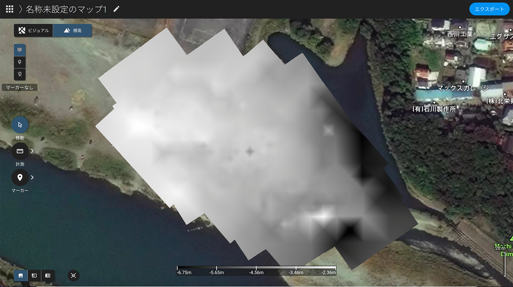

では、ここで古橋先生の車のサイズを測っていきましょう**(*ﾟ▽ﾟ)ﾉ**

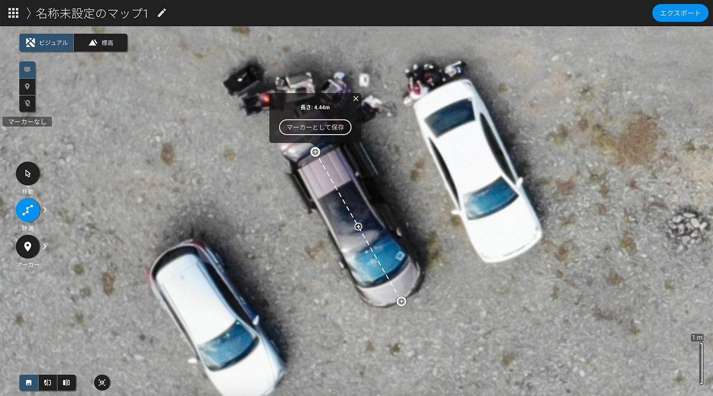

4.44mみたいですね！ちゃんと距離も計測されていることがわかります！
そしてオプトアウト式を採択している古橋ゼミは有能ですね！

⑥エクスポート

エクスポートする際は、GeoTIFF形式にしましょう。標高データはOpenAerialMapでも利用できるので、チェックマーク入れとくと後々にいいことがあるかもしれません。

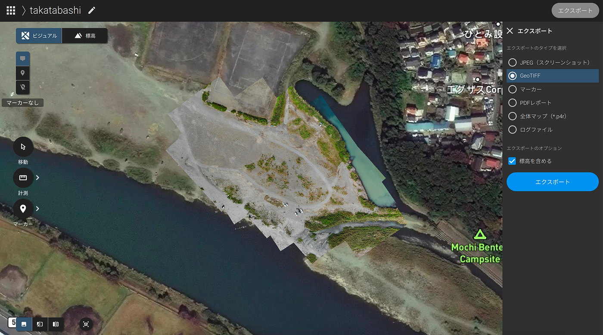

こちらが完成したオルソモザイクになります。
今回のデータはGitHubに落としてあるので、興味ある方は確認してください。

[dronebird/oam_sagamihara20201013takatabashi01mavicair
You can't perform that action at this time. You signed in with another tab or window. You signed out in another tab or…github.com](https://github.com/dronebird/oam_sagamihara20201013takatabashi01mavicair)

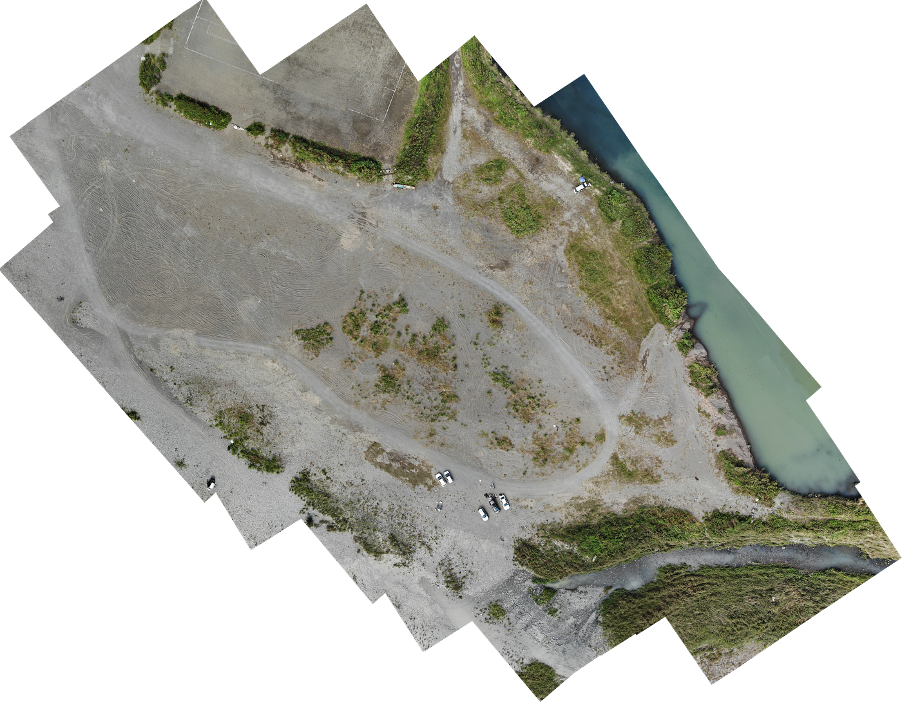

### 3. OpenAerialMapに投稿

撮影したデータをOpenAerialMapに投稿するのですが、投稿の仕方は以前の記事をご覧ください。しかし今回はGeoTIFF形式ですでにエクスポートしてあるので、QGISでの作業は不要となります。

[OpenAerialMapの活用(草津市編）
ハッカソン7月編medium.com](https://medium.com/furuhashilab/openaerialmap%E3%81%AE%E6%B4%BB%E7%94%A8-%E8%8D%89%E6%B4%A5%E5%B8%82%E7%B7%A8-a42476a6f891)

### 4. GitHubでデータ管理

こちらも、中尾さんが記事をまとめてくれているので、そちらを参照してください。

[GitHubを活用しよう（超初級編） - Qiita
いつのまにかクリスマスもお正月も過ぎてしまいましたが、ようやく DRONEBIRD Advent Calendar 2019の記事を書きました。 今回は、 GitHubを活用しよう（超初級編） というタイトルで DRONEBIRD での…qiita.com](https://qiita.com/fairlaterfair/items/073493f0a67fb0bbb02f?fbclid=IwAR2rTi6u5O5n4im5hImNwQfJ1pliQfbu88kuxIU7BNduaVe93DIRVpNQsJY)

