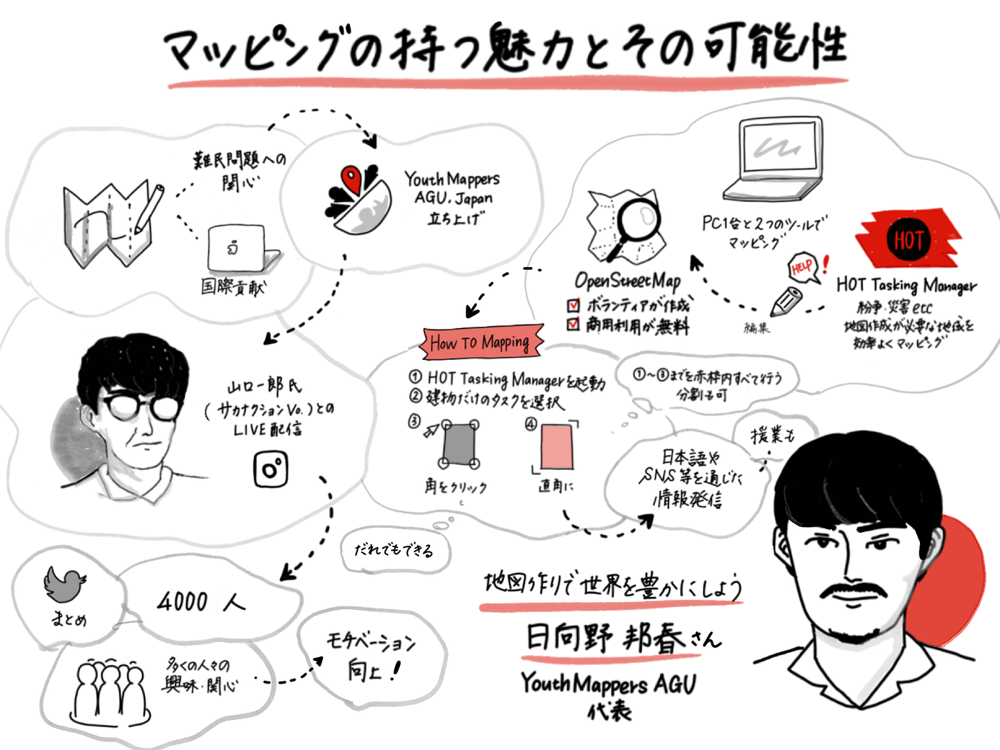
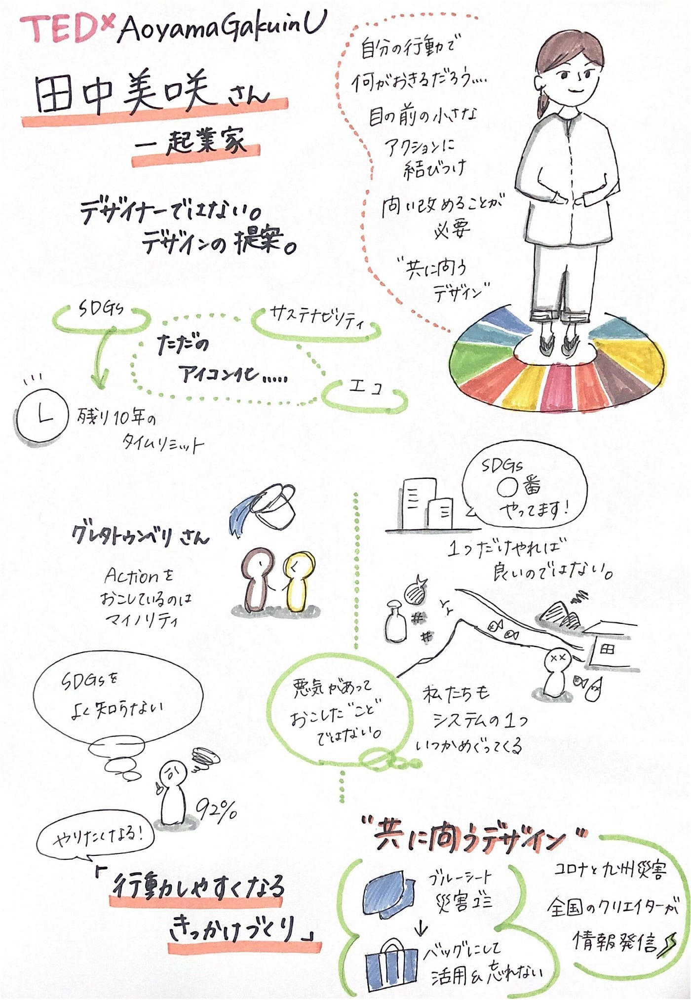
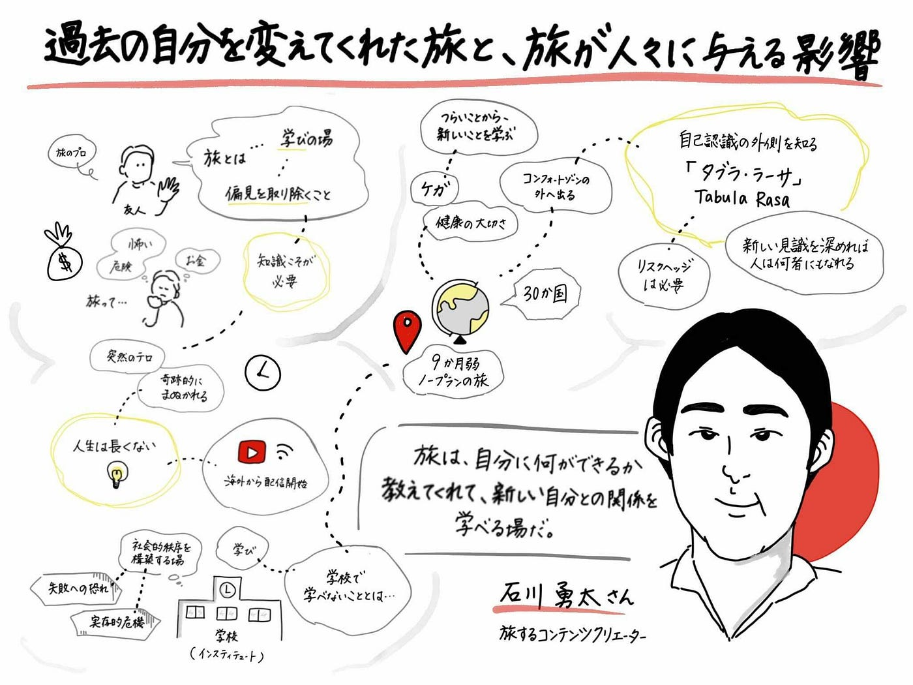
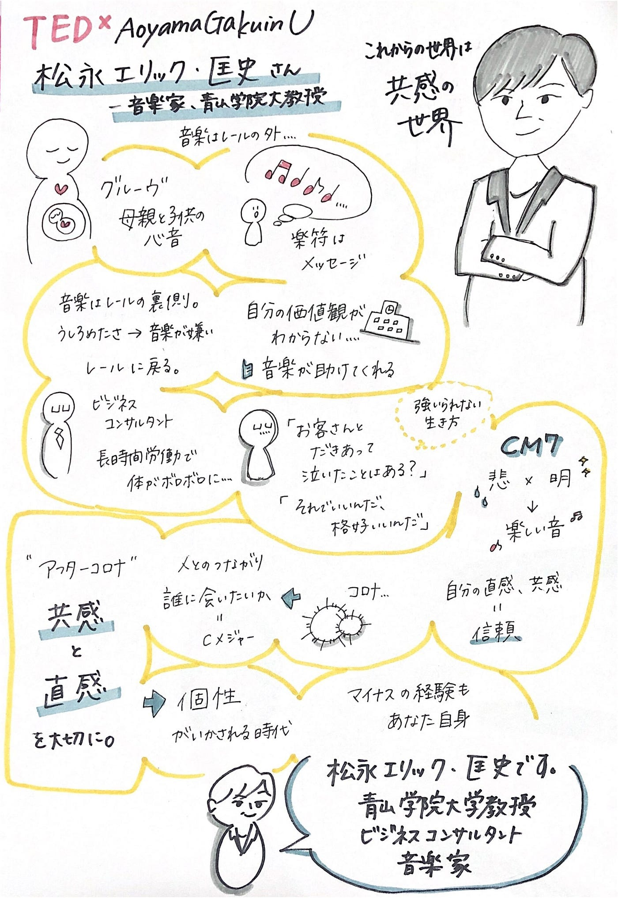
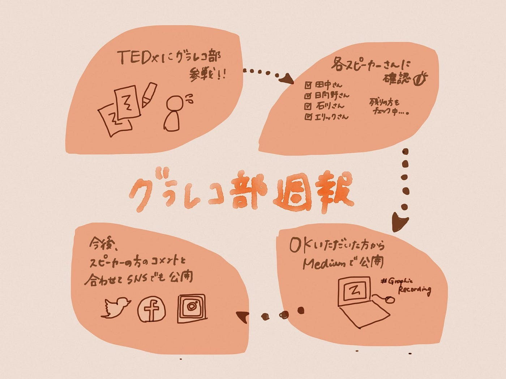

### 4TEDxGrareco

先週お知らせした、TEDxAoyamaGakuinUへのグラレコ部参戦！
「グラレコの素早さ」という良さを活かすには、なるはやで仕上げなくては…。ということで、一部公開です！

#### 日向野邦春さん

#### 田中美咲さん

#### 石川勇太さん

#### 松永エリック・匡史さん

今回は、現時点でスピーカーの方からチェックを頂いている4枚のグラレコを公開しました。ご本人にチェックしていただくのはやはり緊張です…。もっと似顔絵、頑張ります！笑

その他のスピーカーの方のグラレコも、チェックを頂き次第こちらのMediumで公開していきます！また、スピーカーの方のコメントと一緒に公式SNSでも公開する予定です！そちらはもうしばらくお待ちください。

[公式Facebook](https://www.facebook.com/tedxaogaku17/)（@tedxaogaku17）
[公式Twitter](https://twitter.com/tedxagu?s=21)（@tedxagu）
[公式Instagram](https://www.instagram.com/tedxaoyamagakuinu/?igshid=17n9yepjk79dy)（@tedxaoyamagakuinu）

当日参加していただいた方は、グラレコを見ながらお話の内容を思い出して頂けたら嬉しいです。参加できなかった方にも、少しでも様子が伝わればいいなと思います。

#### ##グラレコ

青山学院大学 古橋研究室3年

大岸 裕紀
