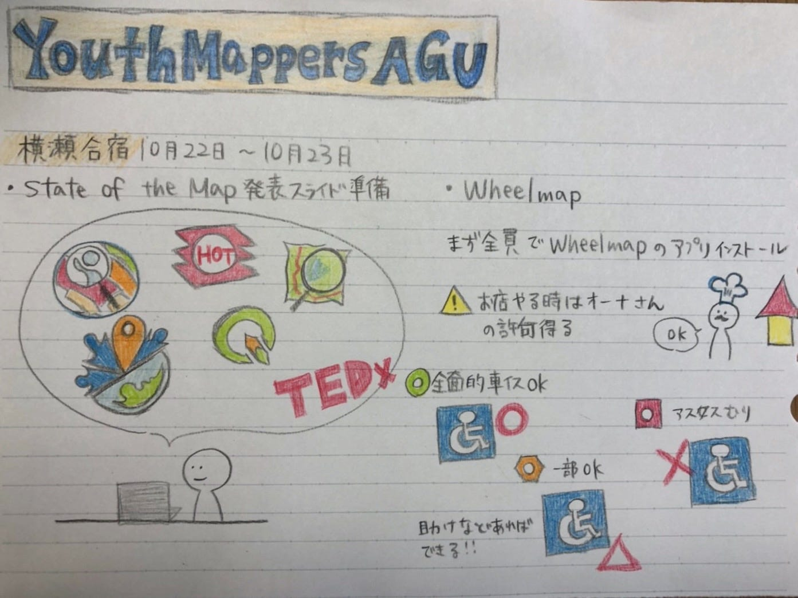

YouthMappersAGU 初合宿！

お久しぶりです、今回担当する2年の村松です。

10月22日から23日に合宿を行いましたので報告させていただきます。

1 State of the Mapの発表準備

11/7（土）に行われるState of the Map の発表向けてスライドの準備をしました！

2 Wheelmap.org

明日(26日)に企業にWheelmapについての説明会を行います！そのため全員でWheelmap調べ、スライド作成、アプリをインストールをし、アプリの仕組みを確認しました。一定の規定によって赤、オレンジ、緑で色分けします。写真を追加することが可能ですが、その際は私有地外で撮るか、オーナーの許可が必要になります！

今週のグラレコ

