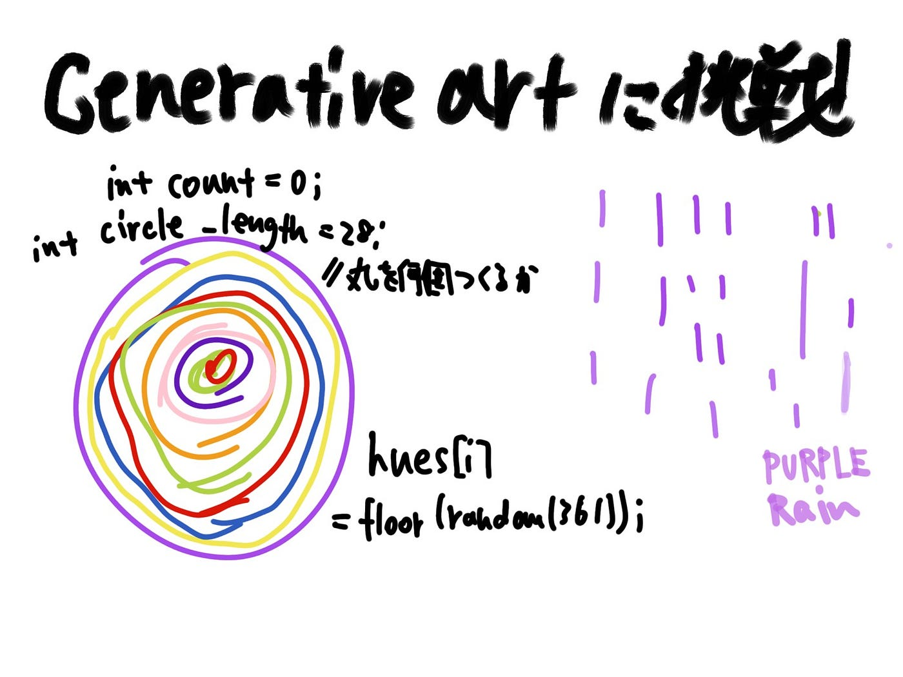

### Generative animation

Processing のランダム関数を試してみました。せっかくプログラムで動画を作るので毎回違った動きや色味になるような予想できないものを作成できたらと思い、練習がてらサンプルコードを利用して毎回違う色とスピードで円を自動生成するプログラムをトライしました（ほぼ写経）。

[randomアニメーション練習 · Issue #6 · furuhashilab/fabla-bu
Dismiss GitHub is home to over 50 million developers working together to host and review code, manage projects, and…github.com](https://github.com/furuhashilab/fabla-bu/issues/6)

random関数を利用した面白そうなGenerative art 動画はいろいろとありそうです。

#### ＜参考＞

[https://www.youtube.com/playlist?list=PLbLdd1fdNg5yp0x3_oRWeBur0FVX8PvFH](https://www.youtube.com/playlist?list=PLbLdd1fdNg5yp0x3_oRWeBur0FVX8PvFH)

このやたらとハイテンションなprocessing開発者の「Codeing Challenge」シリーズも、けっこう参考になります。

パープルレインを振らせるコード紹介

### グラレコ

