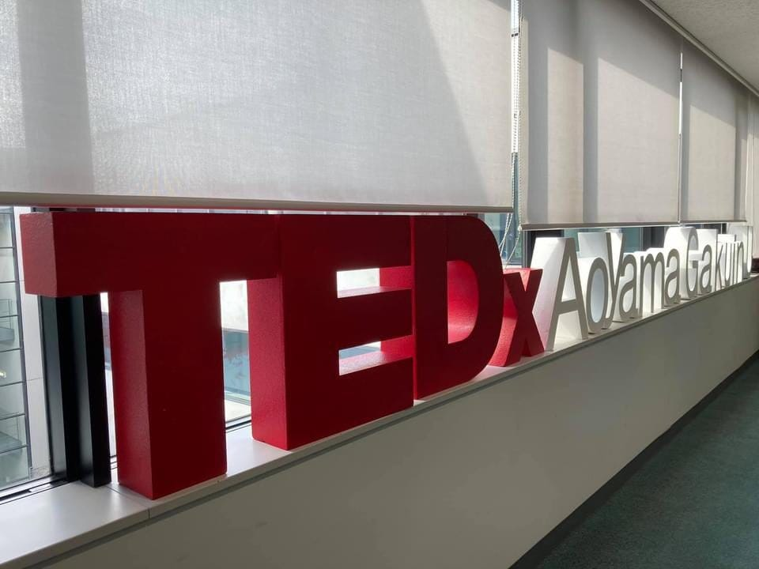

### TEDｘフィードバック

tedxが終了したということで、みんなで次回開催？に向けて今回の運営についてフィードバックを行いました。今回は反省の身に重点を当てて週報します。

### 方針決定

・計画性・役割分担➡初めてのオンライン会場での主催ということで、想定外の出来事も多くフロー設計がグダグダ。(字幕組がぎりぎりに、、、)誰がいつまでに何をするのか具体的に決められていなかったためどこまでのタスクをすればいいのかわからない状態。【役割分担、役割内容を最初のミーティングで明確化させる】

・連絡手段の多さ➡Line、slack、Massanger、Githubなど様々な連絡ツールを用いてしまっていたので、絞るべき【SlackとMassangerが便利】➡【先生：この四つのSNSを同時に使用することは問題なく、それぞれのSNSの特性を生かした使い方ができれば良し】

・Githubを使いこなせていない➡タスク管理に慣れていない。主に古橋ゼミのメンバー以外は使おうとしていなかった。【初めからタスク管理はGithub以外で行わないことをメンバーに周知する必要性】

### 集客

・集客にかける時間が短すぎた➡100人を目標として結果集まったのが40人弱【オンライン開催決定次第早急に集客動き出す、より積極的な発信（sns）、集客ツールの勉強】

### 撮影

・撮影時スピーカーにグリーンバックの緑被れ➡スピーカーのふちが緑っぽくなってしまっていた【スピーカーの前に白いレフ版を置く】

・撮影時の騒音➡編集で消せると思っていた騒音だが思った以上に難しい！【完璧な状態（扇風機なども止めて）で撮影をする必要がある】

・撮影日当日のメンタリング➡一人がほぼ全員分やっていたけど、絶対に動画編集する人がやるべきだった。細かいニュアンスとかは本人と話し合って決めたほうが良い。【最初に動画編集する人を決めて編集の勉強を２～３か月前から練習する必要がある。（最初から担当決めとけば責任感も生まれる気がする！）】

### 動画編集

・データの受け渡しの難しさ➡みんなが使う編集ソフトがばらばらであったため、協力しづらい、データ受け渡しが難しい、トラブル発生が多すぎた【団体として使うソフトを定めて（経費で購入）、初心者が一人でやるのではなくみんなで協力できる環境を作り、役割分担をはじめに決めておく】

・blenderやAfter Effectの使い手の少なさ➡専門的な知識が必要なこれらのソフトを使う人が少なすぎたためタスクの加重化が目立った【オンラインイベントをする際にははじめからこれらを使える人の確保が必要不可欠】

・出力の時間がかかりすぎる➡普通のノートパソコンだと出力するのに6時間ほどかかってしまう。【スペックの高いパソコンをみんなが共有して使える仕組みづくり、編集作業の時間をより長く確保する】

### 本番・配信

・質問がいろんなアカウント宛に来てしまっていた。➡【事前に、TEDx ホスト、TEDx質問応答係、TEDx画面共有、、、などの役割分担をしZOOMに入っていればよかった。】

・直前になってルーム分けを決めるなど、事前に決まっていないことが多かった。【もっと早く段取りを決めて練習していたらよかった。】

・ZOOMのブレイクアウトルームについて知っている人が少なかったため、せめて【2人は担当についているともっとスムーズにできたかも】。今回の40人でもきつかったから、これ以上だったらやばかった…

・ブレイクアウトルームを設定する時に、1人1人手動で振り分けていたので、【STAFF 〇〇、SPEAKER〇〇など名前を統一して変えていればもっと早く振り分けができたと思う！】

・交流会では、積極的な人は十分にスピーカーと交流できていたが、zoomに慣れていなくて話せずにいた人がいた。【アイスブレイクがあってもよかったかな? 司会側の準備不足もあった。チャット機能を使った会話があってもよかったのかもしれない。】

・参加者側の視点からして、zoom、YouTube、スグキクの三つを行ったり来たりの動作が面倒臭い。【各ブレイクアウトセッションに予め決められたスタッフを配属させておき、スタッフは移動なしの固定制にする】
・ZOOMのアップデートなどの問題で、参加者とのコミュニケーションの不安定さ。

・交流会で話す題材をざっくりと決めておくとスムーズにトークが回ったかも。

### 今後のVR開催について

・VR/MRを使ったイベントは、参加者側にいかにそれが可能な環境を提供できるかによるものだった。ヘッドセットを安価に提供するサービスや案を練る必要があった。【先生：今回撮影した素材を使ってVRを使用したらこうなった！みたいな企画が生まれれば面白いのではないか】

