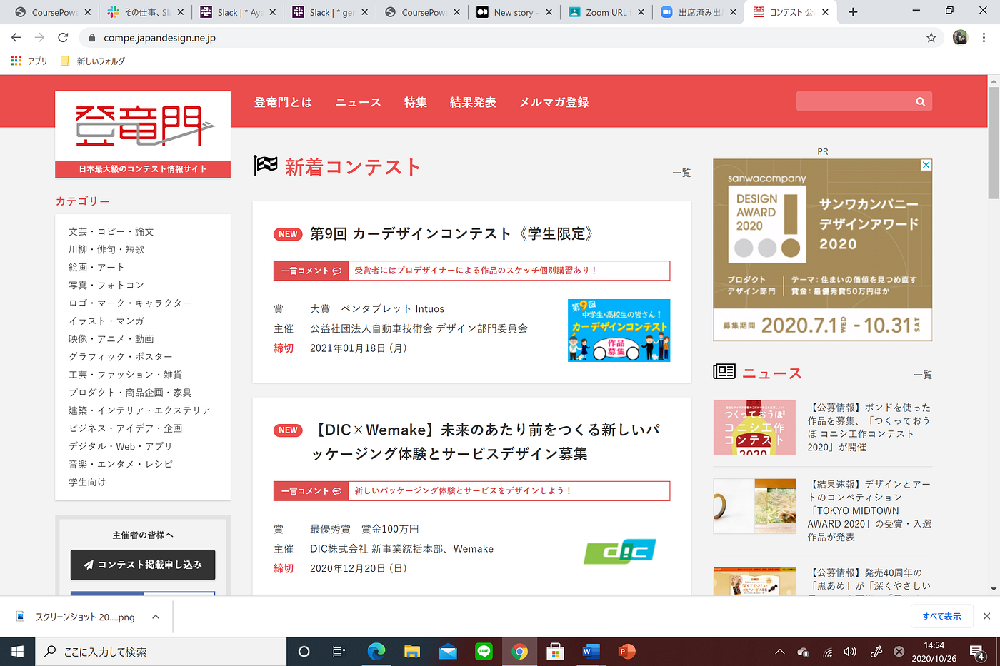
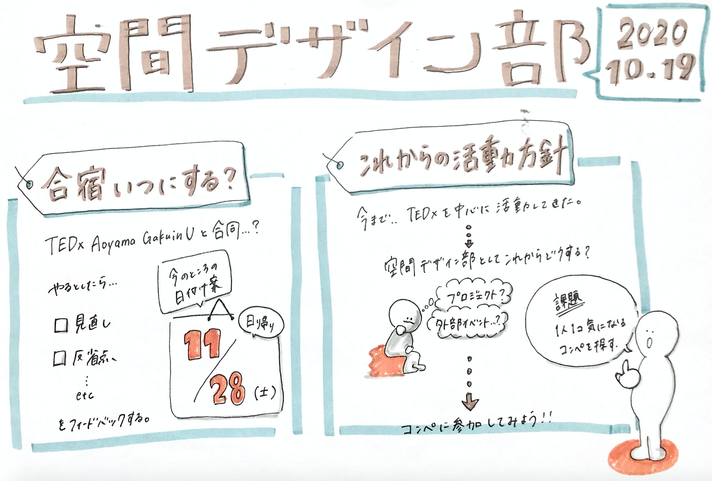

### 空間デザイン新スタート

空間デザイン部はTEDxAoyamaGakuinUを終えて新しく目標設定をしていこうと考えております！そして今回はそれに向けた合宿についても決定しました！

### 新目標

これから空間デザイン部では今までつけてきた力を発揮するべく「登竜門」の中にある一つのテーマに絞ってコンテストに出場することに決まりました！賞金目指して部として名を残していきたいと考えております！！

### 合宿

日程：11月28日（日帰り）

内容：tedxの反省、フィードバック、次回コンテストに向けての活動

> 次回課題

> 登竜門の中にある気に入ったコンテストを一人一つずつ発表

